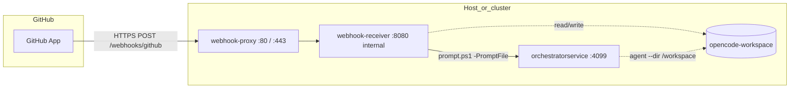
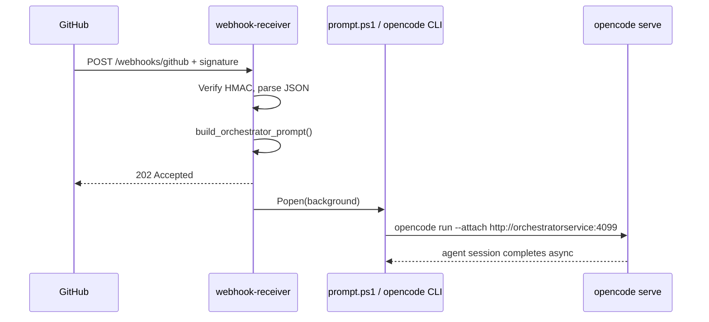
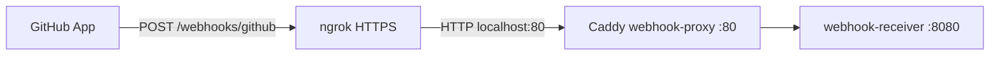

# GitHub App setup for orchestrator webhooks

This document explains the **webhook receiver application**, how it integrates with a **GitHub App**, and step-by-step instructions to register the app and route events into the OpenCode orchestrator.

---

## Webhook receiver application

### Description

The **webhook receiver** is a small Python service (`webhook_receiver/`) that sits between **GitHub** and the **OpenCode orchestration server**. It:

1. Exposes an HTTP endpoint for GitHub App webhook deliveries.
2. **Verifies** each request using the app’s webhook secret (`X-Hub-Signature-256`).
3. **Transforms** the JSON event payload into a structured orchestration prompt.
4. **Dispatches** a one-shot `opencode run --attach …` session via `scripts/prompt.ps1` (PowerShell; requires `pwsh`), targeting the long-running `orchestratorservice` container.

The receiver does **not** implement GitHub API logic itself, does **not** parse individual business rules (e.g. “only label X”), and does **not** wait for the agent to finish. It accepts the webhook quickly (HTTP **202**), then runs orchestration in a **background subprocess**. Filtering by event type is optional; finer-grained rules belong in the orchestrator agent instructions or in which events you subscribe to on the GitHub App.

### Role in the stack

| Component | Responsibility |
|-----------|----------------|
| **GitHub App** | Subscribes to repo/org events; POSTs signed JSON to your public URL |
| **webhook-receiver** | Auth verification, prompt assembly, async dispatch |
| **orchestratorservice** | `opencode serve` on port **4099**; agents, MCP, image config under `/app` |
| **Shared volume `opencode-workspace`** | `/workspace` — clone/edit target for agent sessions |
| **`scripts/prompt.ps1`** | Client launcher: `opencode run --attach` with `-Prompt` or `-PromptFile` |

Provider API keys and server password are configured on **orchestratorservice**; the webhook container needs the **webhook secret**, **OpenCode server URL/password**, and (recommended) **GitHub tokens** so spawned runs can use `gh`.

### Architecture



**Sequence (non-ping event):**



### Source layout

| Path | Purpose |
|------|---------|
| `webhook_receiver/app.py` | FastAPI routes: `GET /health`, `POST /webhooks/github` |
| `webhook_receiver/github.py` | HMAC-SHA256 verification for `X-Hub-Signature-256` |
| `webhook_receiver/prompts.py` | Builds markdown prompt with delivery metadata + JSON payload |
| `webhook_receiver/runner.py` | Writes prompt file; spawns `pwsh` + `prompt.ps1` via `subprocess.Popen` |
| `webhook_receiver/config.py` | Environment-driven `Settings` dataclass |
| `webhook_receiver/__main__.py` | CLI entry: `uv run orchestrator-webhook` |
| `scripts/prompt.ps1` | `opencode run --attach` with `-Prompt` or `-PromptFile` (requires `pwsh`) |
| `Dockerfile.webhook` | Image: Python app + uv + pwsh + opencode CLI |
| `compose.yaml` | Service `webhook-receiver` alongside `orchestratorservice` |

### GitHub App integration

The receiver implements the **webhook delivery** side of a GitHub App. It does **not** handle OAuth, installation callbacks, or JWT installation tokens by itself—those are separate GitHub App flows if you build API automation. For orchestration triggered by repo events, you need:

| GitHub App setting | Maps to |
|--------------------|---------|
| **Webhook URL** | `https://<host>/webhooks/github` |
| **Webhook secret** | `GITHUB_WEBHOOK_SECRET` (must match exactly) |
| **Subscribe to events** | Which `X-GitHub-Event` values GitHub sends |
| **Install App** on repos | Without install, no deliveries for that repo |

**HTTP headers used:**

| Header | Use |
|--------|-----|
| `X-Hub-Signature-256` | `sha256=<hex>` HMAC of raw body with webhook secret |
| `X-GitHub-Event` | Event name (e.g. `issues`, `pull_request`); compared to allow list |
| `X-GitHub-Delivery` | Unique delivery UUID; included in orchestration prompt |
| `Content-Type` | `application/json` |

**Response codes:**

| Code | When |
|------|------|
| **200** | `ping` event only — `{"status":"pong"}` |
| **202** | Event accepted and queued, or ignored by allow list |
| **401** | Signature missing or invalid |
| **400** | Body is not valid JSON |

**Ping vs work events:** On URL save, GitHub sends `X-GitHub-Event: ping`. The receiver responds **200** and does **not** call `prompt.ps1`. All other subscribed events (unless filtered) get **202** and a background orchestration run.

**GitHub App permissions vs webhooks:** Webhook subscriptions control **which events fire**. Repository **permissions** control what the **orchestrator agent** can do via `gh`/API when handling the prompt (e.g. write issues). Configure both in the app settings (see Part 1 below).

### Request processing pipeline

1. Read raw body bytes (required for correct signature verification).
2. `verify_signature(body, X-Hub-Signature-256, GITHUB_WEBHOOK_SECRET)` using constant-time compare.
3. If `event == ping` → return 200.
4. If `WEBHOOK_ALLOWED_EVENTS` is set and event not in set → return 202 `ignored` (no orchestration).
5. `json.loads(body)` → `build_orchestrator_prompt(delivery_id, event, payload)`.
6. `BackgroundTasks` → `dispatch_to_opencode`: write `/tmp/orchestrator-webhook/last-prompt.md`, `Popen` prompt script with `-PromptFile`.
7. Return 202 `accepted` to GitHub immediately.

Concurrent deliveries each spawn a separate `opencode run` process. There is no in-app queue or deduplication by delivery ID—plan capacity on the OpenCode server accordingly.

### Prompt format

The generated prompt is markdown intended for the **orchestrator** agent (`OPENCODE_AGENT`, default `orchestrator`). It includes:

- Delivery ID, event name, optional `action`, repository `full_name`, sender login.
- Instructions to use the JSON payload and `gh` when a token is present.
- Full webhook JSON in a fenced code block (truncated at `WEBHOOK_MAX_PAYLOAD_CHARS`, default **120000**).

Truncation avoids huge argv/files while keeping most issue/PR payloads intact. The agent can fetch more context with `gh` if needed.

### Configuration

All settings are **environment variables**. In Docker Compose, set them on the host before `docker compose up` or in an env file.

#### Required

| Variable | Description |
|----------|-------------|
| `GITHUB_WEBHOOK_SECRET` | Same secret as GitHub App → Webhook secret |

#### OpenCode / orchestration

| Variable | Default (compose) | Description |
|----------|-------------------|-------------|
| `OPENCODE_SERVER_URL` | `http://orchestratorservice:4099` | Base URL for `opencode run --attach` |
| `OPENCODE_SERVER_PASSWORD` | *(from host)* | Passed into prompt container env for CLI auth |
| `ORCHESTRATOR_WORKSPACE` | `/workspace` | `--dir` for agent file access |
| `PROMPT_SCRIPT` | `/app/scripts/prompt.ps1` | PowerShell launcher path in image |
| `OPENCODE_MODEL` | `zai-coding-plan/glm-4.7-flash` | Model flag |
| `OPENCODE_AGENT` | `orchestrator` | Agent name |

#### GitHub CLI (recommended)

| Variable | Description |
|----------|-------------|
| `GH_ORCHESTRATION_AGENT_TOKEN` | PAT or token with repo access; used by `gh` in agent runs |
| `GITHUB_TOKEN` | Often set to the same value for tools expecting `GITHUB_TOKEN` |

These are **not** used by the webhook HTTP handler; they are inherited by the child `opencode` process.

#### HTTP server (webhook-receiver)

| Variable | Default | Description |
|----------|---------|-------------|
| `WEBHOOK_HOST` | `0.0.0.0` | Bind address |
| `WEBHOOK_PORT` | `8080` | Bind port (internal; not host-published in compose) |
| `WEBHOOK_LOG_LEVEL` | `info` | Logging and uvicorn log level |

#### Reverse proxy (webhook-proxy / Caddy)

| Variable | Default | Description |
|----------|---------|-------------|
| `WEBHOOK_SITE_ADDRESS` | `:80` | Caddy site address; use `hooks.example.com` for automatic HTTPS |

#### Filtering and limits

| Variable | Default | Description |
|----------|---------|-------------|
| `WEBHOOK_ALLOWED_EVENTS` | *(empty = allow all)* | Comma-separated `X-GitHub-Event` names, e.g. `issues,pull_request` |
| `WEBHOOK_MAX_PAYLOAD_CHARS` | `120000` | Max JSON characters embedded in prompt |

### Deployment options

**Docker Compose (recommended)**

| Service | Role |
|---------|------|
| `webhook-proxy` | Caddy — public **80** / **443**, TLS when `WEBHOOK_SITE_ADDRESS` is a domain |
| `webhook-receiver` | FastAPI — internal **8080** only (not published to host) |
| `orchestratorservice` | OpenCode server — **4099** |

```bash
# HTTP on port 80 (default WEBHOOK_SITE_ADDRESS=:80)
docker compose up --build

# Automatic HTTPS (Let's Encrypt) — DNS must point at this host first
export WEBHOOK_SITE_ADDRESS=hooks.example.com
docker compose up --build
```

GitHub webhook URL: `https://hooks.example.com/webhooks/github` (or `http://<host>/webhooks/github` when using `:80` only).

Config file: `deploy/caddy/Caddyfile`. Logs: `docker compose logs -f webhook-proxy webhook-receiver`

**Local development with ngrok + Docker Compose**

See **[Local development with ngrok + Docker Compose](#local-development-with-ngrok--docker-compose)** — tunnel `ngrok http 80` to Caddy while the full stack runs in Compose.

**Local development (uv, no Docker)**

```bash
uv sync
export GITHUB_WEBHOOK_SECRET='…'
export OPENCODE_SERVER_URL=http://localhost:4099
uv run orchestrator-webhook
```

Requires local `pwsh`, `opencode`, and a running OpenCode server on the URL you configure. For GitHub webhooks, run `ngrok http 8080` (receiver binds **8080** directly when not using Compose).

### Security considerations

- **TLS termination** must happen in front of the receiver (reverse proxy, tunnel, or load balancer). GitHub requires a valid HTTPS webhook URL for production apps.
- **Secret handling:** Never commit `GITHUB_WEBHOOK_SECRET`. Rotate by updating both GitHub App settings and compose env, then restart `webhook-receiver`.
- **Signature required:** Unsigned or wrong-signature requests are rejected; there is no anonymous orchestration trigger.
- **No built-in IP allowlist:** Rely on secret verification; optionally restrict ingress at the network layer to GitHub’s [hook IP ranges](https://api.github.com/meta) if you operate a firewall.
- **Fire-and-forget subprocess:** Failed `opencode` runs do not fail the HTTP response GitHub already received; monitor `last-run.stderr` and OpenCode server logs.

### Observability

| Location | Content |
|----------|---------|
| `docker compose logs webhook-receiver` | Accept/reject/ignore lines per delivery |
| `/tmp/orchestrator-webhook/last-prompt.md` | Last prompt sent (inside container) |
| `/tmp/orchestrator-webhook/last-run.stderr` | stderr from last `prompt.ps1` invocation |
| GitHub App → **Recent Deliveries** | HTTP status, request/response, redelivery |

### Limitations and extension points

- **No persistence** of delivery IDs—redeliveries from GitHub spawn duplicate runs.
- **No GitHub App JWT** exchange in this service—use a PAT in `GH_ORCHESTRATION_AGENT_TOKEN` or extend the app to mint installation tokens.
- **Business logic** (e.g. only `labeled` + label `orchestrate`) should live in orchestrator instructions or a future middleware layer; the receiver intentionally stays thin.
- **Synchronous agent completion** is not exposed to GitHub; use Actions or status APIs from within the agent if you need check runs or comments when done.

---

## Prerequisites

- Orchestrator stack running: `docker compose up --build` (see root `README.md`).
- Environment variables set before compose starts:
  - `OPENCODE_SERVER_PASSWORD`
  - At least one provider key (`ZAI_CODING_API_KEY` and/or `OPENROUTER_API_KEY`)
  - `GITHUB_WEBHOOK_SECRET` — you will choose this when creating the app (or generate one and paste the same value into the app and your shell).
  - `GH_ORCHESTRATION_AGENT_TOKEN` (recommended) — PAT or app installation token so the orchestrator can use `gh` against your repos.
- A **public HTTPS URL** that reaches **`webhook-proxy`** (ports **80** / **443**). GitHub requires HTTPS for production webhooks.

**Option A — Caddy in compose (recommended)**

```bash
export WEBHOOK_SITE_ADDRESS=hooks.example.com   # your DNS hostname
docker compose up --build
# Webhook URL: https://hooks.example.com/webhooks/github
```

**Option B — HTTP only on port 80** (local lab or TLS terminated upstream)

```bash
# default WEBHOOK_SITE_ADDRESS=:80
docker compose up --build
curl -s http://localhost/health
```

**Option C — external tunnel to port 80** (recommended for local development)

GitHub requires a **public HTTPS** webhook URL. `http://localhost` is not reachable from GitHub unless you terminate TLS with a tunnel. With Docker Compose, tunnel to **`webhook-proxy` on port 80** — not port **8080** (`webhook-receiver` is internal only).

See **[Local development with ngrok + Docker Compose](#local-development-with-ngrok--docker-compose)** below for step-by-step ngrok instructions. Other tunnels work the same way (e.g. `cloudflared tunnel --url http://localhost:80`).

---

## Local development with ngrok + Docker Compose

Use this when developing on a laptop or workstation without a public hostname. [ngrok](https://ngrok.com/) gives you a temporary `https://….ngrok-free.app` URL that forwards to Caddy on localhost port **80**.

### How traffic flows



### Prerequisites

- [ngrok](https://ngrok.com/download) installed and signed in (`ngrok config add-authtoken …` once).
- Docker Compose stack from this repo (see root [README.md](../README.md)).
- A GitHub App (or draft app) with webhook **Active** — you will paste the ngrok URL in Part 1.

### 1. Start the stack

Export required variables on the host (same values you will use in the GitHub App):

```bash
export OPENCODE_SERVER_PASSWORD='…'
export ZAI_CODING_API_KEY='…'                    # and/or OPENROUTER_API_KEY
export GITHUB_WEBHOOK_SECRET='…'                 # generate now; reuse in GitHub App settings
export GH_ORCHESTRATION_AGENT_TOKEN='…'          # optional but recommended

# default WEBHOOK_SITE_ADDRESS=:80 — HTTP on port 80; ngrok provides HTTPS
docker compose up --build
```

Confirm Caddy is healthy locally:

```bash
curl -s http://localhost/health
# {"status":"ok"}
```

### 2. Start ngrok

In a **second terminal**, forward public HTTPS to port **80**:

```bash
ngrok http 80
```

ngrok prints a forwarding URL, for example:

```text
Forwarding   https://abc123.ngrok-free.app -> http://localhost:80
```

Copy the **https** URL (not the `http://127.0.0.1` line).

### 3. Set the GitHub App webhook URL

In your GitHub App settings (Part 1 below):

| Field | Value |
|-------|--------|
| **Webhook URL** | `https://abc123.ngrok-free.app/webhooks/github` |
| **Webhook secret** | Same string as `GITHUB_WEBHOOK_SECRET` |
| **SSL verification** | **Enabled** (default) — ngrok presents a valid certificate |

Save the app. GitHub sends a **ping**; check **Recent Deliveries** for **200**.

Verify through ngrok before saving (replace the host):

```bash
curl -s https://abc123.ngrok-free.app/health
# {"status":"ok"}
```

### 4. Watch deliveries

```bash
docker compose logs -f webhook-proxy webhook-receiver
```

- **ping** → HTTP **200**, no orchestration run.
- Other subscribed events → HTTP **202**, background `opencode run` via `prompt.ps1`.

### ngrok notes

| Topic | Detail |
|-------|--------|
| **Port** | Always `ngrok http 80` with Compose. Do not tunnel **8080** unless you run `uv run orchestrator-webhook` without Caddy. |
| **URL changes** | Free ngrok URLs change when you restart ngrok. Update the GitHub App **Webhook URL** each time (or use a [reserved domain](https://ngrok.com/docs/guides/how-to-set-up-a-custom-domain/) on a paid plan). |
| **Stack order** | Start `docker compose` first, then ngrok. If compose is down, ngrok returns 502 and GitHub deliveries fail. |
| **Alternatives** | [Cloudflare Tunnel](https://developers.cloudflare.com/cloudflare-one/connections/connect-networks/) (`cloudflared tunnel --url http://localhost:80`) or Tailscale Funnel work the same way — tunnel to port **80**, path `/webhooks/github`. |

### ngrok troubleshooting

| Symptom | Likely cause | Fix |
|---------|----------------|-----|
| GitHub **connection failed** | ngrok not running or wrong port | `ngrok http 80`; confirm compose is up |
| **502 Bad Gateway** from ngrok | Caddy/receiver not listening | `curl -s http://localhost/health`; restart compose |
| **401** on delivery | Secret mismatch | `GITHUB_WEBHOOK_SECRET` must match GitHub App webhook secret exactly |
| URL worked yesterday, fails today | Free ngrok hostname changed | Copy new URL from ngrok UI; update GitHub App webhook URL |
| Browser shows ngrok interstitial | ngrok free-tier warning page | `curl` and GitHub deliveries are unaffected; use ngrok dashboard to inspect requests |

---

## Part 1 — Create the GitHub App

### 1. Open GitHub App settings

1. Sign in to GitHub.
2. Go to **Settings** → **Developer settings** → **GitHub Apps**.
3. Click **New GitHub App**.

(For an **organization** app: Organization → **Settings** → **Developer settings** → **GitHub Apps** → **New GitHub App**.)

### 2. Basic information

| Field | Suggestion |
|--------|------------|
| **GitHub App name** | `orchestrator-webhook` (must be unique on GitHub) |
| **Description** | Forwards repo events to OpenCode orchestrator |
| **Homepage URL** | Your docs or repo URL |
| **Webhook** | **Active** — required |
| **Webhook URL** | `https://<public-host>/webhooks/github` |
| **Webhook secret** | Generate a strong random string (32+ chars). **Save it** — this is `GITHUB_WEBHOOK_SECRET`. |
| **SSL verification** | Enable (default) |

### 3. Permissions (repository)

Grant only what the orchestrator needs. Typical starting set:

| Permission | Access | Why |
|------------|--------|-----|
| **Metadata** | Read-only | Required baseline |
| **Contents** | Read (or Read & write if agents push code) | Read repo files |
| **Issues** | Read & write | Issues, labels, comments |
| **Pull requests** | Read & write | PRs and reviews |
| **Actions** | Read | Inspect workflow runs (if you subscribe to `workflow_run`) |
| **Workflows** | Write | Only if agents will re-run or dispatch workflows |

Adjust up/down based on what your orchestrator agents actually do.

### 4. Subscribe to events (triggers)

Under **Subscribe to events**, check the events that should **trigger** orchestration. The receiver forwards any subscribed event unless you restrict with `WEBHOOK_ALLOWED_EVENTS` in compose.

| Event | Fires when | Example use |
|-------|------------|----------------|
| **Issues** | Issue opened, edited, closed, labeled, etc. | Run orchestrator when label `orchestrate` is added |
| **Issue comment** | Comment created/edited on an issue | Respond to `@bot` commands in comments |
| **Pull request** | PR opened, synchronized, closed, labeled, … | Review or update on new PRs |
| **Pull request review** | Review submitted/edited/dismissed | Act on approval or change requests |
| **Pull request review comment** | Inline review comments | Fix specific review threads |
| **Workflow run** | CI run requested/completed | Triage failing Actions |
| **Check run** | Check suite activity | Finer-grained CI signals |
| **Push** | Git push to a branch | Post-push automation (noisy — use carefully) |
| **Create** / **Delete** | Branches or tags created/deleted | Repo structure changes |
| **Release** | Release published | Release automation |
| **Repository** | Repo renamed, archived, etc. | Rare |

**Ping** is sent automatically when you save the webhook URL; the receiver answers with `pong` and does not start orchestration.

#### Optional: restrict events in compose

To ignore deliveries for events you did not intend to handle:

```bash
export WEBHOOK_ALLOWED_EVENTS=issues,pull_request,issue_comment,workflow_run
docker compose up --build
```

Comma-separated names must match the `X-GitHub-Event` header (lowercase), e.g. `pull_request`, not `Pull Request`.

### 5. Where can this GitHub App be installed?

- **Only on this account** — personal repos.
- **Any account** — orgs you administer can install it.

Choose based on whether orchestration targets org repos or only your user.

### 6. Create the app

Click **Create GitHub App**.

---

## Part 2 — Install the app on repositories

Webhooks are only sent for repos where the app is **installed**.

1. On the app’s page, open **Install App** (left sidebar).
2. Select your user or organization.
3. Choose **All repositories** or **Only select repositories**.
4. Confirm **Install**.

Note the **Installation ID** if you later use the GitHub API with an installation token.

---

## Part 3 — Wire secrets to Docker Compose

On the machine running compose, export the **same** webhook secret you entered in the app:

```bash
export GITHUB_WEBHOOK_SECRET='paste-the-exact-secret-from-step-2'
export OPENCODE_SERVER_PASSWORD='…'
export ZAI_CODING_API_KEY='…'
export GH_ORCHESTRATION_AGENT_TOKEN='…'   # optional but recommended
docker compose up --build
```

Compose passes `GITHUB_WEBHOOK_SECRET` into the `webhook-receiver` service (see `compose.yaml`).

---

## Part 4 — Verify delivery

### 1. Ping (automatic)

After saving the webhook URL, GitHub sends a **ping** event.

- GitHub UI: App → **Advanced** → **Recent Deliveries** → latest **ping** → should be **200**.
- Receiver logs: delivery accepted, no orchestration run.

### 2. Manual redelivery

1. **Recent Deliveries** → select a delivery → **Redeliver**.
2. Confirm response **202** with body like `{"status":"accepted",...}` for non-ping events.

### 3. Trigger a real event

Examples:

- Add a label to an issue (if **Issues** is subscribed).
- Open a draft PR (if **Pull request** is subscribed).
- Re-run a failed workflow (if **Workflow run** is subscribed).

Check orchestration:

- Receiver logs (container): `docker compose logs -f webhook-receiver`
- Last prompt written in container: `/tmp/orchestrator-webhook/last-prompt.md`
- stderr from prompt run: `/tmp/orchestrator-webhook/last-run.stderr`

---

## Part 5 — Event-driven patterns (recommended)

### Label-gated issues (common)

1. Subscribe to **Issues** only (or add `issues` to `WEBHOOK_ALLOWED_EVENTS`).
2. In your repo, define label `orchestrate` (or similar).
3. Add the label to an issue → webhook → orchestrator prompt includes full JSON payload; agent decides actions.

### PR opened

1. Subscribe to **Pull request**.
2. Open a PR → delivery `pull_request` / `action: opened` → orchestrator runs with PR context.

### Failed CI

1. Subscribe to **Workflow run** (and grant **Actions: Read**).
2. On `completed` + `conclusion: failure`, orchestrator can triage logs (agent uses `gh` / workflow APIs).

Use **repository rules** or **label filters** in your orchestrator instructions (in `image/.opencode/agents/orchestrator.md` or prompts) so the agent ignores events you do not care about, even if GitHub sends them.

---

## Troubleshooting

| Symptom | Likely cause | Fix |
|---------|----------------|-----|
| Delivery **401** | Wrong `GITHUB_WEBHOOK_SECRET` | Match app secret and compose env exactly; restart `webhook-receiver` |
| Delivery **connection failed** | URL not reachable | Check tunnel/firewall; URL must be HTTPS and path `/webhooks/github` |
| **202** but no agent activity | OpenCode down or prompt failed | `docker compose logs orchestratorservice`; inspect `last-run.stderr` |
| Event ignored (`ignored` in body) | Not in `WEBHOOK_ALLOWED_EVENTS` | Unset variable or add the event name |
| Ping OK, events missing | App not installed on repo | **Install App** on that repository |
| SSL errors | Self-signed cert | Use a tunnel with valid TLS (ngrok, Cloudflare, reverse proxy with Let’s Encrypt) |

---

## Quick reference

| Item | Value |
|------|--------|
| Endpoint | `POST /webhooks/github` |
| Health | `GET /health` |
| Public entry | `webhook-proxy` (Caddy) on **80** / **443** |
| Internal app | `webhook-receiver` on **8080** (Docker network only) |
| CLI (local) | `uv run orchestrator-webhook` |
| Application details | [Webhook receiver application](#webhook-receiver-application) above |
| Local dev (ngrok) | [Local development with ngrok + Docker Compose](#local-development-with-ngrok--docker-compose) |

See also the root [README.md](../README.md) for compose and client script usage.

Before opening a PR, run `pwsh -NoProfile -File ./scripts/validate.ps1 -All` (see [AGENTS.md](../AGENTS.md)).
