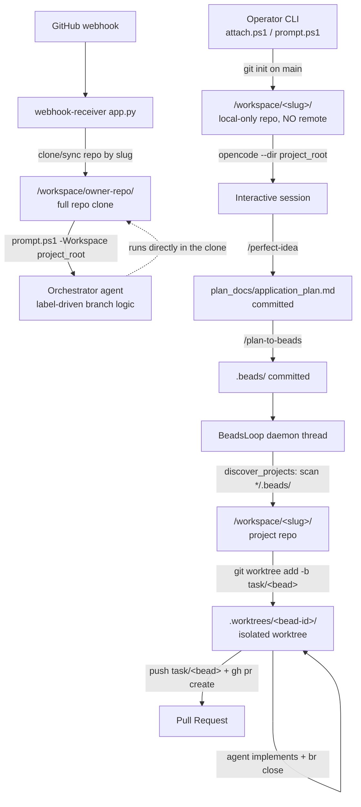
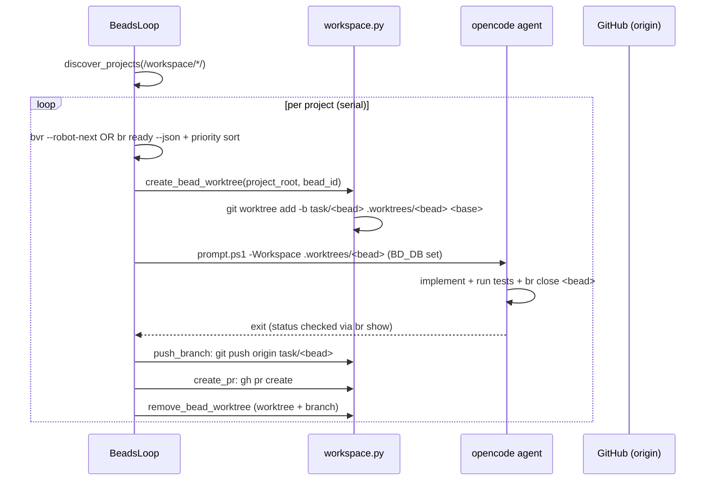
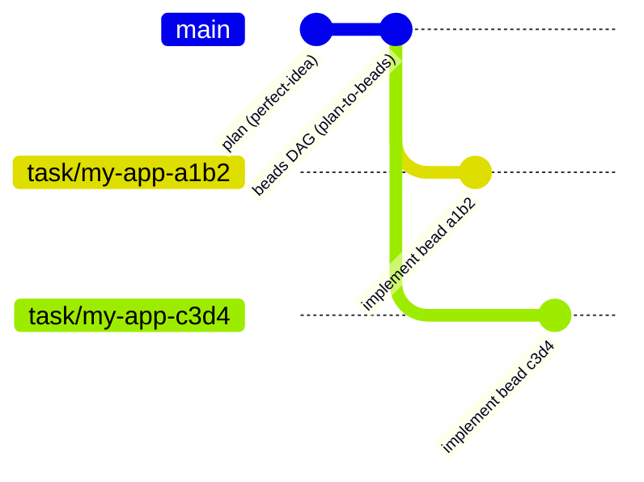

# How GitHub Repos Are Handled in Orchestrator-Service Prompt Sessions

This document explains **which repository an OpenCode prompt session operates in, where that repo comes from, who creates it, which branches are used, and how changes get pushed** — across every dispatch path and every "repo exists / doesn't exist" scenario.

The second half is an in-depth, step-by-step trace of the **greenfield** lifecycle (a brand-new app with no GitHub repo yet): repo creation → plan/DAG authoring → per-bead worktree creation → the task branch → push and PR.

All behavior is derived from the committed source: `compose.yaml`, `scripts/prompt.ps1`, `scripts/attach.ps1`, `scripts/init-project-workspace.ps1`, `webhook_receiver/{app,runner,workspace,beads_loop,bead_context,config,prompts}.py`, `Dockerfile`, `Dockerfile.webhook`, and `scripts/git-trust.sh`.

A final section, **"Actual behavior in the shipped image,"** flags two concrete places where the *designed* flow diverges from what the running webhook image does today, with evidence. Designed vs. actually-running behavior is kept separate throughout.

---

## Table of contents

1. [Mental model](#1-mental-model)
2. [Project identity (the "slug")](#2-project-identity-the-slug)
3. [The three dispatch paths](#3-the-three-dispatch-paths)
4. [Repo source matrix — where does the repo come from?](#4-repo-source-matrix--where-does-the-repo-come-from)
5. [Branch model](#5-branch-model)
6. [Pushing changes](#6-pushing-changes)
7. [Edge cases, security, and known limitations](#7-edge-cases-security-and-known-limitations)
8. [Greenfield lifecycle — step by step](#8-greenfield-lifecycle--step-by-step)
9. [Actual behavior in the shipped image (verify before relying on)](#9-actual-behavior-in-the-shipped-image-verify-before-relying-on)
10. [Key file reference](#10-key-file-reference)

---

## 1. Mental model

There is **no single global repo**. The service is multi-project and long-running. Every prompt session runs inside an **isolated per-project git repository** that lives in a subdirectory of the shared workspace bind mount.

```
Host:    $WORKSPACE_DIR/                          ← host directory (compose: ${WORKSPACE_DIR})
Container: /workspace/                            ← bind-mounted into BOTH services
              <project-slug>/                     ← one git repo per project
                .beads/beads.db                   ← this project's beads DAG
                .git/                             ← git repo (cloned OR fresh `git init`)
                .git/info/exclude                 ← contains ".worktrees/"
                .worktrees/<bead-id>/             ← per-bead git worktrees (beads path only)
                plan_docs/application_plan.md     ← committed so worktrees inherit it
                (project code)
```

Two containers share that mount (see `compose.yaml`):

| Service | Role | Workspace use |
|---|---|---|
| `orchestratorservice` | `opencode serve` on `:4099` — hosts agent sessions | Sessions run with `--dir /workspace/<slug>` |
| `webhook-receiver` | FastAPI on `:8080` — webhook validation, dispatch, and the `BeadsLoop` daemon | Clones/syncs repos, scans for projects, creates per-bead worktrees, pushes branches, opens PRs |

`BEADS_WORKSPACE_ROOT` (default `/workspace`, `config.py:90`) is the **scan base** the `BeadsLoop` walks to discover projects.

---

## 2. Project identity (the "slug")

The repo for a session is identified by a **project slug** — a single path-safe segment that names the directory under `/workspace`. Slug resolution has three tiers (`init-project-workspace.ps1`, `Resolve-ProjectWorkspace`):

1. **Explicit** `-Project <slug>` (manual scripts) — wins if supplied.
2. **Derived** from `-Workspace /workspace/<slug>` (the webhook style) — when the caller passes a one-level workspace path.
3. **Auto-generated** `session-<yyyyMMdd-HHmmss>-<6hex>` (UTC) — fallback so every session is isolated even with no name.

A strict allowlist `^[A-Za-z0-9][A-Za-z0-9._-]*$` plus a **root guard** ensure the bare `/workspace` root is **never** used as a project (`init-project-workspace.ps1:160-173`). Path traversal (`..`, `/`, `.`) is rejected.

---

## 3. The three dispatch paths

"Which repo is used and where does it come from?" differs by path.



### Path A — Webhook dispatch (label-driven orchestrator)
**Source: `app.py`, `prompts.py`, `runner.py`, `orchestration_prompt.jinja2.md`**

This is the existing, preserved label-driven orchestration (it coexists with beads additively).

```mermaid
sequenceDiagram
    participant GH as GitHub
    participant APP as webhook-receiver (app.py)
    participant BG as BackgroundTask (_safe_dispatch)
    participant OC as opencode serve
    GH->>APP: POST /webhooks/github (signed)
    APP->>APP: verify signature + parse payload
    APP->>APP: slug = repository.full_name → "owner-repo"
    APP->>APP: project_settings.workspace = /workspace/owner-repo
    APP-->>GH: 202 Accepted (immediately)
    APP->>BG: add_task(_safe_dispatch)
    BG->>BG: ensure_project_from_clone(clone_url, default_branch)
    Note over BG: clone on first event;<br/>idempotent on later events
    BG->>BG: sync_project (fetch + checkout + pull)
    BG->>OC: prompt.ps1 -Workspace /workspace/owner-repo -PromptFile
    OC->>OC: orchestrator agent runs label match-case
```

- **Which repo:** the repo **identified in the triggering event** — read from `payload.repository.clone_url` and `payload.repository.default_branch` (`app.py:112-114`).
- **Where it comes from:** `ensure_project_from_clone()` (`workspace.py:131`) clones `clone_url` into `/workspace/<slug>/` on the repo's `default_branch`.
- **Branch:** the repo's **own default branch** (`default_branch` from the payload), sanitized via `_safe_branch()` — falls back to `main` if malformed (`app.py:45-63`).
- **Worktree?** **No.** The webhook-dispatched orchestrator run operates **directly in the project-root clone**, not a worktree.
- **Prompt:** `orchestration_prompt.jinja2.md` (match-case branching on labels: `orchestration:plan-approved`, `epic-ready`, `dispatch`, etc.).

> **Clarification:** in this path the orchestrator agent is responsible for its own commits/PRs as dictated by the label logic and the dynamic workflows it invokes. The automatic "worktree → push → PR" pipeline belongs **only** to the beads path (Path C).

### Path B — Manual planning dispatch (greenfield / interactive)
**Source: `scripts/attach.ps1`, `scripts/prompt.ps1`, `scripts/init-project-workspace.ps1`, skills `perfect-idea`, `plan-to-beads`**

This is how a brand-new project (no GitHub repo yet) gets bootstrapped. It is the subject of the deep-dive in [Section 8](#8-greenfield-lifecycle--step-by-step).

```mermaid
sequenceDiagram
    participant OP as Operator
    participant SC as attach.ps1 / prompt.ps1
    participant OC as opencode serve
    participant BL as BeadsLoop
    OP->>SC: attach.ps1  (no -Project, or -Project my-app)
    SC->>SC: Resolve-ProjectWorkspace → slug
    SC->>SC: Initialize-ProjectWorkspace: mkdir + git init --initial-branch=main
    SC->>OC: opencode attach --dir /workspace/<slug>
    Note over OP,OC: interactive session in /workspace/<slug>
    OP->>OC: /perfect-idea
    OC->>OC: writes plan_docs/application_plan.md
    OC->>OC: git add + git commit (so worktrees inherit it)
    OP->>OC: /plan-to-beads
    OC->>OC: br init; br create ...; git add .beads/ ; git commit
    Note over BL: next scan: discover_projects() sees .beads/
    BL->>BL: begins executing beads (→ Path C per bead)
```

- **Which repo:** a **locally-created repo**. Nobody clones anything.
- **Who creates it:** the **client script** (`Initialize-ProjectWorkspace`, `init-project-workspace.ps1:17`) does `mkdir` + `git init --initial-branch=main` + adds `.worktrees/` to `.git/info/exclude`.
- **Where it comes from:** nowhere — it's born empty on `main` with **no remote**.
- **Branch:** always `main` (forced by `git init --initial-branch=main`).
- **Key requirement:** `/perfect-idea` **commits** `plan_docs/application_plan.md` and `/plan-to-beads` **commits** `.beads/` to this repo. Because per-bead worktrees branch off this repo, the plan and DAG must be committed to be visible inside worktrees.
- **How BeadsLoop picks it up:** `discover_projects()` scans `/workspace/*/` for a `.beads/` dir; the moment `/plan-to-beads` commits `.beads/`, the project self-registers on the next poll — **no restart**.

### Path C — BeadsLoop execution (per-bead worktrees)
**Source: `beads_loop.py`, `workspace.py` (worktree fns), `bead_context.py`**

This is where **worktrees and automatic pushing** actually happen. The loop is a daemon thread started at receiver boot (`__main__.py:31-34`) when `BEADS_ENABLED=true`.



- **Which repo:** the **project repo** (cloned via Path A, or `git init`'d via Path B). The agent does **not** run in that repo directly — it runs in a **per-bead worktree** branched off it.
- **Worktree:** `.worktrees/<bead-id>/` created by `git worktree add -b task/<bead-id> <wt_path> <base_branch>` (`workspace.py:263`). Stale worktrees are force-removed first.
- **Base branch for the worktree:** auto-detected via `git symbolic-ref --short HEAD` with fallback `main` (`_detect_default_branch`), so non-`main` default branches work.
- **Task branch:** `task/<bead-id>` — one per bead.
- **`BD_DB`:** set to `<project_root>/.beads/beads.db` so `br close` inside the worktree resolves the correct DAG regardless of cwd (`beads_loop.py:436-437`).
- **Pushing changes:** **the orchestrator does this, not the agent.** On `br close` success the loop calls `push_branch()` (`git push origin task/<bead-id>`) then `create_pr()` (`gh pr create`) from the worktree (`beads_loop.py:317-319`). The agent prompt explicitly tells it **not** to push or open a PR (`bead_context.py:47-48`).

---

## 4. Repo source matrix — where does the repo come from?

| Scenario | Path | Repo source | Who creates it | Initial branch |
|---|---|---|---|---|
| Webhook for an **existing** GitHub repo | A | `git clone` of `payload.repository.clone_url` | webhook-receiver (`ensure_project_from_clone`) | repo's `default_branch` (payload) |
| Webhook with **no valid clone_url** | A | fresh local repo | webhook-receiver (`init_project_workspace`) | `main` |
| Manual session, **new project, no `-Project`** | B | fresh local repo | client script (`Initialize-ProjectWorkspace`) | `main` |
| Manual session, **new project, `-Project <slug>`** | B | fresh local repo | client script (`Initialize-ProjectWorkspace`) | `main` |
| Bead execution (any project) | C | **worktree off** the project repo | BeadsLoop (`create_bead_worktree`) | `task/<bead-id>` from detected default |

### "The repo already exists" — what happens?

| Path | Behavior on subsequent arrival/attach |
|---|---|
| **A (webhook)** | `ensure_project_from_clone` is **idempotent**: if `/workspace/<slug>/.git` already exists, it returns it as-is (**no re-clone**) and `sync_project` does `git fetch && checkout <default_branch> && git pull` (best-effort; never raises). (`workspace.py:144-146`) |
| **B (manual)** | `Initialize-ProjectWorkspace` only `git init`s **if `.git` is absent**; otherwise it reuses the existing repo. So `attach.ps1 -Project my-app` **resumes** the named project. (`init-project-workspace.ps1:42`) |
| **C (beads)** | Worktrees are created fresh each time (stale one removed first); the underlying project repo is reused across beads and across polls. |

### "The repo doesn't exist yet" — what happens?

| Path | Behavior |
|---|---|
| **A (webhook, has clone_url)** | Fresh `git clone --branch <default_branch> <clone_url> /workspace/<slug>/`. |
| **A (webhook, no clone_url)** | `mkdir` + `git init --initial-branch=main` — bootstrap so later `git worktree add` won't fail on a missing `.git`. (`app.py:160-164`) |
| **B (manual / greenfield)** | `mkdir` + `git init --initial-branch=main`, **no remote**. The project is born entirely locally. **A later bead (or the operator) must add a remote** (`git remote add origin …`) before `push_branch`/`create_pr` can succeed. |

---

## 5. Branch model

| Branch kind | Name | Created by | Notes |
|---|---|---|---|
| Project default | repo's `default_branch` (webhook) / `main` (manual) | clone or `git init` | Auto-detected by `git symbolic-ref` in beads path; `main` fallback |
| Task (per bead) | `task/<bead-id>` | `create_bead_worktree` | One short-lived branch per bead; deleted on cleanup |
| Orchestrator label-path branches | (agent-managed) | the orchestrator/workflows it invokes | Path A only; not centrally tracked |

`_safe_branch()` (`app.py:45`) rejects branch values that could be parsed as git flags (leading `-`), contain `..`, or fail `^[A-Za-z0-9][A-Za-z0-9._/-]*$`, falling back to `main` — a defense against flag-injection via `git clone --branch <x>`.

---

## 6. Pushing changes

| Path | Who pushes | How |
|---|---|---|
| **A (webhook label-driven)** | The orchestrator agent / dynamic workflows it triggers | Conventional git/`gh` operations the agent performs in the clone |
| **C (beads)** | **The orchestrator loop**, not the agent | `push_branch(ws_path, bead_id)` → `git push origin task/<bead-id>`; then `create_pr` → `gh pr create`. Wrapped in `try/except` so a push/PR failure logs but does **not** roll back the `br close`. (`beads_loop.py:317-323`) |
| **B (manual)** | The operator / skills during planning | `/perfect-idea` and `/plan-to-beads` `git commit` plan + DAG so worktrees inherit them |

**Greenfield caveat:** Path B's repo starts with **no `origin`**. Until a remote is added, `push_branch` will fail (logged, non-fatal) and no PR is created. The multi-project spec contemplates a dedicated "create remote" bead to establish `origin` later.

---

## 7. Edge cases, security, and known limitations

| Concern | Handling / Status |
|---|---|
| Git "dubious ownership" on the host-owned bind mount | `scripts/git-trust.sh` runs `git config --global --add safe.directory '*'` in **both** images (called from `Dockerfile` and `Dockerfile.webhook`). Required because project dirs are created at runtime by host UID 1000 and `safe.directory` isn't recursive. |
| `.worktrees/` showing as untracked | Added to **`.git/info/exclude`** (local-only, never the committed `.gitignore`) by both Python (`_ensure_worktrees_excluded`) and PowerShell (`Initialize-ProjectWorkspace`). |
| SSRF via crafted `clone_url` | `_validate_clone_url` accepts **HTTPS only** — rejects `file://`, `ssh://`, `http://`. (`app.py:86-98`) |
| Stale worktree (bead crashed) | `create_bead_worktree` force-removes a pre-existing worktree + `rmtree` fallback before creating. |
| Concurrent webhooks for the same repo | ⚠️ **No per-project clone/sync lock is implemented.** The multi-project *spec* proposed `_project_locks`, but the shipped code has only a single lock for `BeadsLoop` internal state. `ensure_project_from_clone` guards on `.git/` existence but two simultaneous first-clones can race. |
| Plan/DAG not visible in worktrees | `/perfect-idea` and `/plan-to-beads` are required to **commit** `plan_docs/` and `.beads/`; uncommitted plans are invisible to branched worktrees. |
| Legacy single-project layout (`.beads/` at `/workspace` root) | `discover_projects` logs a prominent WARNING and **will not** process it; a hard guard prevents creating root-level projects. Must be migrated into a project subdir. |
| "Beads not initialized" | A **normal startup state**, not an error. `BeadsLoop` logs INFO once and waits for `/plan-to-beads`. |
| Bead max retries | `BEADS_MAX_RETRIES` (default 3); on exhaustion the bead is **halted** for human intervention (`_halted_beads`). |

---

## 8. Greenfield lifecycle — step by step

A brand-new application with **no GitHub repo yet**. From the moment the operator starts a session, through repo creation, plan + DAG authoring, per-bead worktree creation, the task branch, and the push/PR.

```mermaid
sequenceDiagram
    autonumber
    participant OP as Operator (host)
    participant SC as attach.ps1 / prompt.ps1
    participant SRV as opencode serve (:4099)
    participant WR as webhook-receiver<br/>(BeadsLoop daemon)
    participant GH as GitHub (origin)

    Note over OP,SC: STEP 0 — repo creation (no remote)
    OP->>SC: attach.ps1 [-Project my-app]
    SC->>SC: Resolve-ProjectWorkspace → /workspace/my-app
    SC->>SC: Initialize-ProjectWorkspace:<br/>mkdir + git init --initial-branch=main + exclude .worktrees/
    SC->>SRV: opencode attach --dir /workspace/my-app

    Note over SRV: STEPS 1–2 — planning (agent commits to main)
    SRV->>SRV: /perfect-idea → writes plan_docs/application_plan.md<br/>git commit "Add application plan"
    SRV->>SRV: /plan-to-beads → br init + br create/dep<br/>br sync --flush-only<br/>git commit "Add beads DAG"

    Note over WR: STEP 3 — discovery
    WR->>WR: discover_projects(/workspace/*/.beads) → my-app

    loop each bead (serial)
        Note over WR: STEP 4 — select bead (bvr/br)
        WR->>WR: STEP 5 — create_bead_worktree:<br/>git worktree add -b task/&lt;bead&gt; .worktrees/&lt;bead&gt; main
        WR->>WR: STEP 6 — write BEADS_AGENT_GUIDE.md into worktree
        WR->>SRV: STEP 7 — opencode run --dir &lt;worktree&gt;<br/>BD_DB=&lt;project&gt;/.beads/beads.db
        SRV->>SRV: implement + tests + br close &lt;bead&gt;
        WR->>WR: STEP 8 — br show → status == closed?
        WR->>GH: STEP 9 — git push origin task/&lt;bead&gt;<br/>gh pr create
        WR->>WR: STEP 10 — git worktree remove --force + branch -D
    end
```

### STEP 0 — Repo creation (the new repo is born locally, no remote)

**Trigger:** the operator runs `attach.ps1` (interactive) or `prompt.ps1` (one-shot) **on the host**.

**Code:** `scripts/attach.ps1` / `scripts/prompt.ps1` → dot-source `scripts/init-project-workspace.ps1` → `Resolve-ProjectWorkspace` → `Initialize-ProjectWorkspace`.

**0a. Slug resolution** (`Resolve-ProjectWorkspace`, `init-project-workspace.ps1:109`)
- `-Project my-app` supplied → slug = `my-app`.
- No `-Project` → slug auto-generated as `session-<yyyyMMdd-HHmmss>-<6hex>` (UTC).
- Slug validated against `^[A-Za-z0-9][A-Za-z0-9._-]*$`; root `/workspace` and traversal are hard-rejected.

**0b. Host-side directory + git init** (`Initialize-ProjectWorkspace`, `init-project-workspace.ps1:17`)
Because this runs **on the host**, `$HostWorkspaceDir = Get-WorkspaceDirFromEnvOrDotEnv()` returns your `$WORKSPACE_DIR` (the host dir bind-mounted at `/workspace`).
```
$WORKSPACE_DIR/my-app/                 ← created (mkdir -Force)
  .git/                                ← git init --initial-branch=main
  .git/info/exclude                    ← ".worktrees/" appended
```
- `git init --initial-branch=main` — the repo's default branch is **`main`**.
- `.worktrees/` is added to `.git/info/exclude` (local-only ignore; the committed `.gitignore` is never touched).
- **There is no `origin`.** The repo is entirely local.

**0c. Attach**
```
opencode attach <server> --dir /workspace/my-app
```
Container-side, `/workspace/my-app` is the same directory (bind mount). The session now runs inside the empty `main` branch.

**Git state after Step 0:** `main` exists, **0 commits**, no remote.

### STEP 1 — Plan authoring (`/perfect-idea` skill)

**Skill:** `image/.opencode/skills/perfect-idea/SKILL.md` (Phase 2, Generation).

The agent writes `plan_docs/application_plan.md`, then **commits it** (this is mandatory, `SKILL.md:41-45`):
```bash
git add plan_docs/application_plan.md
git commit -m "Add application plan"
```
> **Why commit matters:** per-bead worktrees branch off `main`. Anything *uncommitted* on `main` is invisible inside a worktree. The plan and the DAG must both live as commits.

**Git state after Step 1:** `main` has 1 commit (the plan).

### STEP 2 — Plan → DAG (`/plan-to-beads` skill)

**Skill:** `image/.opencode/skills/plan-to-beads/SKILL.md`. The orchestrator has no `bash` tool, so it delegates execution to the `developer` agent.

Inside `/workspace/my-app`:
```bash
br init                                   # creates .beads/ (beads.db, issues.jsonl, ...)
# bead IDs are prefixed from the cwd basename → e.g. "my-app-<hex>"
TASK=$(br create "Title" --type task --priority 1 \
        --description "$(cat <<'EOF'
Context: ...
Acceptance Criteria: ...
Validation: ...
EOF
)" | grep -oP 'Created \K\S+')
br dep add <blocked> <blocking>           # DAG edges
br sync --flush-only                      # DB → issues.jsonl export
br sync --status                          # must report "In sync"
git add .beads/
git commit -m "Add beads DAG from application plan"
```
- `.beads/issues.jsonl` (the git-tracked, recoverable form) is committed; `beads.db`/`*.lock` are git-ignored by `br init`.
- The DAG now exists on `main` as a commit.

**Git state after Step 2:** `main` has 2 commits (plan, DAG). `.beads/` present → the project is now discoverable.

### STEP 3 — BeadsLoop discovery

**Code:** `beads_loop.py:_scan_and_process` → `workspace.py:discover_projects`.

- `discover_projects("/workspace")` walks `/workspace/*/`, skipping hidden dirs, looking for subdirs that contain a `.beads/` directory → finds `my-app`.
- `_poll_and_process_project("my-app", "/workspace/my-app")` is called. Processing is **serial per project** (one bead at a time per project).

> A project with **no** `.beads/` is simply skipped; "Beads not initialized" is a normal idle state, not an error. The moment `/plan-to-beads` commits `.beads/`, the next poll picks it up — no restart.

### STEP 4 — Bead selection

**Code:** `beads_loop.py:_get_next_bead` / `_get_next_bead_bvr` / `_get_ready_beads`.

1. Try `bvr --robot-next --format json` (graph-aware, picks the highest-impact unblocked bead).
2. Fallback: `br ready --json` then `min(beads, key=priority)`.
3. Skipped if the bead is already active or halted (`_active_beads`, `_halted_beads`, keyed by `my-app:<bead_id>`).

Result: a bead dict `{id, title, description, priority}`.

### STEP 5 — Worktree creation (the core of "worktrees handle pushing")

**Code:** `workspace.py:create_bead_worktree` (`beads_loop.py:287` calls it).

Given `project_root = /workspace/my-app` and `bead_id = my-app-a1b2`:
```
wt_dir    = /workspace/my-app/.worktrees
safe_id   = bead_id.replace("/", "-")        # "my-app-a1b2"
wt_path   = /workspace/my-app/.worktrees/my-app-a1b2
branch    = "task/my-app-a1b2"
base      = _detect_default_branch(project_root)
           = git symbolic-ref --short HEAD   → "main" (fallback "main")
```
Then, run from `project_root`:
```bash
# remove any stale worktree first (remove_bead_worktree)
git worktree remove --force /workspace/my-app/.worktrees/my-app-a1b2   # if present
git branch -D task/my-app-a1b2                                          # best-effort

# create the fresh worktree
git worktree add -b task/my-app-a1b2  /workspace/my-app/.worktrees/my-app-a1b2  main
```

**Git state after Step 5:** a second working tree of the same repo, on a brand-new branch `task/my-app-a1b2` forked from `main`. Because `main` already has the plan + DAG commits, the worktree **sees** `plan_docs/application_plan.md` and `.beads/`.

```
/workspace/my-app/                         ← main repo (branch: main)
├─ .beads/                                 ← shared object store
├─ plan_docs/application_plan.md
└─ .worktrees/
   └─ my-app-a1b2/                         ← worktree (branch: task/my-app-a1b2)
      ├─ plan_docs/application_plan.md     ← inherited from main
      └─ .beads/                           ← inherited
```

> Worktrees are **zero-copy** — they share the single `.git` object database. `git worktree` is the isolation primitive: each bead gets its own index, HEAD, and branch without touching `main` or sibling beads.

### STEP 6 — Context injection into the worktree

**Code:** `beads_loop.py:_build_bead_prompt` → `bead_context.py:build_agent_guide` / `write_context_files` / `progress_snapshot`.

- `build_agent_guide(wt_path)` reads `plan_docs/application_plan.md` **from the worktree** (truncated to 4000 chars) and prepends tooling notes.
- `write_context_files(wt_path, guide)`:
  - writes `BEADS_AGENT_GUIDE.md` into the worktree (**always**);
  - writes `AGENTS.md` **only if absent** — it never clobbers an existing `AGENTS.md` (so a cloned repo keeps its own instructions; for a greenfield repo there is none, so it writes one).
- `progress_snapshot` runs `br list --json` + `br graph --all --json` to report closed/open counts and this bead's completed blockers.
- The prompt tells the agent: **"Do NOT push the branch or open a PR — the orchestrator does that after `br close`"** (`bead_context.py:47-48`).

### STEP 7 — Agent spawn (intended behavior)

**Code:** `beads_loop.py:_spawn_agent` (`runner.py:_prompt_script_invocation`).
```python
modified = replace(self._settings, workspace=ws_path)      # workspace = worktree path
env["BD_DB"] = "/workspace/my-app/.beads/beads.db"          # so br resolves THIS project's DAG
cmd = ["pwsh","-NoProfile","-File",".../prompt.ps1",
       "-Workspace", ws_path, "-PromptFile", prompt_path, ...]
```
**Designed intent:** `opencode run --dir <worktree>` so the agent works **inside** the worktree, on `task/my-app-a1b2`. It implements the task, runs the project's validation suite, commits, and runs `br close my-app-a1b2`.

> ⚠️ See [Section 9](#9-actual-behavior-in-the-shipped-image-verify-before-relying-on) — `prompt.ps1` re-routes the worktree path through `Resolve-ProjectWorkspace`, which does not preserve a multi-segment worktree path. This is the one place where *designed* and *shipped* diverge today.

### STEP 8 — Closure verification

**Code:** `beads_loop.py:_check_bead_status`.
- `br show my-app-a1b2 --json` → read `status`.
- `status == "closed"` → success path. Anything else → the bead is retried (up to `BEADS_MAX_RETRIES`, default 3), then halted for human review. Failure logs are fed back into the next attempt's prompt.

### STEP 9 — Pushing the changes (the "push" mechanism)

**Code:** `beads_loop.py:317-323` → `workspace.py:push_branch` + `create_pr`. **The loop pushes, not the agent.**

On success (`status == "closed"`), inside the worktree:
```bash
git push origin task/my-app-a1b2          # push_branch(ws_path, bead_id)
gh pr create --title "Implement my-app-a1b2: <title>" --body "..."   # create_pr(...)
```
- The pushed branch is **`task/<bead-id>`**, opened as a PR against the default branch (`main`).
- This is wrapped in `try/except`: a push/PR failure is **logged but does not undo** `br close` — the bead stays closed and the retry state is cleared (`beads_loop.py:320-325`).

#### 🌱 The greenfield "no remote" reality
The repo from Step 0 has **no `origin`**, so the very first beads' `git push` will fail (logged, non-fatal). To make pushing work, a remote must be established. The design's intended path (per the multi-project spec's edge-case table) is a **dedicated early bead** (or manual operator action) that runs:
```bash
gh repo create <owner>/<repo> --private --source=. --remote=origin   # or: git remote add origin <url>
git push -u origin main
```
After that remote-configuring bead commits `origin` on `main`, every **subsequent** bead's `push_branch` succeeds and a real PR opens. Until then, bead work still completes and closes locally — it just isn't published.

### STEP 10 — Worktree cleanup

**Code:** `workspace.py:remove_bead_worktree` (called in `finally`, `beads_loop.py:341`).
```bash
git -C /workspace/my-app worktree remove --force .worktrees/my-app-a1b2
git -C /workspace/my-app branch -D task/my-app-a1b2          # best-effort
# shutil.rmtree fallback if the worktree command itself fails
```
The worktree and its task branch are removed; `main` and `.git` are untouched. The next poll can pick up the next unblocked bead.

### Branch model at a glance (greenfield)


- `main` — the project trunk; plan + DAG live here; PRs target it.
- `task/<bead-id>` — one short-lived branch per bead, born in a worktree, pushed for PR, deleted after.

### End-to-end state summary

| Step | Who | Action | Git result |
|---|---|---|---|
| 0 | `attach.ps1` (host) | `git init --initial-branch=main` | `main`, 0 commits, no remote |
| 1 | agent (`/perfect-idea`) | commit plan | `main` +1 commit |
| 2 | agent (`/plan-to-beads`) | commit `.beads/` | `main` +1 commit; project discoverable |
| 5 | BeadsLoop | `git worktree add -b task/<bead>` | new branch off `main` |
| 7 | agent | implement + `br close` | commits on `task/<bead>` |
| 9 | BeadsLoop | `git push origin task/<bead>` + `gh pr create` | PR against `main` |
| 10 | BeadsLoop | `worktree remove` + `branch -D` | clean slate for next bead |

---

## 9. Actual behavior in the shipped image (verify before relying on)

Two concrete divergences from the designed flow above. Both are in committed source (not uncommitted edits). Designed vs. actually-running behavior is kept separate throughout this document.

### Gap 1 — `init-project-workspace.ps1` is not in the webhook image

`Dockerfile.webhook:100` copies **only** `prompt.ps1`:
```dockerfile
COPY scripts/prompt.ps1 ./scripts/
```
But `prompt.ps1:69-70` dot-sources a sibling helper:
```powershell
$scriptDir = Split-Path -Parent $MyInvocation.MyCommand.Path
. (Join-Path $scriptDir "init-project-workspace.ps1")
```
In the webhook container that path is `/app/scripts/init-project-workspace.ps1`, which **isn't copied**. So the beads loop's `prompt.ps1` invocation can't load `Resolve-ProjectWorkspace` / `Initialize-ProjectWorkspace`.

(`Dockerfile` — the orchestratorservice image — copies the whole `image/` tree and `scripts/docker-entrypoint.sh`, and the *host* working copy has the helper, so the host-side `attach.ps1`/`prompt.ps1` in Step 0 is fine. The break is specifically the in-container beads dispatch.)

### Gap 2 — `Resolve-ProjectWorkspace` reassigns multi-segment worktree paths

Even if the helper were present, `_spawn_agent` passes the worktree path as `-Workspace` (`beads_loop.py:432`, `runner.py:_base_args`). In `Resolve-ProjectWorkspace` (`init-project-workspace.ps1:136-152`):
```powershell
if ($Workspace -match '^/workspace/(?<rel>.+)$') {
    $rel = $Matches['rel']                                   # "my-app/.worktrees/my-app-a1b2"
    if ($rel -notmatch '[/\\]' -and ...) { $Project = $rel } # FAILS: rel contains '/'
}
if ([string]::IsNullOrWhiteSpace($Project)) {
    ... $Project = "session-<ts>-<hex>"                      # auto-generate instead
}
return "$containerRoot/$Project"                            # "/workspace/session-..."  ← not the worktree
```
A single-segment check (`$rel -notmatch '[/\\]'`) deliberately rejects nested paths, so the worktree path falls through to a freshly-generated `session-...` slug. The designed step 7 (`--dir = worktree`) therefore doesn't survive the wrapper.

**Net effect for greenfield today:** the *host-side* repo creation, planning, worktree creation (Steps 0–6, 10) and `br`/push mechanics (Steps 8–9) are all wired correctly; the specific hand-off at **Step 7** (running the bead agent with `--dir` pointed at the worktree, inside the webhook container) is the link that isn't functional in the shipped image. The unit tests mock `_spawn_agent`, so this path has no end-to-end coverage.

**To verify against a running image:**
```bash
docker compose exec webhook-receiver ls -la /app/scripts/            # is init-project-workspace.ps1 present?
docker compose exec webhook-receiver pwsh -c 'Resolve-ProjectWorkspace -Workspace "/workspace/my-app/.worktrees/x" -Project ""'   # does it return the worktree or a session-... slug?
```
The targeted fix is small: copy `scripts/init-project-workspace.ps1` into the webhook image (`Dockerfile.webhook:100`), and teach `Resolve-ProjectWorkspace` to pass through an already-multi-segment path under `/workspace/` unchanged (or have `_spawn_agent` bypass the resolver for the beads worktree path).

---

## 10. Key file reference

| File | Responsibility |
|---|---|
| `compose.yaml` | Binds `${WORKSPACE_DIR}:/workspace` into both services; sets `BEADS_WORKSPACE_ROOT=/workspace`. |
| `scripts/prompt.ps1` | One-shot launcher; resolves project workspace and runs `opencode run --dir <project>`. |
| `scripts/attach.ps1` | Interactive launcher; resolves project workspace and runs `opencode attach --dir <project>`. |
| `scripts/init-project-workspace.ps1` | `Resolve-ProjectWorkspace` + `Initialize-ProjectWorkspace` (slug resolution, `git init`, exclude, root guard). |
| `webhook_receiver/app.py` | Webhook handler; derives slug from payload, ensures workspace (clone/init), dispatches. |
| `webhook_receiver/workspace.py` | Multi-project + worktree primitives: `discover_projects`, `ensure_project_from_clone`, `sync_project`, `create_bead_worktree`, `push_branch`, `create_pr`. |
| `webhook_receiver/beads_loop.py` | Daemon thread: per-project scan, bead selection (`bvr`/`br`), worktree+agent+push+PR lifecycle. |
| `webhook_receiver/runner.py` | `dispatch_to_opencode` — non-blocking background subprocess of `prompt.ps1`. |
| `webhook_receiver/prompts.py` + `orchestration_prompt.jinja2.md` | Label-driven orchestrator prompt (Path A). |
| `webhook_receiver/bead_context.py` | Per-bead prompt assembly; writes `BEADS_AGENT_GUIDE.md`. |
| `webhook_receiver/config.py` | `Settings` (incl. `beads_workspace_root`, `beads_*`, clone-agnostic). |
| `Dockerfile` / `Dockerfile.webhook` / `scripts/git-trust.sh` | `safe.directory '*'` for the bind mount; image contents. |
| `image/.opencode/skills/perfect-idea/SKILL.md` | Greenfield planning; commits `plan_docs/application_plan.md`. |
| `image/.opencode/skills/plan-to-beads/SKILL.md` | DAG creation; commits `.beads/`. |
