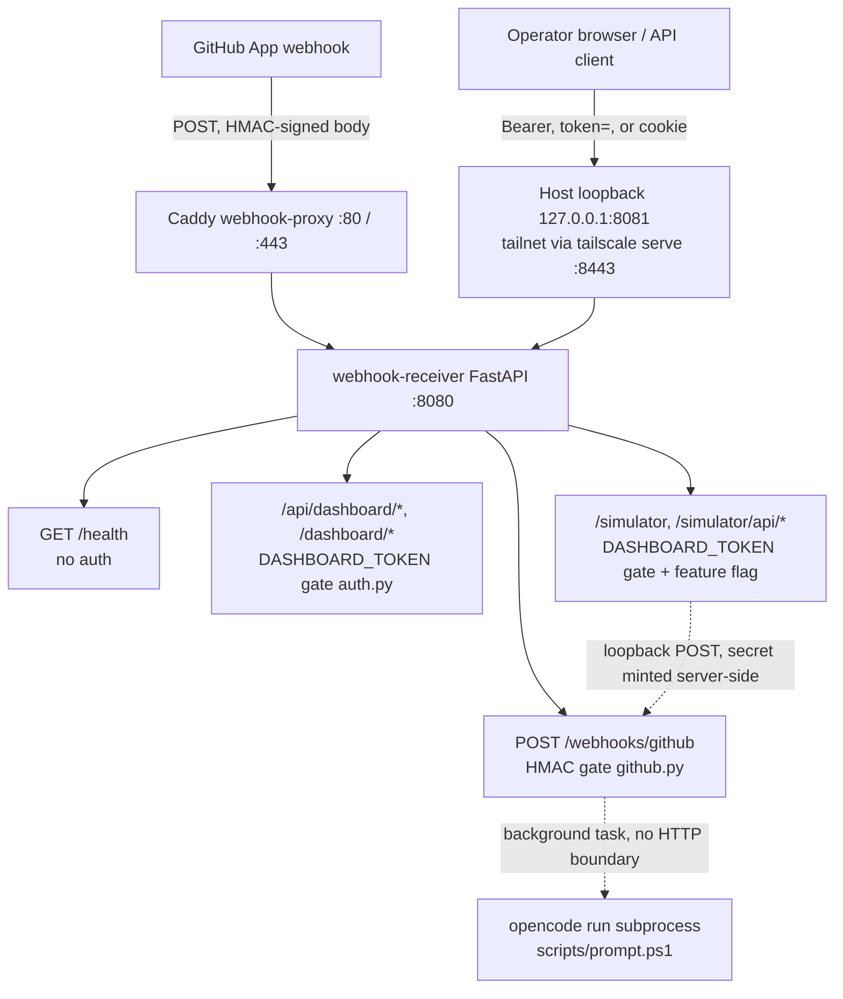

# API surface

`webhook-receiver` (FastAPI, internal port `8080`) exposes every HTTP route this runtime has. There is no separate API gateway or admin service — `webhook_receiver/app.py` builds one `FastAPI` app and mounts every router onto it. Two network paths reach that one app: Caddy on host `:80`/`:443`, which proxies **only** `/webhooks/github` and `/health` and `404`s everything else, and the receiver's loopback-only publish at `127.0.0.1:8081` (optionally tailnet-served on `:8443`), which carries the full app including the dashboard, its API, and the simulator.

The surface splits into route groups with **different, non-overlapping auth gates**. Getting the gate wrong for a given path is still a real risk: every router is mounted on the same listener, so the proxy's path allowlist keeps the dashboard and simulator off the public edge, while each route's own gate remains the layer that protects it on the loopback/tailnet path — this page is the map; [Security](../security.md) explains why each gate exists and what happens when its secret is unset.

## Trust boundary at a glance

`/webhooks/github` and the dashboard/simulator group are **independent trust boundaries with independent secrets** (`OS_WEBHOOK_SECRET` vs `DASHBOARD_TOKEN`). Presenting one does not satisfy the other — see [Webhook ingress and dashboard API](webhook-and-dashboard.md) for the exact checks.

## Route groups

| Group | Paths | Auth gate | Surface disabled when | Source |
|---|---|---|---|---|
| Health | `GET /health` | **None** | Never — always on | `webhook_receiver/app.py` |
| Webhook ingress | `POST /webhooks/github` | HMAC (`X-Hub-Signature-256`, `OS_WEBHOOK_SECRET`) | Never — `Settings.from_env()` raises if `OS_WEBHOOK_SECRET` is unset, so the process refuses to start | `webhook_receiver/app.py`, `webhook_receiver/github.py`, `webhook_receiver/filters.py` |
| Dashboard JSON API | `GET`/`POST /api/dashboard/*` | `DASHBOARD_TOKEN` (Bearer header, `?token=`, or cookie) | `DASHBOARD_TOKEN` unset → every route returns `404` (fail-closed) | `webhook_receiver/dashboard.py`, `webhook_receiver/auth.py` |
| Dashboard HTML pages | `GET /dashboard`, `/dashboard/bead/{id}`, `/dashboard/runs[/…]`, `/dashboard/events`, `/dashboard/webhooks` | Same `DASHBOARD_TOKEN` dependency as the JSON API | Same — `404` when unset | `webhook_receiver/dashboard.py` |
| `bvr` static pages bundle | `GET /dashboard/pages`, `/dashboard/pages/{file_path}` | Same `DASHBOARD_TOKEN` dependency | Same — `404` when unset | `webhook_receiver/dashboard.py` |
| Webhook simulator | `GET /simulator`, `GET /simulator/api/templates[/…]`, `POST /simulator/api/send` | `DASHBOARD_TOKEN`, but the *disabled* status is `401` (not `404`) | `WEBHOOK_ENABLE_SIMULATOR` not truthy → every route returns `404` regardless of token | `webhook_receiver/simulator.py`, `webhook_receiver/auth.py` |

Full route-by-route detail — headers, request/response shapes, every documented status code, and the filter/auth logic behind each gate — lives in [Webhook ingress and dashboard API](webhook-and-dashboard.md). `docs/openapi.json` is the generated OpenAPI schema (via `scripts/export-openapi.py`) and `docs/dashboard.md` is the hand-written dashboard API reference this page and the next one build on.

## Why two different disabled-statuses

`make_dashboard_token_dep` (`webhook_receiver/auth.py`) is parameterized per caller:

- The **dashboard** passes the defaults (`disabled_status=404`) so an unconfigured deployment leaks nothing — the surface looks like it doesn't exist.
- The **simulator** passes `disabled_status=401` with an actionable detail message, because `WEBHOOK_ENABLE_SIMULATOR=1` is itself an explicit opt-in; the simulator's *separate* `enabled` flag (not this dependency) is what returns `404` when the feature is off entirely.

Both paths use the same `hmac.compare_digest` constant-time comparison and the same token-extraction order (`Authorization: Bearer …` → `?token=` → `dashboard_token` cookie), so there is exactly one auth implementation to audit for both surfaces.

## Read next

- [Webhook ingress and dashboard API](webhook-and-dashboard.md) — every route, status code, and the admission/dispatch pipeline behind `/webhooks/github`.
- [Security](../security.md) — the trust-boundary rationale, direct-body sender allowlisting, and residual risks.
- [Webhook dispatch](../features/webhook-dispatch.md) — the admission-to-prompt pipeline in feature-level detail.
- [Observability](../features/observability.md) — what the dashboard's data actually represents.
- [Services](../services/index.md) — how `webhook-receiver` relates to `orchestratorservice` and `webhook-proxy`.
