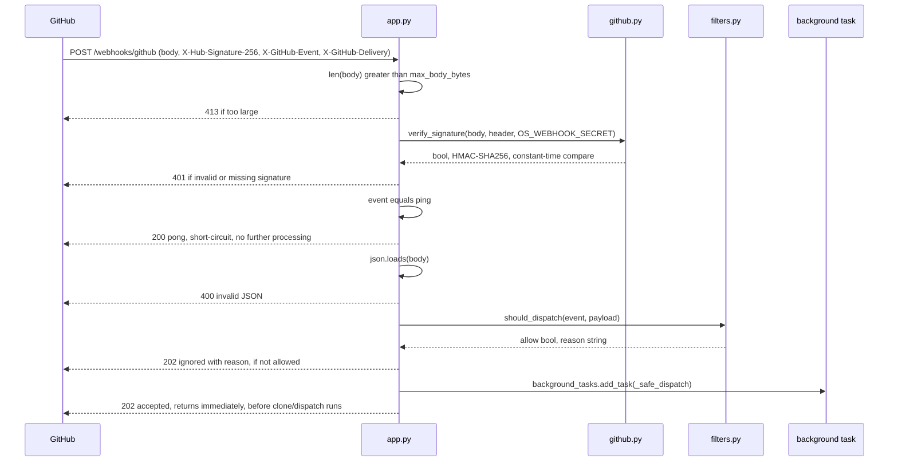

# Webhook ingress and dashboard API

Route-by-route detail for the two independently-gated surfaces introduced in [API surface](index.md): the signed GitHub webhook endpoint and the token-gated dashboard/simulator group.

## `POST /webhooks/github` — HMAC-gated ingress

Implemented in `webhook_receiver/app.py`. No dependency injection here — the checks are inline, in this exact order, so an early rejection never runs later logic:

### Signature verification

`webhook_receiver/github.py` implements `verify_signature`: it requires the header to start with `sha256=`, decodes the hex digest, recomputes HMAC-SHA256 over the raw body with `OS_WEBHOOK_SECRET`, and compares with `hmac.compare_digest` (constant-time). A missing header, a non-`sha256=` prefix, or a non-hex suffix all fail closed to `False` — none of them raise, so a malformed header cannot bypass the check via an exception path.

### Admission filter (`should_dispatch`)

`webhook_receiver/filters.py` is a hardcoded replica of the GitHub Actions `orchestrator-agent.yml` orchestrate-job `if:` guard — its purpose is to prevent an echo-loop where a dispatched agent's own comment re-triggers a webhook. It runs **after** signature verification and returns `(False, reason)` on the first failing check:

1. `event` must be `issues` (all other event types are ignored).
2. `action` must be `labeled`.
3. `sender.login` must not look like a bot (`*[bot]` or `*-bot` suffix, case-insensitive) — anti-loop.
4. `label.name` must be workflow-relevant: prefixed with `orchestration:` or `gh-issue-tracking:`, or exactly `implementation:ready`/`implementation:complete`.
5. **Direct-body special case** — if the label is exactly `gh-issue-tracking:direct-body`, the sender's login (lowercased) must appear in the `DIRECT_BODY_ALLOWED_SENDERS` env var (comma-separated). An empty/unset allowlist rejects **every** sender — this path is fail-closed, not fail-open.

A rejected delivery still gets `202 {"status":"ignored", "reason": "<why>"}` — the webhook was received and acknowledged, just not dispatched. This is deliberately not a `4xx`: GitHub does not treat `202` as a delivery failure, so a filtered-but-valid webhook does not trigger GitHub's redelivery/backoff behavior.

### Why direct-body is gated separately

`gh-issue-tracking:direct-body` runs the **entire issue body verbatim** as the orchestrator prompt, with no workflow-name parsing or argument boundary. The resulting run inherits `GH_ORCHESTRATION_AGENT_TOKEN` and `--auto` (auto-approved tool permissions). Without the allowlist, anyone with label-apply rights on the repo could use this label to make the orchestrator execute arbitrary instructions with full agent privileges — a confused-deputy escalation from "can label an issue" to "can run privileged automation." `DIRECT_BODY_ALLOWED_SENDERS` closes that gap by checking the webhook payload's `sender.login` against a trusted set; see [Security](../security.md#agent-capability-boundary).

### Post-acceptance: background dispatch

Once accepted, the handler returns `202` **before** any git clone or agent dispatch happens — all of that runs in a FastAPI `BackgroundTasks` callback (`_safe_dispatch` in `app.py`), so a slow clone never blocks the HTTP response or GitHub's delivery timeout. `_safe_dispatch`:

1. Derives a filesystem-safe project slug from `repository.full_name` (`_derive_project_slug`, allowlist regex `^[A-Za-z0-9][A-Za-z0-9._-]*$`).
2. Validates `repository.clone_url` is `https://` with a non-empty host (`_validate_clone_url`) — rejects `file://`/`ssh://`/`http://` to prevent SSRF/local-file-read via a crafted payload.
3. Clones or syncs the project workspace (`workspace.py`; see [Security](../security.md#inputs)) — falls back to a fresh local `git init` if there is no valid clone URL, so `BeadsLoop`'s `git worktree add` never fails on a missing `.git`.
4. Refuses to dispatch if the resolved project path equals the workspace root (`os.path.realpath` guard) — a defensive check against `_derive_project_slug` ever resolving to the base directory itself.
5. Calls `runner.dispatch_to_opencode`, which writes the prompt/manifest files, starts `scripts/prompt.ps1` as a subprocess, and starts the idle watchdog (`watchdog.py`) plus a completion watcher thread that posts failure/zero-work/incomplete comments back to the triggering issue via `gh issue comment` (using `GH_ORCHESTRATION_AGENT_TOKEN`, falling back to `GITHUB_TOKEN`).

None of this background work is visible in the HTTP response — the `202` body only carries `delivery_id`, `event`, and (on `accepted`) nothing about clone/dispatch outcome. Dispatch outcome is only observable via the dashboard's `/api/dashboard/runs` and `/api/dashboard/webhooks` endpoints, or the receiver's own logs.

## Dashboard and simulator auth (`auth.py`)

Both surfaces share one dependency factory, `make_dashboard_token_dep(token, *, disabled_status, disabled_detail)` in `webhook_receiver/auth.py`:

- If `token` (the configured `DASHBOARD_TOKEN`) is falsy, every request to the gated router raises `disabled_status` — `404` for the dashboard, `401` for the simulator (see [API surface](index.md#why-two-different-disabled-statuses)).
- Otherwise the request must present a token via, in order: `Authorization: Bearer <token>` header, `?token=` query parameter, or `dashboard_token` cookie. Comparison is `hmac.compare_digest` — no early-exit timing leak.
- A mismatch or missing token raises `401 Invalid or missing dashboard token`.
- `persist_token_cookie` writes a valid `?token=` as an `HttpOnly`, `SameSite=Strict` cookie (`Secure` when the request came in over HTTPS), so a browser tab opened with `?token=...` keeps working for subsequent same-origin `fetch()`/`EventSource` calls without repeating the query param.

## Dashboard JSON API (`/api/dashboard/*`)

All routes below require the token dependency at the router level (`dependencies=[Depends(auth)]` in `create_dashboard_router`). Backing data comes from the `br`/`bvr` CLI (TTL-cached 5s, `bvr` pages bundle 60s), the in-process `BeadsLoop`, the in-memory `EventStore`, and per-run manifest/log files under the receiver's log directory.

| Method | Path | Status codes | Notes |
|---|---|---|---|
| `GET` | `/api/dashboard/overview` | `200` | Counts + `BeadsLoop` status; accepts `?project=` |
| `GET` | `/api/dashboard/beads` | `200` | All beads enriched with UI status/retry/elapsed |
| `GET` | `/api/dashboard/beads/{bead_id}` | `200`, `400` (invalid ID shape), `404` (not found) | |
| `GET` | `/api/dashboard/graph` | `200` | Dependency DAG for graph rendering |
| `GET` | `/api/dashboard/active` | `200` | Beads currently being processed |
| `GET` | `/api/dashboard/beads/{bead_id}/logs` | `200`, `400` | `tail` clamped to `[1, 2000]`, default 200 |
| `GET` | `/api/dashboard/events` | `200` | `limit` clamped to `> 0`, default 100 |
| `GET` | `/api/dashboard/events/stream` | SSE stream, `503` | Server-Sent Events; capped at **10 concurrent subscribers** |
| `GET` | `/api/dashboard/runs` | `200` | Per-dispatch manifest listing, newest-first, capped at 100 |
| `GET` | `/api/dashboard/runs/{stem}/logs` | `200`, `400` (invalid stem) | `tail` clamped to `[1, 4000]`, default 400 |
| `GET` | `/api/dashboard/runs/{stem}/narrative` | `200`, `400` | Synthesized timeline from `run_narrative.py` |
| `GET` | `/api/dashboard/run-events` | `200`, `400` | Typed tool-stream glyph events; `?stem=` optional (defaults to newest) |
| `GET` | `/api/dashboard/webhooks` | `200` | Recent signed deliveries (`WebhookStore`); default limit 500 |
| `GET` | `/api/dashboard/webhooks/{delivery_id}` | `200`, `404` (store disabled or not found) | |
| `POST` | `/api/dashboard/pages/refresh` | `200` (`{"ok": false, ...}` on a non-fatal failure) | Force-regenerates the `bvr` static-pages bundle |

Path-safety helpers guard every user-supplied identifier before it touches the filesystem or a subprocess: `_valid_bead_id` (alnum + `-`/`_` only) and `_valid_run_stem` (alnum + `-`/`_` only) both reject anything else with `400` rather than passing it to `glob`/`Path` construction. `bead_logs` additionally applies `glob.escape` to the (already-validated) bead ID before globbing.

## Dashboard HTML pages and the `bvr` pages bundle

| Method | Path | Notes |
|---|---|---|
| `GET` | `/dashboard` | Main page |
| `GET` | `/dashboard/bead/{bead_id}` | `400` on invalid ID |
| `GET` | `/dashboard/runs`, `/dashboard/runs/{stem}` | `400` on invalid stem |
| `GET` | `/dashboard/events` | Events timeline page |
| `GET` | `/dashboard/webhooks` | Webhook deliveries page |
| `GET` | `/dashboard/pages` | `307` redirect to `/dashboard/pages/` |
| `GET` | `/dashboard/pages/{file_path}` | Serves the generated `bvr` bundle; `200` with a "not initialized" placeholder page if `.beads/` does not exist yet |

`pages_serve` resolves `file_path` inside the bundle root using `os.path.realpath` + a `startswith(root + os.sep)` prefix guard (the CodeQL `py/path-injection` `SafeAccessCheck` pattern), rejects embedded NUL bytes, and 404s anything that resolves outside the bundle or is not a regular file. This is the one route in the dashboard group that serves an arbitrary relative path from a client-controlled string, so the containment check is load-bearing — see [Security](../security.md#inputs).

## Webhook simulator (`/simulator`, `/simulator/api/*`)

`webhook_receiver/simulator.py`. When `WEBHOOK_ENABLE_SIMULATOR` is not truthy, `create_simulator_router` returns a router where **every** path (including unknown sub-paths, via a catch-all) raises `404 Simulator disabled` — the feature does not exist at all, independent of any token. When enabled, the real router requires the same `DASHBOARD_TOKEN` dependency as the dashboard, but with `disabled_status=401`.

| Method | Path | Status codes | Notes |
|---|---|---|---|
| `GET` | `/simulator` | `200`, `401`/`404` (gate) | Serves `simulator.html`; persists the token cookie |
| `GET` | `/simulator/api/templates` | `200` | `?safe_only=` filters to ping-only templates |
| `GET` | `/simulator/api/templates/{event}` | `200`, `404` (unknown event), `400` (bad params) | Returns a pre-built payload for the event |
| `POST` | `/simulator/api/send` | `200` (outer), `400`, `500`, `502` | See below |

`simulator_send` is the one endpoint that touches the webhook secret: it reads `OS_WEBHOOK_SECRET` from the **server process environment** (never from the request), computes the HMAC signature with `github.compute_signature`, and forwards the signed payload over loopback (`http://127.0.0.1:{port}/webhooks/github`) — so `OS_WEBHOOK_SECRET` never reaches the browser. Its own HTTP response is **always `200`**; the *forwarded* webhook's status code and body are nested inside the JSON payload (`{"status": <forwarded_status>, "body": <forwarded_body>}`). A `400` from this endpoint means the simulator request itself was malformed (missing `event`/`payload`, invalid JSON); `500` means `OS_WEBHOOK_SECRET` is unset server-side; `502` means the loopback POST to `/webhooks/github` failed at the transport level (e.g. the receiver is mid-restart).

## Status code reference (both surfaces)

| Code | Meaning here |
|---|---|
| `200` | Success, or ping ack, or an intentionally non-error placeholder (e.g. "beads not initialized" page) |
| `202` | Webhook accepted-and-dispatched, or accepted-but-filtered (`status: "ignored"`) — both are `202`, differentiated by body |
| `307` | `/dashboard/pages` → `/dashboard/pages/` redirect (relative-asset resolution requires the trailing slash) |
| `400` | Invalid JSON body, or a client-supplied identifier (bead ID, run stem, event name) fails its allowlist/shape check |
| `401` | Invalid/missing webhook HMAC signature; invalid/missing `DASHBOARD_TOKEN`; simulator disabled-by-token-absence |
| `404` | Dashboard disabled (no `DASHBOARD_TOKEN`); simulator feature flag off; resource not found (bead, run, webhook delivery, bundle file) |
| `413` | Webhook body exceeds `WEBHOOK_MAX_BODY_BYTES` (default 25 MiB) |
| `500` | Simulator: `OS_WEBHOOK_SECRET` unset server-side |
| `502` | Simulator: loopback forward to `/webhooks/github` failed |
| `503` | Dashboard SSE stream at its 10-subscriber cap |

## Key source

| File | Role |
|---|---|
| `webhook_receiver/app.py` | `/health`, `/webhooks/github`, router wiring, background dispatch, project-workspace derivation |
| `webhook_receiver/github.py` | HMAC signature compute/verify |
| `webhook_receiver/filters.py` | `should_dispatch` admission gate, direct-body sender allowlist |
| `webhook_receiver/auth.py` | Shared `DASHBOARD_TOKEN` dependency + cookie persistence |
| `webhook_receiver/dashboard.py` | `/api/dashboard/*`, `/dashboard/*` HTML pages, `bvr` bundle serving |
| `webhook_receiver/simulator.py` | `/simulator`, `/simulator/api/*`, server-side signing |
| `webhook_receiver/workspace.py` | Project slug/path containment, clone/sync, worktree lifecycle |
| `webhook_receiver/runner.py` | Dispatch subprocess, manifests, failure/zero-work/incomplete GitHub comments |
| `webhook_receiver/watchdog.py` | Idle/error/ceiling/permission-deadlock kill logic for a dispatched run |
| `webhook_receiver/config.py` | `Settings.from_env()` — every env var this surface reads, and its fail-closed/fail-open defaults |
| `docs/openapi.json` | Generated OpenAPI schema for every route above |
| `docs/dashboard.md` | Hand-written dashboard API reference this page expands on |

## Read next

- [API surface](index.md) — the route-group overview and trust-boundary diagram this page details.
- [Security](../security.md) — why each gate exists, and residual risks (shared server log, best-effort secret redaction, token-in-URL exposure).
- [Webhook dispatch](../features/webhook-dispatch.md) — the admission-to-prompt pipeline in feature-level detail.
- [Observability](../features/observability.md) — how dashboard data is produced and what its status values mean operationally.
