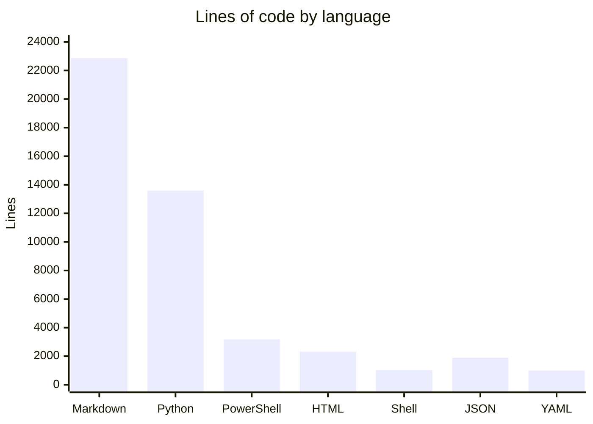

# By the numbers

Data collected on 2026-07-31.

This page summarizes the repository's size, composition, and recent activity, computed directly from `git ls-files`, `wc -l`, `du`, and `git log` against the working tree at `/home/nam20485/src/github/nam20485/orchestrator-service`. For a narrative description of what these files do and how the services fit together, see the forthcoming [`overview/architecture.md`](overview/architecture.md) page.

## Size by language

The repository tracks 261 files in git. Line counts (via `wc -l` over `git ls-files`) by extension:

| Language / extension | Files | Lines |
|---|---|---|
| Markdown (`.md`) | 127 | 22,863 |
| Python (`.py`) | 45 | 13,592 |
| PowerShell (`.ps1`) | 23 | 3,173 |
| HTML (`.html`) | 7 | 2,319 |
| Shell (`.sh`) | 17 | 1,039 |
| JSON / JSONC (`.json`, `.jsonc`) | 9 | 1,899 |
| YAML (`.yml`, `.yaml`) | 12 | 990 |

Total tracked content on disk is **~2.2 MiB** (2,290,328 bytes, `git ls-files -z | xargs -0 du -cb`).

## Source, test, and config counts

- **Application source (Python):** 24 non-test `.py` files, 5,821 lines, concentrated in `webhook_receiver/` (e.g. `webhook_receiver/app.py`, `webhook_receiver/runner.py`, `webhook_receiver/beads_loop.py`, `webhook_receiver/dashboard.py`, `webhook_receiver/watchdog.py`) plus `scripts/export-openapi.py`.
- **Python tests:** 21 `test_*.py` files under `tests/`, 7,460 lines — test code (7,460 lines) actually exceeds application source (5,821 lines).
- **PowerShell Pester tests:** 7 `*.Tests.ps1` files under `test/`.
- **Bash test scripts:** 12 `.sh` files under `test/` (e.g. `test/test-docker-entrypoint.sh`, `test/test-compose-config.sh`).
- **Automation/ops scripts (PowerShell + Bash):** 23 `.ps1` files (`scripts/*.ps1`, `image/...`) and 17 `.sh` files repo-wide (3,173 + 1,039 lines).
- **Configuration:** 22 files (`.yml`/`.yaml`/`.json`/`.jsonc`/`.toml`) totaling 2,889 lines, including `compose.yaml`, `compose.development.yaml`, `compose.https.yaml`, `pyproject.toml`, and `docs/openapi.json`.
- **Documentation:** 127 Markdown files, 22,863 lines — by far the largest content category, dominated by `plan_docs/` (49 files) planning/spec documents and `image/.opencode/` agent instruction Markdown.

## 90-day activity and churn

The repository's entire commit history (356 commits) falls inside the last 90 days: the first commit is dated 2026-05-27 and the most recent 2026-07-31, per `git log --reverse --format=%ad --date=short`.

- **Commits (90d / all-time):** 356
- **Files touched (sum across commits):** 1,159 (`git log --since="90 days ago" --shortstat`)
- **Lines added:** 62,589
- **Lines removed:** 10,800
- **Net growth:** +51,789 lines

Most-churned files (insertions + deletions, last 90 days):

| File | Churn (lines) |
|---|---|
| `image/.opencode/agents/agent-instructions-expert.md` | 1,492 |
| `webhook_receiver/dashboard.py` | 1,468 |
| `tests/test_dashboard.py` | 1,424 |
| `docs/openapi.json` | 1,237 |
| `tests/test_beads_loop.py` | 1,114 |
| `webhook_receiver/static/dashboard.html` | 1,111 |
| `webhook_receiver/runner.py` | 1,064 |
| `tests/test_watchdog.py` | 1,061 |
| `tests/test_runner.py` | 1,052 |

## Bot-attributed commit share (lower bound)

Git author identity almost universally shows a single human author (`Nathan Miller`, 355/356 commits), with one commit authored by `dependabot[bot]`. However, commit trailers reveal AI-agent co-authorship that the author field alone does not capture:

- 1 commit authored directly by `dependabot[bot]`.
- 48 commits carry a `Co-authored-by:` trailer naming an AI agent — 47 `Co-authored-by: Cursor <cursoragent@cursor.com>` and 1 `Co-authored-by: factory-droid[bot] <...>`.
- **At least 49 of 356 commits (~14%) are bot/agent-attributed**, counting the dependabot author commit plus all distinct commits with an agent `Co-authored-by:` trailer. This is a **lower bound**: commits made by agents under the human author identity without a co-author trailer are not detectable from git metadata alone.

## Complexity: large files and directory sizes

Largest tracked files by line count (excluding `uv.lock`):

| File | Lines |
|---|---|
| `tests/test_dashboard.py` | 1,268 |
| `docs/openapi.json` | 1,235 |
| `tests/test_runner.py` | 1,020 |
| `tests/test_watchdog.py` | 1,003 |
| `webhook_receiver/dashboard.py` | 948 |
| `tests/test_beads_loop.py` | 940 |
| `webhook_receiver/static/dashboard.html` | 911 |
| `webhook_receiver/runner.py` | 850 |
| `webhook_receiver/watchdog.py` | 808 |
| `webhook_receiver/beads_loop.py` | 738 |

Directory sizes for tracked content (`git ls-files -z | xargs -0 du -cb`, top-level, bytes):

| Directory | Size |
|---|---|
| `plan_docs/` | 583,664 |
| `webhook_receiver/` | 357,778 |
| `tests/` | 276,006 |
| `image/` | 239,364 |
| `docs/` | 127,705 |
| `traces/` | 126,031 |
| `scripts/` | 99,190 |
| `test/` | 61,758 |
| `.cursor/` | 42,716 |
| `.github/` | 23,518 |

`plan_docs/` is the largest tree by both file count (49 files) and bytes, reflecting the project's spec/planning-heavy workflow; `webhook_receiver/` is the largest application-code tree.

Note: a top-level, git-ignored `.opencode/` directory containing `node_modules/` (untracked local workspace scaffolding) was excluded from all counts above since it is not part of the tracked repository.
