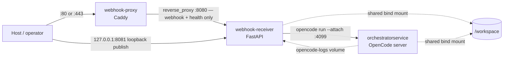

# Deployment

`orchestrator-service` deploys as a three-container Docker Compose stack: an OpenCode server, a FastAPI webhook receiver, and a Caddy reverse proxy. There is no orchestration platform (Kubernetes, Nomad, etc.) — this is a single-host deployment by design, and the trade-offs of that choice are called out at the end of this page.

## Source files

| File | Purpose |
| --- | --- |
| `compose.yaml` | Base (production) stack — pulls `:main-latest` images from GHCR. |
| `compose.development.yaml` | Standalone dev stack — pulls `:development-latest` images; duplicates every service/env var (not layered on `compose.yaml`). |
| `compose.build.yaml` | Local-build overlay — adds `build:` contexts, sets `pull_policy: never`. |
| `compose.https.yaml` | TLS overlay — adds host `443:443` for Caddy automatic HTTPS. |
| `Dockerfile` | `orchestratorservice` image (OpenCode server, agent tooling). |
| `Dockerfile.webhook` | `webhook-receiver` image (FastAPI app, `br`/`bvr`, `gh`, `pwsh`). |
| `Dockerfile.beads` | Canonical Beads (`br`/`bvr`) builder; published separately so Rust compiles once and both other images `COPY --from` it. |
| `deploy/caddy/Dockerfile` | `webhook-proxy` image (Caddy + non-root `caddy` user + `setcap`). |
| `deploy/caddy/Caddyfile` | Reverse-proxy config: the `{$WEBHOOK_SITE_ADDRESS}` site proxies only `/webhooks/github` and `/health` to `webhook-receiver:8080` via `handle` blocks, with a `404` catch-all for every other path. Copied into the image by `deploy/caddy/Dockerfile`, so edits need an image rebuild. |
| `deploy/caddy/caddy-entrypoint.sh` | Root entrypoint: chowns `/data`/`/config` on first mount, drops to `caddy` via `su-exec`. |
| `scripts/docker-entrypoint.sh` | `orchestratorservice` entrypoint: writes `auth.json` from env vars, self-heals a corrupt `memory.jsonl`, drops to `app` via `gosu`. |
| `scripts/webhook-entrypoint.sh` | `webhook-receiver` entrypoint: chowns the runner-log bind mount, drops to `app` via `gosu`. |
| `scripts/dc.ps1` | Thin `docker compose` wrapper that selects the image tag via `IMAGE_REF` (`main`/`development`/`nam20485`) and layers `compose.build.yaml` when `--build` is passed. |
| `docs/deployment-compose.md` | Authoritative deployment reference this page is derived from. |

## The three services



| Service | Image | Port | Role |
| --- | --- | --- | --- |
| `orchestratorservice` | `ghcr.io/.../orchestrator-service` | `4099` | OpenCode server (`opencode serve`) hosting agent sessions. |
| `webhook-receiver` | `ghcr.io/.../orchestrator-service/webhook` | `8080` (internal); published host `127.0.0.1:8081` | Validates GitHub webhooks, runs the `BeadsLoop`, serves `/health` and the dashboard. |
| `webhook-proxy` | `ghcr.io/.../orchestrator-service/caddy` | `80` / `443` | Caddy reverse proxy (TLS edge); proxies only `/webhooks/github` and `/health`. |

`orchestratorservice` and `webhook-receiver` share a host directory via a bind mount at `/workspace` (`WORKSPACE_DIR`) — that is where agent sessions run and `.beads/` DAG state lives. Two required env vars gate every mode: `WORKSPACE_DIR` and `OPENCODE_SERVER_PASSWORD`.

## Compose modes (layering)

There are four compose files. Two are standalone; two are overlays layered on top of a base.

| Mode | Command | Notes |
| --- | --- | --- |
| Dev (pull images) | `docker compose -f compose.development.yaml up -d` | Standalone; self-contained, does **not** layer on `compose.yaml`. |
| Dev (build from source) | `docker compose -f compose.development.yaml -f compose.build.yaml up -d --build` | Use when editing Dockerfiles or image-baked app code. |
| Prod (HTTP only) | `docker compose -f compose.yaml up -d` | Publishes host `:80` (Caddy: webhook + health only) and `127.0.0.1:8081` (receiver: loopback-only, serves the dashboard). |
| Prod (HTTPS) | `COMPOSE_FILE=compose.yaml:compose.https.yaml docker compose up -d` | Adds host `:443`, Caddy automatic Let's Encrypt. |

Compose merges files left-to-right; later files override/extend earlier ones. Because `compose.development.yaml` fully re-declares every service and its `environment:` block rather than layering on `compose.yaml`, a new environment variable must be added to **both** files or dev will silently miss it.

Local webhook testing tunnels public HTTPS to host **:80** (Caddy), not the receiver's internal **:8080** — via Tailscale Funnel (`tailscale funnel 80`, stable `*.ts.net` URL) or ngrok. Funnel and `compose.https.yaml` both bind host `:443`, so use `compose.yaml` alone with Funnel active. Because that Caddy site proxies only `/webhooks/github` and `/health`, the tunnel does not reach the dashboard, its API, or the simulator — they `404` at the edge; use `http://127.0.0.1:8081/dashboard` on the host, or `tailscale serve --bg --https=8443 localhost:8081` for tailnet peers (`docs/dashboard.md`). Never the positional form `tailscale serve --bg 8081`: it mounts on the default served port `443`, the same handler the funnel points at `127.0.0.1:80`, and would re-aim the public funnel at the dashboard while breaking webhook delivery.

## How images are published

`.github/workflows/docker-publish.yml` builds and pushes four images (`orchestrator-service`, `webhook`, `caddy`, `beads`) on pushes to `main`/`development` and on `v*.*.*` tags, tagging `<branch>-latest` (+ `<branch>-<run_number>`). All images are cosign-signed. The `beads` (`Dockerfile.beads`) image is published first and overrides the `rust-builder` stage in the other two Dockerfiles via `build-contexts`, so the Beads Rust toolchain compiles exactly once per pipeline run instead of once per image.

`compose.yaml` resolves to `:main-latest`; `compose.development.yaml` resolves to `:development-latest`. Promotion is: merge/tag → workflow publishes → `pull_policy: always` picks up the new image on the next `up`.

## Non-root design

All three containers run as a non-root user at runtime, but each image starts as **root** so its entrypoint can fix ownership on first mount before dropping privileges:

- `orchestratorservice` / `webhook-receiver` — `scripts/docker-entrypoint.sh` / `scripts/webhook-entrypoint.sh` run as root, chown any root-owned bind mounts or named volumes to `app` (UID/GID 1000 by default, baked in at **build** time via `ARG APP_UID`/`APP_GID`), then `exec gosu app "$@"`.
- `webhook-proxy` — `deploy/caddy/caddy-entrypoint.sh` chowns `/data`/`/config` to `caddy` (a system user created in `deploy/caddy/Dockerfile`, since the pinned upstream `caddy:2.10.0-alpine` ships no non-root user), then `exec su-exec caddy "$@"`. Privileged-port binding (`:80`/`:443`) survives the drop via a file capability baked at build time (`setcap cap_net_bind_service=+ep /usr/bin/caddy`) plus compose `cap_add: CAP_NET_BIND_SERVICE` — `no-new-privileges` is deliberately **not** set on this service because it would block file capabilities at `execve`.

Because the `app`/`caddy` UIDs are baked in at build time, compose sets **no** runtime `user:` override — that would bypass the root→drop entrypoint and start the container as an arbitrary UID that cannot write `/home/app` or `/app/.memory`. To run as a different host UID you must **rebuild**:

```bash
docker compose -f compose.yaml -f compose.build.yaml build \
  --build-arg APP_UID=$(id -u) --build-arg APP_GID=$(id -g)
```

A one-time host-side migration (`sudo chown -R $(id -u):$(id -g) "$WORKSPACE_DIR"`) is needed for pre-existing root-owned workspace files; this cannot be done from inside a non-root container.

`orchestratorservice`/`webhook-receiver` also apply `security_opt: no-new-privileges:true`, `cap_drop: ALL`, and add back only the specific capabilities their entrypoints need (`SETUID`/`SETGID` for the `gosu` drop, `CHOWN`/`DAC_OVERRIDE` for the first-mount fixup).

## Persistence

| Mount | Kind | Written by | Contents |
| --- | --- | --- | --- |
| `/workspace` (`WORKSPACE_DIR`) | Host bind mount | Both `orchestratorservice` and `webhook-receiver` | Downstream project clones, `.beads/` DAG state, git worktrees. |
| `opencode-memory` → `/app/.memory` | Named volume | `orchestratorservice` | The single-writer MCP `memory-graph` knowledge graph (`memory.jsonl`); self-healed on startup if unparseable. |
| `opencode-logs` → `/home/app/.local/share/opencode/log` (server) and `/var/log/opencode-server:ro` (receiver) | Named volume, shared | `orchestratorservice` writes, `webhook-receiver` reads read-only | Lets the receiver's idle watchdog observe server-side activity (e.g. subagent delegation) without making the opencode client's own log directory read-only. |
| `${WEBHOOK_LOG_DIR:-./traces/runner}` → `/tmp/orchestrator-webhook` | Host bind mount | `webhook-receiver` | Prompt/stdout/stderr/manifest run artifacts and the webhook store — see [How to monitor → Logging](how-to-monitor/logging.md). |
| `caddy_data`, `caddy_config` | Named volumes | `webhook-proxy` | Caddy's ACME certificates and runtime config. |

None of `/workspace`, `opencode-memory`, or `/tmp/orchestrator-webhook` are backed up automatically — an operator running this in production is responsible for backing up `WORKSPACE_DIR` and the named volumes.

## Health checks

| Service | Mechanism | Command |
| --- | --- | --- |
| `orchestratorservice` | TCP probe (the server requires `OPENCODE_SERVER_PASSWORD`, so an authenticated HTTP probe isn't used) | `exec 3<>/dev/tcp/127.0.0.1/4099` |
| `webhook-receiver` | HTTP probe | `curl -fsS http://127.0.0.1:8080/health` |
| `webhook-proxy` | Local admin API probe (not the proxied site, since `WEBHOOK_SITE_ADDRESS` may be a hostname needing DNS/ACME not reachable in every environment) | `wget -q -O- http://127.0.0.1:2019/config/` |

`webhook-receiver` additionally has a compose-level `depends_on: orchestratorservice: condition: service_healthy`, so it will not start dispatching work until the OpenCode server's health check passes.

## Update limitations

This is a single-host deployment with no rolling-update mechanism:

- **No rolling / zero-downtime deploys.** `docker compose pull && docker compose up -d` recreates containers in place; each recreated container has brief downtime.
- **No high availability or horizontal scaling.** One Caddy, one webhook receiver, one OpenCode server, one `/workspace`. `EventStore` (in-process ring buffer) and bead state (on-disk under `/workspace`) both pin the deployment to a single node.
- **No first-class staging/multi-environment promotion.** The `development` branch/image tag is the closest analog; promoting further means running the same Compose stack on another host.
- **No health-gated rollout or autoscaling.** Docker's `restart: always`/`unless-stopped` will restart a crashed container, but there is no scheduler rebalancing or readiness-gated traffic shift.

A Kubernetes + IaC path would address these gaps; see `plan_docs/.deferred/prod-deployment/prod-deployment-plan.md` for the deferred trade-off analysis. It is **not** implemented.

## Related pages

- [How to monitor](how-to-monitor/index.md) — dashboard, run artifacts, and the absence of metrics/tracing/alerting.
- [How to monitor → Logging](how-to-monitor/logging.md) — where run logs live and how to read them.
- [Architecture](overview/architecture.md) — runtime layers and data paths.
