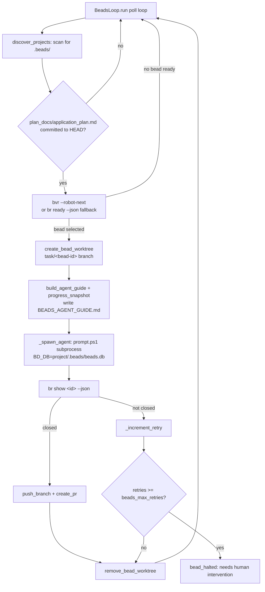

# Beads execution

Active contributors: Nathan Miller

## Purpose

Beads execution is the background daemon that drains a project's Beads dependency graph one task ("bead") at a time. For every discovered project it selects the highest-impact unblocked bead, builds an isolated Git worktree and branch for it, spawns an agent against that worktree with durable project context injected, verifies completion via `br show`, and pushes/opens a PR on success — retrying (and eventually halting) on failure.

## Layout

- `webhook_receiver/beads_loop.py` — `BeadsLoop`, the polling thread: project discovery, bead selection (`bvr --robot-next` then `br ready` fallback), worktree lifecycle, agent spawn, retry/halt bookkeeping, and dashboard-facing read-only state accessors.
- `webhook_receiver/bead_context.py` — pure, unit-testable helpers that build the durable `BEADS_AGENT_GUIDE.md` guide and the volatile per-bead progress snapshot injected into the agent prompt.
- `webhook_receiver/workspace.py` — multi-project workspace layout: project discovery (`.beads/` subdirectories), clone/sync, per-bead worktree create/remove, and `push_branch`/`create_pr`.
- `webhook_receiver/runner.py` — supplies `_prompt_script_invocation` and `_stream_to_logger_and_file`, reused by `BeadsLoop._spawn_agent` so bead agents launch through the same `scripts/prompt.ps1` path as webhook dispatches.
- `webhook_receiver/__main__.py` — starts `BeadsLoop.run()` on a daemon thread when `Settings.beads_enabled` is true, sharing the process's `EventStore`.
- `webhook_receiver/config.py` — `Settings.beads_poll_interval`, `beads_max_retries`, `beads_workspace_root`, `beads_enabled`.

## Key abstractions

| Abstraction | Where | Role |
| --- | --- | --- |
| `BeadsLoop` | `webhook_receiver/beads_loop.py` | Owns the poll loop (`run`/`_scan_and_process`), per-project processing (`_poll_and_process_project`), and thread-safe state (`_active_beads`, `_retry_state`, `_halted_beads`, `_bead_start_times`, `_bead_projects`) exposed read-only via properties and `state_for_project`. |
| `discover_projects(base_dir)` | `webhook_receiver/workspace.py` | Scans `BEADS_WORKSPACE_ROOT` for subdirectories containing `.beads/`; warns once on the legacy single-project layout. |
| `_plan_tracked(project_root)` | `webhook_receiver/beads_loop.py` | Gates dispatch on `plan_docs/application_plan.md` being **committed** to `HEAD` (via `git cat-file -e`) — a per-bead worktree only ever contains committed content, so a staged-but-uncommitted plan would silently be missing from every bead agent. |
| `_get_next_bead` / `_get_next_bead_bvr` / `_get_ready_beads` / `_select_next_bead` | `webhook_receiver/beads_loop.py` | Selection order: `bvr --robot-next --format json` (graph-aware) first; on `FileNotFoundError`/`CalledProcessError`/empty output, falls back to `br ready --json` plus a min-priority sort. |
| `create_bead_worktree` / `remove_bead_worktree` | `webhook_receiver/workspace.py` | `git worktree add -b task/<bead-id> <project>/.worktrees/<bead-id> <base-branch>`; auto-detects the base branch via `git symbolic-ref` unless one is passed. Removal force-removes the worktree and best-effort deletes the branch. |
| `BeadsRunner` / `build_agent_guide` / `write_context_files` / `progress_snapshot` | `webhook_receiver/bead_context.py` | An injectable `br`/`bvr` callable type plus pure functions: `build_agent_guide` assembles the plan overview + `TOOLING_REFERENCE` into `BEADS_AGENT_GUIDE.md`/`AGENTS.md` (never clobbering an existing `AGENTS.md`); `progress_snapshot` reports closed/open counts and this bead's direct blockers via `br graph --all --json`. |
| `_build_bead_prompt` / `_spawn_agent` | `webhook_receiver/beads_loop.py` | Assembles the agent prompt (task id/title/description + guide pointer + progress snapshot + prior-failure warning), writes it to a `bead-<id>-*.md` file, launches the subprocess with `BD_DB` pointed at the project's `beads.db`, and streams stdout/stderr to per-bead log files. |
| `_check_bead_status` | `webhook_receiver/beads_loop.py` | Queries `br show <id> --json` after the agent exits; any parse/shape failure returns `"unknown"` with a WARNING (never a silent dead end). |
| Retry/halt state | `webhook_receiver/beads_loop.py` | `_increment_retry` truncates stored failure logs to the last 3000 chars; a bead that exceeds `Settings.beads_max_retries` is added to `_halted_beads` and emits `bead_halted` instead of being retried indefinitely. |

## Data flow

## Integrations

- **`br` / `bvr` CLI** — the sole interface to the Beads DAG. Every call goes through `_run_beads_cmd` (`RUST_LOG=error` for clean output) or the injectable `BeadsRunner` in `bead_context.py`; `NOT_INITIALIZED` stderr is treated as a normal idle state, not an error.
- **Git worktrees** — `workspace.create_bead_worktree`/`remove_bead_worktree` isolate each bead's working tree so concurrent beads never share files; `.worktrees/` is appended to `.git/info/exclude` (never the committed `.gitignore`).
- **`scripts/prompt.ps1` / OpenCode server** — bead agents are spawned exactly like webhook dispatches, reusing `runner._prompt_script_invocation`, so both features share one subprocess-launch contract.
- **`gh pr create`** — `workspace.create_pr` opens the pull request for a closed bead's branch after `push_branch`; both are best-effort (a push/PR failure is logged but does not re-fail the already-closed bead).
- **`EventStore`** — emits `bead_picked_up`, `agent_spawned`, `agent_completed`, `bead_closed`, `bead_failed`, `bead_halted`, consumed by the [Observability](observability.md) dashboard and event feed.
- **Dashboard** — `BeadsLoop.state_for_project`, `active_beads`, `retry_state`, and `halted_beads` are read by `webhook_receiver/dashboard.py` to enrich `/api/dashboard/beads` and `/api/dashboard/active` without exposing mutable internals.

## Change entry points

- **New bead selection strategy** — add a method alongside `_get_next_bead_bvr`/`_get_ready_beads` in `webhook_receiver/beads_loop.py` and slot it into `_get_next_bead`'s fallback chain.
- **New durable context file for agents** — extend `build_agent_guide`/`write_context_files` in `webhook_receiver/bead_context.py`; keep the "never clobber an existing `AGENTS.md`" invariant.
- **Retry/halt tuning** — `Settings.beads_max_retries` and `Settings.beads_poll_interval` in `webhook_receiver/config.py` (env vars `BEADS_MAX_RETRIES`, `BEADS_POLL_INTERVAL`); halted beads require the retry/halt state to be cleared (currently manual — there is no automatic un-halt path).
- **Worktree/branch naming** — `_WORKTREES_DIR` and the `task/<bead-id>` branch pattern are defined once in `webhook_receiver/workspace.py`; the dashboard's bead-log glob (`bead-<id>-*`) in `webhook_receiver/dashboard.py` assumes the same `bead-<id>` prefix used in `beads_loop._spawn_agent`'s tempfile prefix, so the two must stay in sync.
- **New per-project discovery rule** — `discover_projects` in `webhook_receiver/workspace.py` is the single place that decides what counts as a project (currently: any non-hidden subdirectory containing `.beads/`).

## Key source files

| File | Role |
| --- | --- |
| `webhook_receiver/beads_loop.py` | Poll loop, bead selection, retry/halt state, agent spawn. |
| `webhook_receiver/bead_context.py` | Agent guide + progress snapshot construction (pure, injectable `br`/`bvr` runner). |
| `webhook_receiver/workspace.py` | Project discovery, clone/sync, per-bead worktree lifecycle, push/PR. |
| `webhook_receiver/runner.py` | Shared subprocess-launch helpers (`_prompt_script_invocation`, `_stream_to_logger_and_file`). |
| `webhook_receiver/__main__.py` | Starts the `BeadsLoop` background thread. |
| `webhook_receiver/config.py` | Beads env-derived settings (`beads_enabled`, `beads_poll_interval`, `beads_max_retries`, `beads_workspace_root`). |
| `docs/dashboard.md` | Bead UI-status table and event-type reference shared with the dashboard. |

## Related pages

- [Features overview](index.md)
- [Webhook dispatch](webhook-dispatch.md) — shares `webhook_receiver/workspace.py` project paths and the `runner.py` subprocess-launch helpers.
- [Observability](observability.md) — reads `BeadsLoop` state and per-bead logs for the dashboard.
- [Architecture](../overview/architecture.md)
- [Glossary](../overview/glossary.md)
