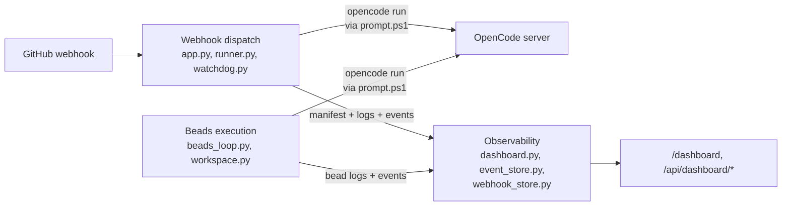

# Features

Active contributors: Nathan Miller

## Purpose

This section documents `orchestrator-service` through the lens of its three core runtime features, rather than its file layout. Each page traces one feature end to end — from the triggering signal, through the Python modules that implement it, to the artifacts and UI it produces — with full root-relative paths to the actual source.

## How the three features fit together

FastAPI (`webhook_receiver/app.py`) accepts a signed GitHub issue-label webhook and, once it passes the eligibility filter, launches an OpenCode orchestrator run in the background with a process watchdog supervising it. That is **[Webhook dispatch](webhook-dispatch.md)**.

Independently, an optional background thread (`BeadsLoop`) drains a project's Beads dependency graph: it builds an isolated Git worktree per task, spawns an agent against it through the same subprocess-launch path webhook dispatch uses, and verifies completion via `br show`. That is **[Beads execution](beads-execution.md)**.

Both features write structured artifacts — run manifests, captured stdout/stderr, and in-process events — that a third feature reads and presents: a token-gated dashboard exposing JSON, HTML, and Server-Sent Events for runs, beads, and webhook deliveries. That is **[Observability](observability.md)**.

## Reading order

| Page | Start here if you want to know... |
| --- | --- |
| [Webhook dispatch](webhook-dispatch.md) | How a GitHub label triggers an orchestrator run — signature verification, the dispatch-eligibility filter, prompt rendering, the subprocess launch, and the idle/error/ceiling watchdog that supervises it. |
| [Beads execution](beads-execution.md) | How the optional Beads DAG gets worked automatically — project discovery, task selection (`bvr`/`br`), per-bead Git worktrees, agent context injection, and retry/halt handling. |
| [Observability](observability.md) | How to see any of the above happening — the dashboard's JSON API, HTML pages, SSE event stream, and the run-narrative synthesis built from captured logs. |

Read [Webhook dispatch](webhook-dispatch.md) and [Beads execution](beads-execution.md) first if you are changing *how work gets triggered or executed*; read [Observability](observability.md) first if you are changing *what an operator can see*. All three share the subprocess-launch helpers in `webhook_receiver/runner.py` and the project-path helpers in `webhook_receiver/workspace.py`, so a change to either module can affect more than one feature page.

## Related pages

- [Architecture](../overview/architecture.md) — the runtime layers and process/data boundaries these features sit inside.
- [Glossary](../overview/glossary.md) — definitions for Bead, BeadsLoop, Dispatch, Manifest, Watchdog, and related terms.
- [Getting started](../overview/getting-started.md)
