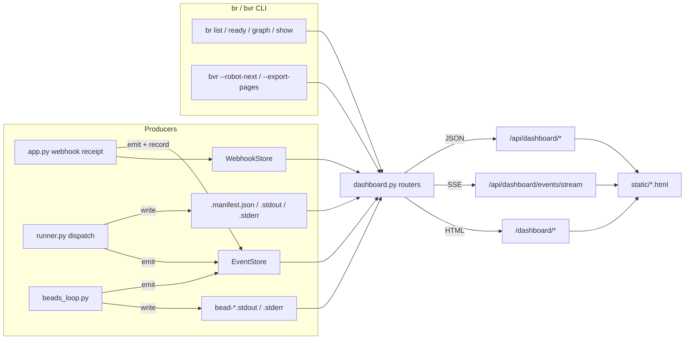

# Observability

Active contributors: Nathan Miller

## Purpose

Observability is the token-gated dashboard surface — JSON API, HTML pages, and a Server-Sent Events stream — that lets an operator watch the Beads DAG, orchestration runs, and webhook deliveries without shelling into the container. It reads its data from three sources: the `br`/`bvr` CLI (live Beads state), the receiver's log directory (per-run manifests and captured stdout/stderr), and two in-process stores (`EventStore` for the live event ring buffer, `WebhookStore` for persisted webhook deliveries).

## Layout

- `webhook_receiver/dashboard.py` — the `/api/dashboard/*` JSON routers, the `/dashboard/*` HTML page routers, the bvr static-pages bundle server, and every caching/enrichment helper behind them.
- `webhook_receiver/event_store.py` — `EventStore`, an in-memory ring buffer with SSE subscriber fan-out; process-local, not durable.
- `webhook_receiver/webhook_store.py` — `WebhookStore`, a JSON-array-backed, capped, time-retained record of webhook deliveries keyed by `delivery_id`.
- `webhook_receiver/run_stream.py` — the single source of truth for decoding the opencode client's glyph-prefixed tool stream out of captured `.stderr`, shared by run classification (`runner.py`) and the live event feed (`dashboard.py`).
- `webhook_receiver/run_narrative.py` — `parse_narrative`, which combines a run's manifest with its parsed glyph events into a synthesized status/timeline/stats view.
- `webhook_receiver/auth.py` — `make_dashboard_token_dep` and `persist_token_cookie`, the constant-time token gate shared by every dashboard route (and the simulator).
- `webhook_receiver/static/` — the self-contained HTML/CSS/JS pages: `dashboard.html`, `bead_detail.html`, `orchestration_runs.html`, `orchestration_run_detail.html`, `events.html`, `webhooks.html`, `simulator.html`.
- `docs/dashboard.md` — the operator-facing API/page/event-type reference.
- `docs/orchestrator-run-logs.md` — how to read run log files, the checklist health signal, and the classification table.

## Key abstractions

| Abstraction | Where | Role |
| --- | --- | --- |
| `EventStore` / `Subscriber` | `webhook_receiver/event_store.py` | Thread-safe `deque(maxlen=1000)` with `emit`, `recent(limit)`, and `subscribe(keepalive)`; each `Subscriber` is a per-connection `queue.Queue` drained by `/api/dashboard/events/stream`, capped at `_MAX_SSE_SUBSCRIBERS` (10) in `dashboard.py`. |
| `WebhookStore` | `webhook_receiver/webhook_store.py` | `record(delivery_id, **fields)` creates-or-merges an event keyed by delivery id; persists the full set as `{log_dir}/webhooks.json` (JSON array, not JSON-lines, because fields mutate across phases); enforces `max_events` and `cleanup_old(max_age_days)`. |
| `make_dashboard_token_dep` | `webhook_receiver/auth.py` | FastAPI dependency: no `DASHBOARD_TOKEN` configured → every route is `404` (fail closed); otherwise requires a `Bearer` header, `?token=` query param, or `dashboard_token` cookie, compared with `hmac.compare_digest`. |
| `extract_tool_names` / `parse_events` | `webhook_receiver/run_stream.py` | Strip ANSI escapes, detect the leading glyph (`•`, `✓`, `✗`, `⚙`, `%`, `→`, `←`, `✱`, `#`), and produce either a set of lowercase tool names (for classification) or a typed event list `{seq, kind, agent, detail}` (for the live feed). |
| `parse_narrative` | `webhook_receiver/run_narrative.py` | Combines `parse_events` output with a run manifest's `classification`/`kill_reason`/`started_at`/`ended_at` into `{summary, timeline, stats}`; `_group_timeline` collapses consecutive `read`/`glob`/`webfetch` events into one summary entry. |
| `_fetch_beads_view` / `_fetch_beads_graph` / `_enrich_beads` | `webhook_receiver/dashboard.py` | Shell out to `br list`/`br ready`/`br graph --all --json`, then merge in `BeadsLoop` runtime state (active/halted/retry/elapsed) to produce the `ui_status` (`active`/`halted`/`closed`/`ready`/`blocked`) shared by the list, detail, and graph endpoints. |
| `_cached` | `webhook_receiver/dashboard.py` | A simple TTL cache (`_CACHE_TTL=5s`, `_PAGES_TTL=60s`) around every expensive CLI call or file scan so polling clients don't re-invoke `br`/`bvr` or re-parse multi-MB transcripts every request. |
| `_load_run_manifests` / `_read_run_logs` / `_tail_lines` | `webhook_receiver/dashboard.py` | List/tail the `<stem>.manifest.json`/`.md`/`.stdout`/`.stderr` files `runner.py` and `beads_loop.py` write; `_tail_lines` reads backward in 64 KiB chunks so tailing a large transcript doesn't require decoding the whole file. |
| `_generate_pages_bundle` | `webhook_receiver/dashboard.py` | Runs `bvr --export-pages` into a cached bundle directory, served path-safely (realpath + prefix guard) by `create_dashboard_pages_router`. |

## Data flow

## Integrations

- **`br` / `bvr` CLI** — every Beads-related dashboard endpoint (`overview`, `beads`, `graph`, `active`, `pages/refresh`) shells out via `_run_beads_cmd`/`_run_bvr_export`, treating a missing `.beads/` directory as the normal "not initialized" state rather than an error.
- **`BeadsLoop`** — injected into `create_dashboard_router` as an optional dependency; when present, its read-only properties (`active_beads`, `halted_beads`, `retry_state`, `bead_start_times`, `state_for_project`) enrich raw `br` output with runtime status.
- **Filesystem run logs** — `runner.py` and `beads_loop.py` are the producers of everything under `Settings.log_dir` (`default_log_dir()`, the compose-mounted `${WEBHOOK_LOG_DIR}`); `dashboard.py` and `run_narrative.py` are consumers only.
- **`webhook_receiver.auth`** — shared token-gate logic also used by `webhook_receiver/simulator.py`, so dashboard and simulator auth never drift.
- **Static HTML (`webhook_receiver/static/`)** — no build step; each page polls its matching JSON endpoint on an interval and/or opens the SSE stream, per `docs/dashboard.md`.

## Change entry points

- **New event type** — call `event_store.emit("new_type", ...)` from the producer (`app.py`, `runner.py`, or `beads_loop.py`), then add a row to the event-type table in `docs/dashboard.md` so the timeline/SSE consumer documentation stays accurate.
- **New dashboard JSON endpoint** — add a route inside `create_dashboard_router` in `webhook_receiver/dashboard.py` (it already sits behind the shared `auth` dependency), then document it in the API table in `docs/dashboard.md`.
- **New dashboard HTML page** — add the static file to `webhook_receiver/static/`, add a route in `create_dashboard_page_router`, and add it to the HTML-pages table in `docs/dashboard.md`.
- **New run classification or kill reason surfaced in the UI** — extend `_CLASSIFICATION_STATUS` / `_KILL_REASON_MESSAGE` in `webhook_receiver/run_narrative.py` to keep the narrative view in sync with `runner.py`'s classification logic (see [Webhook dispatch](webhook-dispatch.md)).
- **New glyph in the opencode tool stream** — add it to `_GLYPH_KIND` in `webhook_receiver/run_stream.py`; both the live event feed and (via `extract_tool_names`) run classification pick it up automatically.
- **Retention/cap tuning** — `EventStore(maxlen=...)`, `WebhookStore(max_events=..., max_age_days=...)`, and `_MAX_RUNS`/`_MAX_SSE_SUBSCRIBERS` in `dashboard.py` are the bounds that keep dashboard cost from growing unbounded with history.

## Key source files

| File | Role |
| --- | --- |
| `webhook_receiver/dashboard.py` | JSON API, HTML pages, bvr pages bundle, caching, enrichment. |
| `webhook_receiver/event_store.py` | In-memory event ring buffer with SSE fan-out. |
| `webhook_receiver/webhook_store.py` | Persisted, capped webhook-delivery record. |
| `webhook_receiver/run_stream.py` | Glyph/ANSI decoding shared by classification and the live feed. |
| `webhook_receiver/run_narrative.py` | Manifest + glyph-event synthesis into a run narrative. |
| `webhook_receiver/auth.py` | Dashboard token gate and cookie persistence. |
| `webhook_receiver/static/` | Dashboard/bead/runs/events/webhooks/simulator HTML pages. |
| `docs/dashboard.md` | API/page/event-type reference and auth setup. |
| `docs/orchestrator-run-logs.md` | Run-log file layout, checklist health signal, classification table. |

## Related pages

- [Features overview](index.md)
- [Webhook dispatch](webhook-dispatch.md) — the manifests, log files, and events this feature reads.
- [Beads execution](beads-execution.md) — the `BeadsLoop` state and per-bead logs this feature reads.
- [Architecture](../overview/architecture.md)
- [Glossary](../overview/glossary.md)
