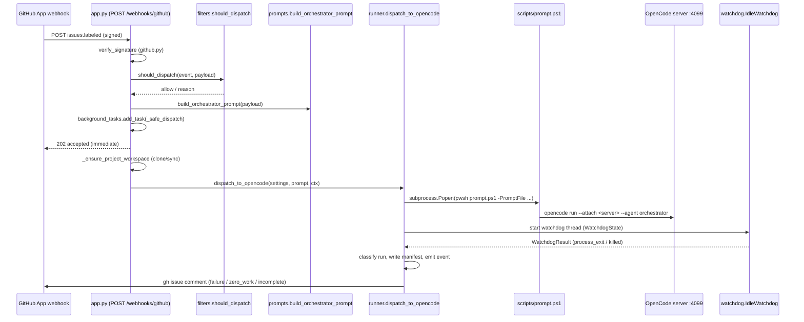

# Webhook dispatch

Active contributors: Nathan Miller

## Purpose

Webhook dispatch is the ingress path that turns a signed GitHub `issues.labeled` delivery into a running OpenCode orchestrator session. It owns three concerns: proving a delivery is genuine and eligible, ensuring the target project has a workspace on disk, and supervising the spawned `opencode run` subprocess until it exits — classifying the outcome and reporting failures back to the triggering GitHub issue.

## Layout

- `webhook_receiver/app.py` — the FastAPI route (`POST /webhooks/github`), request-level validation, and the `_safe_dispatch` background task that wires workspace preparation to the runner.
- `webhook_receiver/github.py` — HMAC SHA-256 signature computation and verification for `X-Hub-Signature-256`.
- `webhook_receiver/filters.py` — the `should_dispatch` transport-level gate (event/action/actor/label checks) and the `should_filter` trace-noise blacklist used by log streaming.
- `webhook_receiver/prompts.py` — renders the Jinja2 orchestration prompt from the webhook payload.
- `webhook_receiver/orchestration_prompt.jinja2.md` — the match-clause state machine the orchestrator agent executes once it receives the rendered prompt.
- `webhook_receiver/runner.py` — `dispatch_to_opencode`, the prompt/log file layout, the run manifest sidecar, tool-usage-based run classification, and GitHub failure/advisory comment posting.
- `webhook_receiver/watchdog.py` — `IdleWatchdog`, the activity-aware process supervisor that kills a stalled or deadlocked run.
- `webhook_receiver/config.py` — the `Settings` dataclass (`Settings.from_env`) supplying server URL, model, agent, workspace, and every watchdog tunable.
- `scripts/prompt.ps1` — the PowerShell launcher `runner.py` invokes as a subprocess to attach `opencode run` to the OpenCode server.

## Key abstractions

| Abstraction | Where | Role |
| --- | --- | --- |
| `verify_signature` / `compute_signature` | `webhook_receiver/github.py` | Constant-time HMAC SHA-256 check of `X-Hub-Signature-256` against `Settings.github_webhook_secret`. |
| `should_dispatch(event, payload)` | `webhook_receiver/filters.py` | Mirrors the GitHub Actions `if:` guard: only `issues.labeled`, non-bot sender, a workflow-relevant label (`orchestration:*`, `gh-issue-tracking:*`, or an exact match) may dispatch; `gh-issue-tracking:direct-body` additionally requires the sender to be in `DIRECT_BODY_ALLOWED_SENDERS`. |
| `build_orchestrator_prompt(...)` | `webhook_receiver/prompts.py` | Serializes the webhook payload into `event_data`, renders it into `orchestration_prompt.jinja2.md`, and truncates to `Settings.max_payload_chars`. |
| `_ensure_project_workspace` / `_safe_dispatch` | `webhook_receiver/app.py` | Derives the project slug/workspace, clones or syncs the repo (best-effort), then calls `dispatch_to_opencode`; errors are swallowed so a failed clone never crashes the background task. |
| `DispatchContext` | `webhook_receiver/runner.py` | Frozen dataclass (`repo_full_name`, `issue_number`, `html_url`, `trigger_label`) carried into the completion watcher so a failed/incomplete run can comment on the originating issue. |
| `dispatch_to_opencode(settings, prompt, event_store, dispatch_ctx)` | `webhook_receiver/runner.py` | Writes the prompt file, builds the `pwsh scripts/prompt.ps1` command line, starts the subprocess in its own process group, writes the run manifest, and starts the stream + watchdog threads. Returns the run's stem for correlation. |
| `WatchdogState` / `WatchdogConfig` / `IdleWatchdog` | `webhook_receiver/watchdog.py` | Shared activity state updated per output line; three independent kill conditions — idle timeout, consecutive errors, hard ceiling — plus a permission-`ask` deadlock detector scoped to the run via `_PermissionAskMonitor`. |
| `_run_completion_watcher` | `webhook_receiver/runner.py` | Waits for the watchdog result, classifies the run (`failed` / `zero_work` / `incomplete` / `completed`), updates the manifest, emits an `EventStore` event, and posts a GitHub comment for anything other than a clean, complete exit. |

## Data flow

## Integrations

- **GitHub App webhooks** — inbound delivery at `/webhooks/github`; `github.py` validates the shared secret configured as `OS_WEBHOOK_SECRET`.
- **`gh` CLI** — `runner.py::_post_issue_comment` and `_dispatch_issue_closed` shell out to `gh issue comment` / `gh issue view`, authenticated via `GH_ORCHESTRATION_AGENT_TOKEN` (falling back to `GITHUB_TOKEN`) through `_gh_env`.
- **`scripts/prompt.ps1`** — the only process boundary between the receiver and the OpenCode server; `runner._prompt_script_invocation` builds its argv from `Settings` (server URL, workspace, model, agent, variant, prompt file).
- **OpenCode server (`opencode serve` on :4099)** — the destination of the launched `opencode run --attach`; `IdleWatchdog._abort_server_session` can also `POST {server}/session/{id}/abort` to cleanly stop a server-side session on a kill.
- **`webhook_receiver.workspace`** — `ensure_project_from_clone` / `sync_project` / `init_project_workspace` prepare the per-project directory before dispatch (shared with [Beads execution](beads-execution.md)).
- **`EventStore` / `WebhookStore`** — every stage emits `webhook_received`, `webhook_filtered`, `dispatch_started`, and `dispatch_completed`/`dispatch_failed`/`dispatch_zero_work`/`dispatch_incomplete` events consumed by the [Observability](observability.md) dashboard.

## Change entry points

- **New trigger label** — extend `_LABEL_PREFIXES` / `_LABEL_EXACT` in `webhook_receiver/filters.py`, then add a matching `case (...)` clause in `webhook_receiver/orchestration_prompt.jinja2.md`. The label allowlist and the prompt's match clauses must stay in sync, or a webhook is either silently ignored or dispatches into the `(default)` clause.
- **New watchdog kill condition** — add a `REASON_*` constant and a check inside `IdleWatchdog.run()` in `webhook_receiver/watchdog.py`, then extend `_build_failure_body` / `_KILL_REASON_MESSAGE` (`runner.py` and `run_narrative.py`) so the failure comment and dashboard narrative describe it.
- **New run classification** — extend the classification chain at the end of `_run_completion_watcher` in `webhook_receiver/runner.py`, then add the corresponding entry to `_CLASSIFICATION_STATUS` in `webhook_receiver/run_narrative.py` and the table in `docs/orchestrator-run-logs.md`.
- **New/changed watchdog tunable** — add the field to `WatchdogConfig` and `Settings` (`webhook_receiver/config.py`), wire it through `WatchdogConfig.from_settings`, and document the env var in `docs/orchestrator-run-logs.md`.
- **Direct-body sender allowlist** — controlled entirely by the `DIRECT_BODY_ALLOWED_SENDERS` env var read in `filters._direct_body_allowed_senders`; no code change needed to add/remove trusted senders.

## Key source files

| File | Role |
| --- | --- |
| `webhook_receiver/app.py` | HTTP route, signature/size checks, workspace bootstrap, background dispatch scheduling. |
| `webhook_receiver/github.py` | Webhook signature compute/verify. |
| `webhook_receiver/filters.py` | Dispatch eligibility gate and trace-noise blacklist. |
| `webhook_receiver/prompts.py` | Orchestrator prompt rendering from the Jinja2 template. |
| `webhook_receiver/orchestration_prompt.jinja2.md` | The orchestrator's label-driven branching logic and helper functions. |
| `webhook_receiver/runner.py` | Subprocess dispatch, manifest, run classification, failure/advisory comments. |
| `webhook_receiver/watchdog.py` | Idle/error/ceiling/permission-deadlock process supervision. |
| `webhook_receiver/config.py` | `Settings.from_env` — every dispatch and watchdog knob. |
| `scripts/prompt.ps1` | PowerShell launcher that attaches `opencode run` to the server. |
| `docs/orchestrator-run-logs.md` | Operator guide to run log files, the checklist health signal, and classification. |

## Related pages

- [Features overview](index.md)
- [Beads execution](beads-execution.md) — shares `webhook_receiver/workspace.py` for project directories and reuses `runner._prompt_script_invocation` / `_stream_to_logger_and_file` for bead agent spawns.
- [Observability](observability.md) — consumes the manifests, `.stdout`/`.stderr` files, and `EventStore` events this feature produces.
- [Architecture](../overview/architecture.md)
- [Glossary](../overview/glossary.md)
