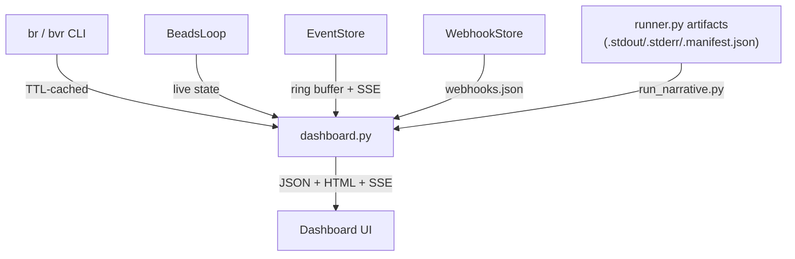
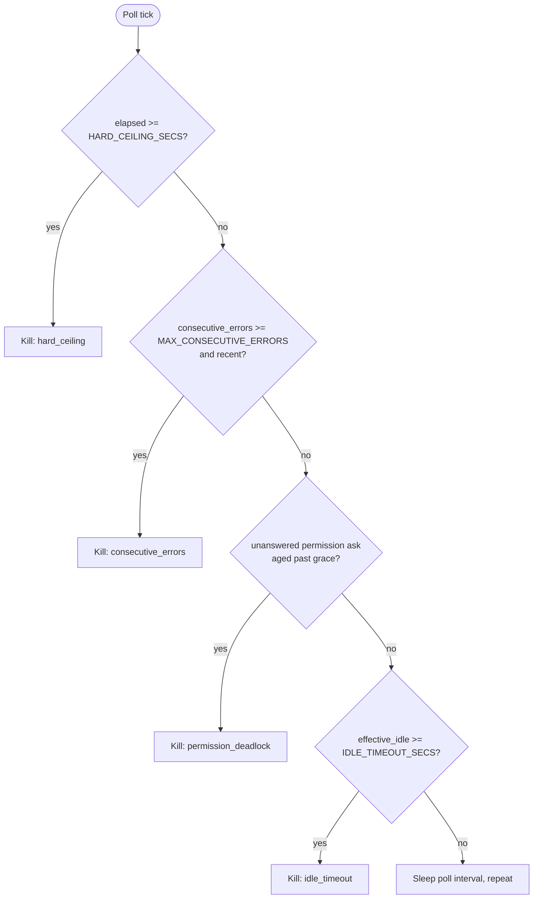

# How to monitor

`orchestrator-service` has no dedicated metrics, tracing, or alerting stack. Observability instead comes from three purpose-built, in-process facilities inside `webhook-receiver`: a token-gated **dashboard** over live Beads/agent state, per-run **log artifacts** captured to disk, and an activity-aware **watchdog** that diagnoses stuck runs. This page covers the dashboard and the watchdog; see [Logging](logging.md) for run-artifact details.

## Source files

| File | Purpose |
| --- | --- |
| `webhook_receiver/dashboard.py` | `/api/dashboard/*` JSON routes + HTML pages; reads bead data via `br`/`bvr`, live state via `BeadsLoop`, events via `EventStore`. |
| `webhook_receiver/event_store.py` | Thread-safe in-memory ring buffer (`EventStore`) of system events with SSE fan-out to subscribers. |
| `webhook_receiver/webhook_store.py` | Persistent JSON-file store (`webhooks.json`) of signed webhook deliveries, keyed by `delivery_id`. |
| `webhook_receiver/run_narrative.py` | Synthesizes a human-readable timeline/summary from a run's `.stderr` glyph stream + manifest. |
| `webhook_receiver/runner.py` | Dispatches runs, captures stdout/stderr/manifest, classifies completion, posts issue comments. |
| `webhook_receiver/watchdog.py` | `IdleWatchdog` / `WatchdogState` / `WatchdogConfig` — activity-based stall detection and kill logic. |
| `docs/dashboard.md` | Authoritative dashboard reference this page is derived from. |
| `docs/orchestrator-run-logs.md` | Authoritative run-log reference — see [Logging](logging.md). |

## The dashboard

The dashboard is served by `webhook-receiver` itself (internal `:8080`, fronted by Caddy on host `:80`/`:443`) — there is no separate observability service.

| Location | URL |
| --- | --- |
| Compose (default `:80`) | `http://localhost/dashboard` |
| Compose + HTTPS overlay | `https://<WEBHOOK_SITE_ADDRESS>/dashboard` |
| Local dev (`uv run orchestrator-webhook`) | `http://localhost:8080/dashboard` |

**Authentication.** The dashboard is disabled by default: if `DASHBOARD_TOKEN` is unset, every dashboard route returns `404` (nothing enumerable through the Caddy proxy). When set, requests authenticate via `Authorization: Bearer <token>`, `?token=<token>`, or a `dashboard_token` cookie set by the HTML page. Use HTTPS in production — the token/cookie should never traverse the network in cleartext.

### What you see

- **Summary cards** — Total / Ready / Blocked / Active / Closed / Halted bead counts.
- **Beads table** — every bead with UI status, retry count, elapsed time; expandable per-row stdout/stderr.
- **Active agents** — beads currently being processed, with attempt number and elapsed time.
- **Event timeline** — recent `EventStore` events, loaded once then kept live via SSE (capped at 10 concurrent subscribers).
- **Runs list / detail** — every dispatch run with its classification and a synthesized narrative (see below).
- **Webhook deliveries** — recent signed webhook events from `WebhookStore`.

| Bead status | Meaning |
| --- | --- |
| `active` | Currently being processed by a spawned agent. |
| `ready` | Open, unblocked, awaiting `BeadsLoop` pickup. |
| `blocked` | Open, waiting on dependencies. |
| `closed` | Completed and verified via `br show`. |
| `halted` | Exceeded `BEADS_MAX_RETRIES`; needs human intervention. |

An empty beads table ("No beads found. Run /plan-to-beads to create the DAG.") is a normal "ready at will" state, not an error.

### Key API surface

| Method | Path | Description |
| --- | --- | --- |
| `GET` | `/api/dashboard/overview` | Counts + `BeadsLoop` status. |
| `GET` | `/api/dashboard/beads` | All beads with UI status/retry/elapsed time. |
| `GET` | `/api/dashboard/events?limit=N` | Last N events. |
| `GET` | `/api/dashboard/events/stream` | SSE stream of live events. |
| `GET` | `/api/dashboard/runs` | List of dispatch runs (manifests). |
| `GET` | `/api/dashboard/runs/{stem}/narrative` | Synthesized timeline for a run. |
| `GET` | `/api/dashboard/webhooks?limit=N` | Recent signed webhook deliveries. |

Full route list, event types, and per-endpoint parameters are in `docs/dashboard.md`.

### Run narrative synthesis

`run_narrative.py` turns a run's raw `.stderr` glyph stream and `.manifest.json` into a UI-friendly `summary` / `timeline` / `stats` structure:

- **Status** is derived from the manifest's `classification` field (written by `runner.py`; see [Logging](logging.md#run-classification)) — `completed`, `failed`, `zero_work`, `incomplete`, or a watchdog-kill reason (`idle_timeout` → `timeout`, `consecutive_errors` → `error`, `permission_deadlock` → `error`).
- **Timeline** groups consecutive low-signal events (`read`/`glob`/`webfetch`) into single summarized entries (e.g. "Read 15 files") so delegations, errors, and watchdog kills stay visible as individual high-signal lines.
- **Stats** aggregate per-kind event counts (tool calls, delegations, errors, files read/written, etc.).

## Watchdog diagnosis

`webhook_receiver/watchdog.py`'s `IdleWatchdog` runs in a dedicated thread per dispatched run (started by `runner.py`'s `_run_completion_watcher`). It polls a shared `WatchdogState` — updated on every stdout/stderr line by the stream-reader threads — every `WATCHDOG_POLL_SECS` and can terminate the run on any of four independent conditions, checked in this order:

1. **Hard ceiling** (`HARD_CEILING_SECS`, default `5400`) — unconditional wall-clock cap regardless of activity; the ultimate safety net.
2. **Consecutive errors** (`MAX_CONSECUTIVE_ERRORS`, default `5`, within `ERROR_GRACE_SECS`) — repeated error-pattern lines (`level=ERROR`, `AI_APICallError`, rate-limit messages, the `✗` glyph) without an intervening normal line.
3. **Permission-ask deadlock** (`permission_ask_grace_secs`, default `60`) — an unanswered `message=asking ... permission=<type>` line in the *server's* log. In a headless (`--auto`) dispatch this can never be answered, so it fails fast instead of waiting out the idle timeout.
4. **Idle timeout** (`IDLE_TIMEOUT_SECS`, default `1800`) — no client stdout/stderr *and* no server-log growth for this long. The **effective idle** is the minimum of client-line idle time and server-log idle time, so a subagent delegation (client silent, server actively writing) does not trigger a false-positive kill.

On any trip, `_terminate()` first best-effort `POST`s `/session/{id}/abort` to the OpenCode server (the session id is scraped from the server log) to cleanly stop the server-side agent loop, then escalates `SIGTERM` → (after `sigterm_grace_secs`) `SIGKILL` against the client's whole process group (`start_new_session=True` makes the client a process-group leader, so grandchildren like `gh` subprocesses are also reaped). `_dump_diagnostics()` logs the last 20 stderr lines before termination for post-mortem.

| Env var | Default | Effect |
| --- | --- | --- |
| `IDLE_TIMEOUT_SECS` | `1800` | No output from client or server log for this long → kill. |
| `ERROR_GRACE_SECS` | `300` | Window in which the consecutive-error count must stay fresh. |
| `HARD_CEILING_SECS` | `5400` | Absolute run ceiling (falls back from `DISPATCH_TIMEOUT_SECS` if unset). |
| `WATCHDOG_POLL_SECS` | `30` | Polling interval. |
| `MAX_CONSECUTIVE_ERRORS` | `5` | Error-line streak that triggers a kill. |
| `WATCHDOG_DEBUG` | `false` | Emit heartbeats every poll instead of only when idle ≥ 60s. |
| `OPENCODE_SERVER_LOG_PATH` | `/var/log/opencode-server/opencode.log` | Shared server log the watchdog reads for the server-activity and permission-ask signals. |

## No metrics, tracing, or alerting

There is deliberately **no** metrics backend (Prometheus/StatsD), **no** distributed tracing (OpenTelemetry), and **no** alerting/paging integration in this service:

- `EventStore` is an in-memory ring buffer (default `maxlen=1000`), not a time-series store — it has no retention beyond process lifetime and no query/aggregation surface beyond "most recent N events" and SSE push.
- `WebhookStore` persists webhook deliveries as a JSON file with a 30-day/`max_events`-count retention cap — adequate for the very low webhook volume this service sees, not a metrics pipeline.
- The watchdog's `[watchdog]` heartbeat lines are structured log output, not exported metrics; there is no counter/gauge/histogram instrumentation anywhere in `webhook_receiver/`.
- Failure/zero-work/incomplete detection surfaces as **GitHub issue comments** posted by `runner.py` (best-effort, via `gh issue comment`), not as alerts to an on-call system.

Operators relying on this service for anything beyond single-host/low-volume use should treat metrics, tracing, and alerting as a gap to fill externally (e.g. scraping container logs, wrapping the dashboard's JSON API, or standing up a separate collector) — none of that tooling exists in this repository today.

## Related pages

- [Logging](logging.md) — where run artifacts live, the checklist health signal, and run classification.
- [Deployment](../deployment.md) — Compose modes, persistence, and health checks.
- [Architecture](../overview/architecture.md) — runtime layers and data paths.
