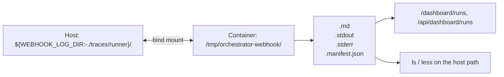

# Logging

Every webhook-dispatched orchestrator run is captured to disk by `webhook_receiver/runner.py` as a set of files keyed by a stable identity slug — no external log aggregator is involved. This page covers where those artifacts live, how to read them, and how a run is classified on completion.

## Source files

| File | Purpose |
| --- | --- |
| `webhook_receiver/runner.py` | Dispatches runs, streams stdout/stderr to disk + logger, writes the manifest sidecar, classifies completion, posts issue comments. |
| `webhook_receiver/watchdog.py` | Kills stalled runs; see [How to monitor](index.md#watchdog-diagnosis). |
| `webhook_receiver/dashboard.py` | Serves `/api/dashboard/runs*` and `/dashboard/runs*` over the same artifacts. |
| `webhook_receiver/run_narrative.py` | Synthesizes a readable timeline from `.stderr` + the manifest. |
| `docs/orchestrator-run-logs.md` | Authoritative reference this page is derived from. |

## Where logs live

| Where | Path | Notes |
| --- | --- | --- |
| Host (persisted) | `${WEBHOOK_LOG_DIR:-./traces/runner}/` | Compose bind-mounts this onto the container path. Survives container restarts. Gitignored (`traces/runner/`). |
| Container | `/tmp/orchestrator-webhook/` | The path `runner.py`/`beads_loop.py`/`dashboard.py` write to (`Settings.log_dir`). |



Each dispatch produces four files keyed by a slug `<owner>__<repo>__issue-<n>__<workflow>__<UTCts>-<rand>`:

| File | Contents |
| --- | --- |
| `<slug>.md` | The exact prompt sent to the orchestrator. |
| `<slug>.stdout` | The orchestrator's text output (narrative / final answer). |
| `<slug>.stderr` | The opencode client's tool stream (the `--print-logs` glyph output). |
| `<slug>.manifest.json` | Identity + lifecycle metadata: repo, issue, workflow, pid, `started_at`, `ended_at`, `exit_code`, `classification`, `tools`. |

## Viewing logs

- **Dashboard** (token-gated by `DASHBOARD_TOKEN`): `/dashboard/runs` lists runs newest-first; `/dashboard/runs/<slug>` shows prompt/stdout/stderr tabs plus the classification badge and synthesized narrative.
- **Shell (host):**

  ```bash
  ls -t traces/runner/                        # newest run first
  less traces/runner/<slug>.stderr             # the tool-call stream
  ls traces/runner/ | grep 'owner__repo__issue-7'   # find by identity
  ```

## How to read a run log — the checklist signal

A healthy `project-setup` run **re-prints its TODO checklist after every assignment** with `[ ]` → `[x]` transitions — this is the single most reliable health signal. The `.stderr` tool stream prefixes each tool call with a glyph:

| Glyph | Meaning |
| --- | --- |
| `⚙` | Tool call (e.g. `⚙ sequential-thinking_sequentialthinking`, `⚙ memory_search_nodes`). |
| `%` | `WebFetch`. |
| `→` | `Read`. |
| `←` | `Write`. |
| `•` | `task` (subagent delegation). |
| `✱` | `Glob`. |
| `#` | `Todos` (the checklist!). |

Read order: skim `.stdout` for the agent's stated plan, then `.stderr` for what it actually did. If `.stderr` ends mid-workflow with unchecked checklist items, the run stalled.

## Run classification

`runner.py`'s `_run_completion_watcher` classifies every completed run (recorded in the manifest's `classification` field and emitted as an `EventStore` event) by scanning the tool calls in `.stderr` and, for the `orchestration:dispatch`/`gh-issue-tracking:direct-body` trigger labels, checking whether the dispatch issue was closed:

```mermaid
flowchart TD
    Exit([Process exits or is killed]) --> WD{Watchdog killed it?}
    WD -->|yes| KillClass["classification = kill_reason\n(idle_timeout / hard_ceiling /\nconsecutive_errors / permission_deadlock)"]
    WD -->|no| Code{exit_code == 0?}
    Code -->|no| Failed[classification = failed]
    Code -->|yes| Tools{Only planning/reading tools used?\n(no bash/task/write/edit)}
    Tools -->|yes| ZeroWork[classification = zero_work]
    Tools -->|no| Label{trigger_label in\nclose-on-success set?}
    Label -->|no| Completed[classification = completed]
    Label -->|yes| Closed{gh issue view: state == closed?}
    Closed -->|yes| Completed
    Closed -->|no| Incomplete[classification = incomplete]
```

| Classification | Trigger | Issue comment? |
| --- | --- | --- |
| `completed` | Exit 0, real tools used, dispatch issue closed (or classification not gated by the close-on-success label set). | No. |
| `incomplete` | Exit 0, real tools used, but the dispatch issue is still open — the workflow's own success contract (close on success) wasn't met. | Advisory. |
| `zero_work` | Exit 0 but only planning/reading tools were ever invoked (`webfetch`/`read`/`grep`/`glob`/`list` plus `sequential-thinking`/`memory-graph`/`web-*`/`zread`/`microsoft_docs*` prefixes) — narrate-and-self-terminate. | Advisory. |
| `failed` | Non-zero exit / killed / timed out. | Failure. |
| `idle_timeout` / `hard_ceiling` / `consecutive_errors` / `permission_deadlock` | Watchdog termination reason (see [How to monitor](index.md#watchdog-diagnosis)); recorded verbatim as the classification. | Failure. |

The `incomplete` class is the "gap-miner" failure mode: exit 0, real work done, but the workflow was abandoned partway and the dispatch issue stayed open. It is only checked for the `orchestration:dispatch` and `gh-issue-tracking:direct-body` labels — other trigger labels succeed without closing the issue by design, so probing their state would false-positive.

Issue-comment bodies are scrubbed for common credential patterns (GitHub PATs, OpenAI-style keys, Bearer tokens, `key=value` secret assignments) via `_sanitize_for_comment` before posting, to prevent CLI stderr leaking secrets into a public GitHub comment.

## Example triage (gap-miner-v2-delta48)

The dispatch `prompt-373i6gxj` (preserved at `traces/gap-miner-v2-delta48-373i6gxj.*`) shows the orchestrator loaded the full `project-setup` workflow, built the correct checklist, then — lacking a `bash` tool — delegated the entire workflow to a single Planner subagent and never resumed. The `.stderr` ends at `• Execute project-setup workflow  Planner Agent`; the dispatch issue stayed open. Full account: `traces/gap-miner-v2-delta48-execution-flow.md`.

## Related pages

- [How to monitor](index.md) — dashboard, event store, and watchdog diagnosis.
- [Deployment](../deployment.md) — where `/tmp/orchestrator-webhook` is bind-mounted and how the volumes it depends on are configured.
