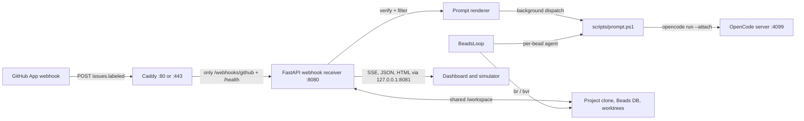

# Architecture

The runtime keeps agent configuration, agent workspaces, and observability data in separate places. The OpenCode service loads its global configuration from `/home/app/.config/opencode`, agent work happens in the shared `/workspace` bind mount, and the webhook receiver writes run artifacts to its log mount.

The receiver is the control plane. It decides whether a GitHub delivery is eligible, then delegates execution to OpenCode and exposes the result through the token-gated dashboard. `webhook_receiver/__main__.py` starts the optional Beads loop in the same process as the FastAPI application.

## Runtime layers

| Layer | Implementation | State and boundary |
| --- | --- | --- |
| Edge | `deploy/caddy/Caddyfile` and the `webhook-proxy` service in `compose.yaml` | Caddy forwards only `/webhooks/github` and `/health` from the public host to the internal receiver and answers `404` for every other path; the dashboard and simulator are reached on the receiver's loopback-only host publish `127.0.0.1:8081` instead. |
| Ingress | `webhook_receiver/app.py` | HMAC validation, payload sizing, trigger decisions, background dispatch scheduling. |
| Execution | `webhook_receiver/runner.py`, `scripts/prompt.ps1` | Prompt files, subprocess streams, manifests, watchdog decisions, and agent sessions. |
| Project work | `webhook_receiver/workspace.py`, `webhook_receiver/beads_loop.py` | Per-project clones under `/workspace/<slug>`, `.beads/`, and `.worktrees/<bead-id>`. |
| Observability | `webhook_receiver/dashboard.py`, `webhook_receiver/event_store.py`, `webhook_receiver/webhook_store.py` | In-memory events plus persisted runner and webhook records in the receiver log directory. |
| Agent definition | `image/.opencode/opencode.json`, `image/.opencode/agents/` | Global OpenCode model, permissions, MCP configuration, and agent roster. |

## Two execution paths

### Webhook-triggered orchestration

`webhook_receiver/app.py` accepts only a valid signed request and queues `_safe_dispatch`. The background path clones or refreshes the project when the payload has a safe HTTPS clone URL, builds a prompt in `webhook_receiver/prompts.py`, and launches the PowerShell wrapper. `webhook_receiver/runner.py` captures logs, writes a manifest, watches progress, and records the final classification.

### Beads-driven implementation

`webhook_receiver/beads_loop.py` scans project subdirectories containing `.beads/`. It requires the canonical plan to be committed, selects a graph-aware next bead with `bvr` when available, creates `task/<bead-id>` in a worktree, and starts an agent. A closed status from `br show` is the completion signal; failed beads retry up to the configured limit.

## State and persistence

- `/workspace` is a host bind mount shared by `orchestratorservice` and `webhook-receiver`. It contains downstream repositories and their Beads data.
- `opencode-memory` persists the single-writer knowledge graph used by agent sessions. Its location is configured in `image/.opencode/opencode.json`.
- `opencode-logs` lets the receiver watchdog observe server-log growth without making the client data directory read-only, as wired in `compose.yaml`.
- The receiver's `/tmp/orchestrator-webhook` path is a bind mount for prompt files, stdout/stderr captures, manifests, the webhook store, and generated `bvr` pages.

## Language mix

The implementation is primarily Python, with PowerShell for host and dispatch wrappers, shell for image entrypoints and static tests, and standalone HTML for the dashboard. The current quantitative snapshot is in [By the numbers](../by-the-numbers.md).

## Related pages

- [Services](../services/index.md) describes each deployable runtime unit.
- [Webhook dispatch](../features/webhook-dispatch.md) explains the ingress path in detail.
- [Observability](../features/observability.md) describes the dashboard, run artifacts, and narratives.
- [Security](../security.md) explains the control points at the public and agent-execution boundaries.
