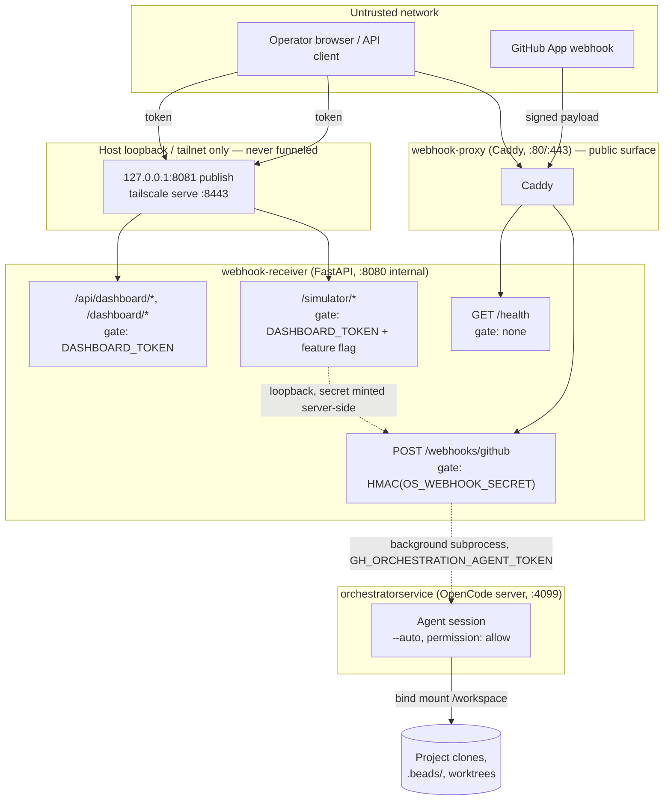

# Security

This page is the security model for the running `orchestrator-service` stack: what protects each public entry point, what an accepted request is allowed to do once inside, and what is explicitly *not* protected. It only states what the code and operational docs in this repository actually implement — see [Key source](#key-source) for exact locations, and treat anything not cited there as unverified.

## Trust boundaries

Two facts anchor everything below:

1. **The webhook and dashboard/simulator groups have independent secrets and independent failure modes.** A valid HMAC signature does not grant dashboard access, and a valid `DASHBOARD_TOKEN` cannot forge a webhook signature. See [API surface](api/index.md) for the full route-group breakdown.
2. **The public listener is path-restricted, and the token still gates everything else.** `deploy/caddy/Caddyfile` proxies only `/webhooks/github` and `/health`; every other path — dashboard pages, `/api/dashboard/*`, `/simulator`, docs — is answered `404` by Caddy itself, so the dashboard is not reachable through the funnel/`:80` edge at all. It reaches clients via the receiver's loopback-only publish (`127.0.0.1:8081`) and, over the tailnet, `tailscale serve --bg --https=8443 localhost:8081`. `DASHBOARD_TOKEN` remains required on **every** one of those paths: the network restriction is a second, independent layer, not a replacement for per-route gating — the public health route still has no gate, and each route keeps its own. The split is by path and port rather than client address because every ingress route to the public listener is sourced from loopback — `tailscaled` dials `127.0.0.1:80` for Funnel, tailnet peers arriving through `tailscale serve` reach the local listener as `127.0.0.1`, and a locally-run tunnel (`ngrok http 80`) does the same. `X-Forwarded-For` is not a dependable substitute (Tailscale's behaviour is version-dependent, and Caddy trusts XFF from loopback while host `:80` is published on all interfaces, so a LAN host can forge it). See `docs/dashboard.md#why-not-allowlist-by-client-address`.

## Inputs

Every value that originates from an external, unauthenticated-until-verified source is validated before it reaches the filesystem, a subprocess, or a git command:

| Input | Validation | Source |
|---|---|---|
| Webhook body | HMAC-SHA256 signature (`X-Hub-Signature-256`) verified with constant-time compare before any parsing; size capped at `WEBHOOK_MAX_BODY_BYTES` (25 MiB default) | `webhook_receiver/github.py`, `webhook_receiver/app.py` |
| Project slug (`repository.full_name`) | Allowlist regex `^[A-Za-z0-9][A-Za-z0-9._-]*$`; falls back to a constant on mismatch | `webhook_receiver/app.py` (`_derive_project_slug`) |
| Default branch (`repository.default_branch`) | Allowlist regex, rejects leading `-` (flag injection into `git clone --branch`/`git checkout`) and `..`; falls back to `"main"` | `webhook_receiver/app.py` (`_safe_branch`) |
| Clone URL (`repository.clone_url`) | Must parse as `https://` with a non-empty host — rejects `file://`, `ssh://`, `http://` (SSRF / local-file-read prevention) | `webhook_receiver/app.py` (`_validate_clone_url`) |
| Workspace paths | `_assert_within_base` resolves both paths with `os.path.realpath` and requires the target to stay under the base directory, raising `ValueError` otherwise | `webhook_receiver/workspace.py` |
| Bead ID / run stem (dashboard path params) | Allowlist to alnum + `-`/`_`; anything else → `400` before it reaches `glob`/`Path` | `webhook_receiver/dashboard.py` (`_valid_bead_id`, `_valid_run_stem`) |
| `bvr` bundle file path (`/dashboard/pages/{file_path}`) | `os.path.realpath` + `startswith(root + os.sep)` containment check (CodeQL `py/path-injection` `SafeAccessCheck` pattern), plus a NUL-byte reject | `webhook_receiver/dashboard.py` (`pages_serve`) |
| Dashboard/simulator token | Extracted from header/query/cookie, compared with `hmac.compare_digest` | `webhook_receiver/auth.py` |
| Simulator webhook secret | Never accepted from the client — read only from the server process environment (`OS_WEBHOOK_SECRET`) and signed server-side before the loopback forward | `webhook_receiver/simulator.py` |

## Logs

- **Best-effort secret redaction before public comments.** `_sanitize_for_comment` scrubs GitHub PAT patterns, `sk-`-style keys, `Bearer <token>`, and generic `key=value` credential assignments before any failure detail is posted to a triggering GitHub issue. This is a regex-based filter — it reduces the chance of an obvious credential leaking into a public issue comment, but it is not a substitute for keeping secrets out of subprocess stderr in the first place, and it does not cover every possible secret shape. | `webhook_receiver/runner.py` (`_SECRET_PATTERNS`, `_sanitize_for_comment`)
- **Trace filtering is a signal/noise control, not a security control.** `filters.should_filter` drops high-frequency, zero-information log lines from the container logger; it explicitly does **not** drop `ERROR`/`WARN` lines, and it writes the *unfiltered* line to the persisted `.stderr` file regardless — only the live container logger is thinned. | `webhook_receiver/filters.py`, `webhook_receiver/runner.py` (`_stream_to_logger_and_file`)
- **Run logs persist indefinitely and may contain secrets or repo content.** Every dispatch's prompt, stdout, and stderr are written under the receiver's log directory (bind-mounted to the host via `WEBHOOK_LOG_DIR`) and are never automatically purged. This is precisely why the dashboard — which serves these files back over HTTP — is gated behind `DASHBOARD_TOKEN` rather than left open.
- **The opencode server log is a single shared file across concurrent dispatches.** The idle watchdog's server-log-growth signal is scoped to bytes appended *during the current dispatch's window*, but two dispatches running truly concurrently still share one growing file — one actively-writing session can briefly mask another's idle state. This is a known, documented limitation, bounded by the hard ceiling; it does not defeat the watchdog, only delays it in that overlap window. | `webhook_receiver/watchdog.py` (`_ServerLogMonitor` docstring)

## Agent capability boundary

- **Permission model.** The orchestrator's opencode configuration sets `permission: allow` server-side and dispatches are launched with `--auto`, so a dispatched agent session runs with tool permissions auto-approved rather than pausing on an interactive `ask`. This is an intentional design choice for headless dispatch (there is no human available to answer a prompt), not an oversight — but it means the agent's effective capability boundary is whatever tools/MCP servers are configured, not a per-call approval gate.
- **Orchestration token scope.** `gh` CLI calls made by the receiver itself (posting failure/zero-work/incomplete comments, checking dispatch-issue state) use `GH_ORCHESTRATION_AGENT_TOKEN` (falling back to `GITHUB_TOKEN`), set via `GH_TOKEN` in the subprocess environment — a single org-level PAT, distinct from the GitHub App's own webhook-delivery credentials. | `webhook_receiver/runner.py` (`_gh_env`)
- **Direct-body dispatch is the sharpest edge of this boundary.** The `gh-issue-tracking:direct-body` label causes the orchestrator prompt to be the issue body **verbatim** — no workflow-name parsing, no argument boundary — run with the orchestration token and `--auto`. Without a gate, anyone able to apply that label could make a privileged agent execute arbitrary instructions (a confused-deputy escalation from "can label an issue" to "can run privileged automation"). The mitigation is `DIRECT_BODY_ALLOWED_SENDERS`: a comma-separated, case-insensitive allowlist of GitHub logins checked against the webhook payload's `sender.login`. **An empty or unset allowlist rejects every sender — the control fails closed, not open.** | `webhook_receiver/filters.py` (`_direct_body_allowed_senders`, `should_dispatch`)
- **Headless permission-deadlock kill.** Because a headless dispatch can never answer an interactive `ask`, the watchdog treats any unanswered permission ask (detected in the opencode server log) as a fatal deadlock once it ages past `PERMISSION_ASK_GRACE_SECS` (60s default) and kills the run — rather than letting it hang until the much longer idle/hard-ceiling timeouts. | `webhook_receiver/watchdog.py` (`_PermissionAskMonitor`, `REASON_PERMISSION_DEADLOCK`)
- **Server-side session abort on kill.** The client process runs in a different container than the opencode server, so killing the client subprocess does not stop an orphaned server-side agent session. On every watchdog kill, the watchdog best-effort `POST`s `{server_url}/session/{id}/abort` using HTTP Basic auth built from `OPENCODE_SERVER_PASSWORD`, so a deadlocked or runaway session is also terminated server-side, not just locally reaped. | `webhook_receiver/watchdog.py` (`_abort_server_session`)

## Containers

Per `docs/deployment-compose.md` and `compose.yaml`:

- **All three containers run as non-root.** `orchestratorservice` and `webhook-receiver` start as root only long enough to `chown` bind-mounted/named volumes, then drop to `app` (UID 1000 by default) via `gosu`. `webhook-proxy` (Caddy) drops to a dedicated `caddy` user via `su-exec` after a root entrypoint fixes up `caddy_data`/`caddy_config` ownership — the pinned `caddy:2.10.0-alpine` base ships no non-root user of its own.
- **Capabilities are minimized per service**, not just dropped globally: `orchestratorservice` and `webhook-receiver` both set `cap_drop: [ALL]` then add back only `SETUID`/`SETGID`/`CHOWN` (both) and `DAC_OVERRIDE` (`orchestratorservice` only, needed for the entrypoint's ownership fixups). `webhook-proxy` cannot use `cap_drop: ALL` because its root entrypoint needs `SETUID`/`SETGID` for the `su-exec` drop and `CHOWN` for named-volume fixup, so it relies on `no-new-privileges` being *absent* plus a file capability (`setcap cap_net_bind_service=+ep` on `/usr/bin/caddy`, baked at image build time) and compose `cap_add: CAP_NET_BIND_SERVICE` to bind `:80`/`:443` without running as root.
- **`no-new-privileges:true`** is set on `orchestratorservice` and `webhook-receiver` (blocking privilege escalation via setuid binaries at exec time), but deliberately **not** on `webhook-proxy` — that flag would also block the file-capability grant Caddy needs for its privileged-port bind after the `su-exec` drop.
- **UID/GID are baked at build time, not set at runtime.** `ARG APP_UID`/`APP_GID` configure the `app` user when the image is built; the compose files set no runtime `user:` override, because that would bypass the root→`gosu` privilege-drop path and could leave files owned by an arbitrary numeric UID the container can't write. Matching a non-1000 host UID requires a rebuild with `--build-arg APP_UID=$(id -u) --build-arg APP_GID=$(id -g)`, not an env var.
- **Workspace files are operator-owned**, not root-owned — a direct consequence of the non-root design, meaning `/workspace` cleanup never needs `sudo` (except for one-time migration of pre-existing root-owned files from before this model was adopted).

## Secrets

- **No committed `.env` for production.** Provider credentials, tokens, and the two shared secrets (`OPENCODE_SERVER_PASSWORD`, `OS_WEBHOOK_SECRET`) are host/CI environment variables passed into containers at `compose up`, never checked into the repository. A local `.env` is git-ignored and used only for compose interpolation of non-secret values.
- **Fail-closed required variables**, enforced at two different layers:
  - `compose.yaml` uses `${VAR:?required}` for `OPENCODE_SERVER_PASSWORD` and `WORKSPACE_DIR` — Compose itself refuses to start the stack if either is unset.
  - `webhook_receiver/config.py`'s `Settings.from_env()` raises `ValueError` if `OS_WEBHOOK_SECRET` is empty — the FastAPI process refuses to construct its settings (and therefore never binds a port) without a webhook secret.
- **`DASHBOARD_TOKEN` is fail-closed by omission, not by error.** If unset, the dashboard and simulator gates simply return `404`/`401` for every request rather than the process refusing to start — the surface is silently absent rather than loudly rejected. This is a deliberate default-safe posture for an optional feature, but it means an operator who *forgets* to set it gets no startup warning, only a working stack with an invisible dashboard. The Caddy path restriction is independent of this and does not soften it: dashboard paths `404` at the proxy whether or not the token is set, so the token is what protects the loopback/tailnet path — forgetting it hides the dashboard everywhere rather than exposing it.
- **`OPENCODE_SERVER_PASSWORD` is reused as an internal service-to-service credential**, not just a client-facing one: the watchdog's session-abort call authenticates to the opencode server with HTTP Basic auth built from this same password (see [Agent capability boundary](#agent-capability-boundary)).
- **Pre-commit secret scanning** (`scripts/validate.ps1 -Scan`, the `scan-uncommitted-secrets` skill) rejects common credential shapes (`ghp_`, `sk-`, `AKIA`, …) in changed files before commit; webhook test fixtures are required to use `FAKE-KEY-FOR-TESTING-…` placeholders only.

## Residual concerns

These are limitations the codebase and operational docs acknowledge or that follow directly from the design above — not newly discovered issues, and not exhaustive:

- **Dashboard token in the URL.** `?token=<DASHBOARD_TOKEN>` is the documented way to open the dashboard UI in a browser; the token then persists as an `HttpOnly`/`SameSite=Strict` cookie. Query strings can end up in proxy/browser history, so the operational docs recommend the HTTPS tailnet Serve URL (`tailscale serve --bg --https=8443 localhost:8081` → `https://<machine>.<tailnet>.ts.net:8443/dashboard`) for anything beyond the host itself, specifically so the token/cookie never traverses the network in cleartext. The host path (`http://127.0.0.1:8081/dashboard`) is cleartext HTTP, but the loopback bind keeps it on the host and off the LAN.
- **Single shared `/workspace`, single node.** Per the deployment guide's stated limits: no horizontal scaling, no rolling/zero-downtime deploys, and the in-process `EventStore` is not durable — a container restart loses the live event timeline (though persisted run manifests/logs and `.beads/` state on disk survive).
- **Concurrent-dispatch server-log masking** (see [Logs](#logs)) — a documented, bounded watchdog blind spot rather than an unbounded one.
- **Regex-based comment redaction is best-effort**, as stated in its own docstring — it catches known credential shapes, not all possible secret formats.
- **Direct-body dispatch's blast radius is the allowlist's integrity.** The control is only as strong as who can modify `DIRECT_BODY_ALLOWED_SENDERS` (a deploy-time env var, not something the webhook path itself can influence) and who is permitted to be a GitHub sender with label-apply rights in the first place — neither of those is enforced by this codebase.
- **Enabling the simulator adds a privileged forwarding surface.** It is gated behind `DASHBOARD_TOKEN` (fail-closed to `401` when absent) and never exposes `OS_WEBHOOK_SECRET` to the client. Caddy no longer forwards `/simulator` through the public listener (it `404`s there like every non-webhook path), but once enabled and reachable on the host loopback or tailnet path, it is one authenticated request away from injecting a fully-signed, arbitrary webhook payload into the same admission pipeline real GitHub deliveries use.

## Key source

| File | Relevance |
|---|---|
| `webhook_receiver/app.py` | Webhook admission order, slug/branch/clone-URL validation, background dispatch |
| `webhook_receiver/github.py` | HMAC signature compute/verify |
| `webhook_receiver/filters.py` | Admission filter, direct-body sender allowlist (confused-deputy mitigation) |
| `webhook_receiver/auth.py` | Dashboard/simulator token extraction, constant-time compare, cookie persistence |
| `webhook_receiver/dashboard.py` | Dashboard route gating, path-traversal containment for the `bvr` bundle |
| `webhook_receiver/simulator.py` | Simulator gating, server-side secret signing (never client-exposed) |
| `webhook_receiver/workspace.py` | Path containment for per-project workspaces |
| `webhook_receiver/runner.py` | Comment secret redaction, orchestration-token scope for `gh` calls |
| `webhook_receiver/watchdog.py` | Permission-deadlock detection, server-side session abort, server-log-sharing limitation |
| `webhook_receiver/config.py` | Fail-closed (`OS_WEBHOOK_SECRET`) vs. fail-closed-by-omission (`DASHBOARD_TOKEN`) defaults |
| `deploy/caddy/Caddyfile` | Public path allowlist (`/webhooks/github`, `/health`); `404` catch-all for every other path |
| `test/test-caddyfile-routes.sh` | Functional regression check that no dashboard/API/simulator path is reachable through the public site |
| `compose.yaml` | Container capabilities, non-root drop, volume/env wiring, receiver's loopback-only `127.0.0.1:8081` publish |
| `docs/deployment-compose.md` | Non-root execution model, capability rationale, deployment limits |
| `docs/environment-variables.md` | Every env var's required/optional status and consumer |
| `docs/dashboard.md` | Dashboard auth contract as documented for operators |
| `docs/openapi.json` | Generated schema confirming documented status codes |

## Read next

- [API surface](api/index.md) — the route groups and gates this page explains the rationale for.
- [Webhook ingress and dashboard API](api/webhook-and-dashboard.md) — full route-by-route mechanics.
- [Webhook dispatch](features/webhook-dispatch.md) — the admission-to-prompt pipeline.
- [Observability](features/observability.md) — what dashboard/run data represents and its retention.
- [Services](services/index.md) — container-level relationships between `orchestratorservice`, `webhook-receiver`, and `webhook-proxy`.
