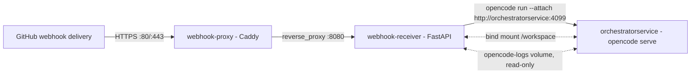

# Services

Active contributors: Nathan Miller

`orchestrator-service` runs as three containers defined in `compose.yaml`. Each container is a single deployable unit with its own image, port, and failure mode. This section documents each one: what it runs, which files control its behavior, and how it talks to the other two.

## The three services

| Service | Compose name | Port | Role | Page |
| --- | --- | --- | --- | --- |
| OpenCode server | `orchestratorservice` | `4099` | Runs `opencode serve`; hosts the orchestrator agent and its specialist subagents. | [OpenCode server](opencode-server.md) |
| Webhook receiver | `webhook-receiver` | `8080` (internal, not published) | FastAPI app: verifies GitHub deliveries, filters triggers, dispatches OpenCode runs, runs the Beads loop, serves the dashboard. | [Webhook receiver](webhook-receiver.md) |
| Webhook proxy | `webhook-proxy` | `80` / `443` | Caddy reverse proxy; the only container with a published host port in the base `compose.yaml`. | [Webhook proxy](webhook-proxy.md) |

## How they connect

`webhook-proxy` and `webhook-receiver` are joined only through the Caddy `reverse_proxy` directive in `deploy/caddy/Caddyfile`. `webhook-receiver` and `orchestratorservice` are joined two ways: the receiver invokes `scripts/prompt.ps1`, which runs `opencode run --attach http://orchestratorservice:4099 ...` as a subprocess, and both containers share the `${WORKSPACE_DIR}:/workspace` bind mount plus the `opencode-logs` named volume (the receiver's watchdog reads the server's log file to detect activity during a dispatch).

## Shared state

| Volume or mount | Declared in | Written by | Read by |
| --- | --- | --- | --- |
| `${WORKSPACE_DIR}:/workspace` | `compose.yaml` | Both `orchestratorservice` and `webhook-receiver` | Agent sessions, `webhook_receiver/workspace.py`, `webhook_receiver/beads_loop.py` |
| `opencode-memory:/app/.memory` | `compose.yaml` | `orchestratorservice` (MCP `memory-graph` server) | `orchestratorservice` only |
| `opencode-logs` | `compose.yaml` | `orchestratorservice` (`/home/app/.local/share/opencode/log`) | `webhook-receiver`, mounted read-only at `/var/log/opencode-server` |
| `caddy_data` / `caddy_config` | `compose.yaml` | `webhook-proxy` | `webhook-proxy` only |

## Modification entry points

- Add or change a service, port, volume, or dependency: `compose.yaml` (production) and `compose.development.yaml` (standalone dev stack — it does not layer on `compose.yaml`, so environment variables must be kept in sync manually).
- Build images locally instead of pulling from GHCR: `compose.build.yaml`, layered on top of either base file.
- Publish TLS on host `:443`: `compose.https.yaml`, layered on `compose.yaml` only (not compatible with a Tailscale Funnel on the same port).

## Related pages

- [OpenCode server](opencode-server.md)
- [Webhook receiver](webhook-receiver.md)
- [Webhook proxy](webhook-proxy.md)
- [Architecture](../overview/architecture.md), for the full runtime data-flow picture.
- [Getting started](../overview/getting-started.md), for starting the stack locally.
