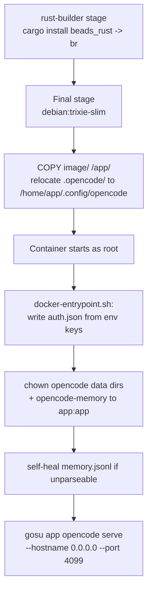

# OpenCode server

Active contributors: Nathan Miller

The `orchestratorservice` container runs `opencode serve`, hosting the OpenCode agent runtime that the webhook receiver and any interactive client attach to. It owns agent configuration (the orchestrator agent and its specialist subagents), model provider credentials, and the MCP servers those agents use. It has no knowledge of GitHub webhooks or Beads; it only executes whatever session an `opencode run` or `opencode attach` client connects to.

## Key source files

| File | Role |
| --- | --- |
| `Dockerfile` | Multi-stage build: a `rust-builder` stage compiles the Beads `br` CLI, then a `debian:trixie-20260518-slim` final stage installs Node.js, PowerShell, `gh`, `uv`, and the `opencode` CLI, copies `image/` to `/app`, and relocates `image/.opencode/` into the global config directory. |
| `image/.opencode/opencode.json` | OpenCode config: `default_agent: "orchestrator"`, default model `zai-coding-plan/glm-5`, per-agent `variant` overrides, MCP server definitions, and `"permission": "allow"` (the server-side allow-all that makes headless dispatch possible). |
| `image/.opencode/AGENTS.md` | Instructions loaded into every session (`instructions: ["AGENTS.md"]` in `opencode.json`); defines the orchestrator/subagent roster and delegation rules. |
| `scripts/docker-entrypoint.sh` | Container entrypoint: writes `auth.json` from provider environment variables, fixes ownership on first-mount volumes, self-heals a corrupted `memory.jsonl`, then drops from root to the `app` user via `gosu` before executing `opencode serve`. |
| `compose.yaml` (`orchestratorservice` service) | Publishes port `4099`, mounts `opencode-memory`, `/workspace`, and `opencode-logs`, and declares the provider/token environment variables passed into the container. |

## Image build and startup

The entrypoint (`scripts/docker-entrypoint.sh`) accepts any of `ZAI_CODING_API_KEY`/`ZAI_API_KEY`, `OPENROUTER_API_KEY`, or `MODEL_STUDIO_API_KEY` and writes them into `~/.local/share/opencode/auth.json` before the server starts; it exits non-zero if none are set. `opencode serve` itself requires `OPENCODE_SERVER_PASSWORD`, which `compose.yaml` marks as required (`${OPENCODE_SERVER_PASSWORD:?...}`).

The Dockerfile's `HEALTHCHECK` probes the raw TCP listener on `127.0.0.1:4099` rather than an authenticated HTTP route, since `opencode serve` requires the server password for any real request.

## Integration points

- **Webhook receiver**: `webhook_receiver/runner.py` builds the command line for `scripts/prompt.ps1`, which runs `opencode run --attach http://orchestratorservice:4099 --dir <workspace> --model <model> --agent orchestrator --auto` as a subprocess against this server. `compose.yaml` sets the receiver's `depends_on: orchestratorservice: condition: service_healthy`, so the receiver only starts once the healthcheck passes.
- **Shared `/workspace`**: agent sessions run with `--dir /workspace/<slug>`, the same bind mount the receiver uses for cloning and Beads worktrees.
- **`opencode-logs` volume**: the server writes its log to `/home/app/.local/share/opencode/log`; the receiver mounts the same volume read-only at `/var/log/opencode-server` so its watchdog can use server-log growth as an activity signal.
- **`opencode-memory` volume**: backs the `memory-graph` MCP server (`/app/.memory/memory.jsonl`), used by the orchestrator agent under the single-writer protocol described in `image/.opencode/AGENTS.md`.

## Modification entry points

- Change the agent roster, default model, MCP servers, or permission policy: `image/.opencode/opencode.json` and `image/.opencode/agents/`.
- Change installed tooling, base image, or the config-relocation step: `Dockerfile`.
- Change provider-credential handling or startup self-healing: `scripts/docker-entrypoint.sh`.
- Change published port, volumes, or environment variables passed to the container: `compose.yaml` and `compose.development.yaml` (kept in sync manually — see [Services](index.md)).

## Related pages

- [Services](index.md)
- [Webhook receiver](webhook-receiver.md), the process that dispatches sessions to this server.
- [Architecture](../overview/architecture.md), for the full runtime data-flow picture.
