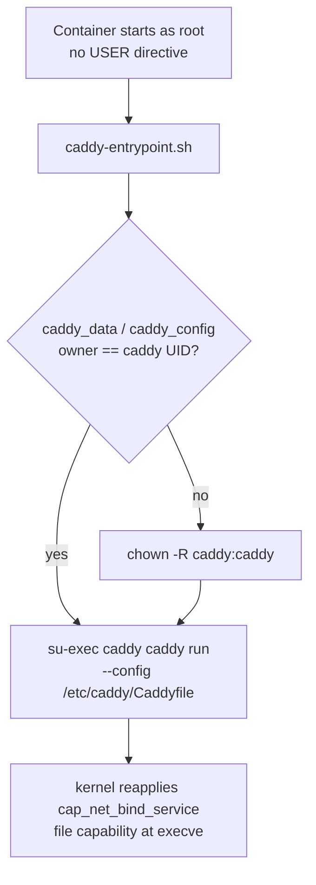

# Webhook proxy

Active contributors: Nathan Miller

`webhook-proxy` is a Caddy reverse proxy that terminates the public HTTP/HTTPS edge and forwards every request to `webhook-receiver` on its internal port `8080`. It is the only container in the base `compose.yaml` that publishes a host port, and it has no application logic of its own — its entire behavior is the single `reverse_proxy` directive in `deploy/caddy/Caddyfile`.

## Key source files

| File | Role |
| --- | --- |
| `deploy/caddy/Caddyfile` | The whole proxy configuration: `{$WEBHOOK_SITE_ADDRESS} { reverse_proxy webhook-receiver:8080 }`. `WEBHOOK_SITE_ADDRESS` selects HTTP-only (`:80`) or a real hostname (triggers Caddy's automatic Let's Encrypt HTTPS). |
| `deploy/caddy/Dockerfile` | Builds from the pinned `caddy:2.10.0-alpine` base (digest-pinned), creates a non-root `caddy` system user (the upstream image ships no non-root user), and grants privileged-port binding via `setcap cap_net_bind_service=+ep /usr/bin/caddy`. |
| `deploy/caddy/caddy-entrypoint.sh` | Container entrypoint: starts as root, chowns the `caddy_data`/`caddy_config` volumes to `caddy:caddy` on first mount if the owner differs, then drops privileges with `su-exec caddy` before executing `caddy run`. |
| `compose.yaml` (`webhook-proxy` service) | Publishes host `80:80`, adds `cap_add: CAP_NET_BIND_SERVICE`, mounts the `caddy_data`/`caddy_config` named volumes, and passes `WEBHOOK_SITE_ADDRESS` through to the Caddyfile. Deliberately omits `no-new-privileges` and `cap_drop: ALL` — the former would block the file capability from taking effect at `execve`, and the latter would remove the `SETUID`/`SETGID`/`CHOWN` capabilities the root entrypoint needs. |
| `compose.https.yaml` | Optional overlay that adds `443:443` to this service, for TLS via Caddy's automatic HTTPS when `WEBHOOK_SITE_ADDRESS` is a real hostname. Not meant to be combined with a Tailscale Funnel, which would also try to bind host `:443`. |

## Startup and privilege drop

The file capability set at build time (`setcap cap_net_bind_service=+ep /usr/bin/caddy`) is what lets the non-root `caddy` process bind `:80`/`:443` after the `su-exec` drop; the kernel reapplies file capabilities at `execve` regardless of the caller's UID, so the privilege drop does not strip the ability to bind those ports.

The image's `HEALTHCHECK` probes Caddy's local admin API (`http://127.0.0.1:2019/config/`) rather than the proxied site, since `WEBHOOK_SITE_ADDRESS` may be a hostname that needs DNS/ACME to resolve and would not be reachable in every environment.

## Integration points

- **Webhook receiver**: the sole downstream target, reached only through the `reverse_proxy webhook-receiver:8080` directive. `webhook-proxy` has no other awareness of the receiver's routes, dashboard, or dispatch logic.
- **GitHub**: the public entry point for `issues:labeled` webhook deliveries; the receiver's HMAC verification (`OS_WEBHOOK_SECRET`) happens downstream of this proxy, not here.
- **`caddy_data` / `caddy_config` volumes**: persist Caddy's internal state (including any Let's Encrypt certificates and account data) across container restarts.
- **`compose.https.yaml`**: the only way to expose host `:443` in this stack; without it, `webhook-proxy` serves HTTP only, which is the expected mode when a Tailscale Funnel or another external TLS terminator sits in front of it.

## Modification entry points

- Change the site address, add another route, or add global Caddy options (for example an ACME account email): `deploy/caddy/Caddyfile`.
- Change the base image, installed packages, or the non-root user/capability setup: `deploy/caddy/Dockerfile`.
- Change startup ownership fixups or the privilege-drop mechanism: `deploy/caddy/caddy-entrypoint.sh`.
- Change published ports, capabilities, or volumes: `compose.yaml` and `compose.https.yaml`.

## Related pages

- [Services](index.md)
- [Webhook receiver](webhook-receiver.md), the only service this proxy forwards to.
- [Architecture](../overview/architecture.md), for the full runtime data-flow picture.
