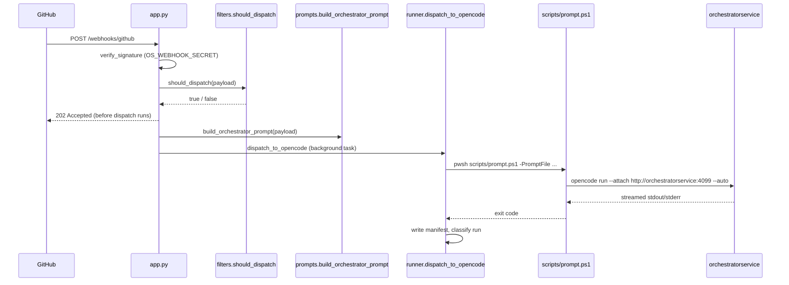

# Webhook receiver

Active contributors: Nathan Miller

`webhook-receiver` is a FastAPI application that is the control plane of the runtime. It verifies inbound GitHub webhook deliveries, decides whether they should trigger an agent run, renders the prompt for that run, and dispatches it to the OpenCode server as a background subprocess. In the same process, an optional background thread (`BeadsLoop`) polls project workspaces for ready Beads tasks and dispatches an agent per bead. The receiver also serves a token-gated dashboard over the same events and run history.

## Key source files

| File | Role |
| --- | --- |
| `webhook_receiver/__main__.py` | Process entry point: builds `Settings` from the environment, starts the `BeadsLoop` daemon thread when `BEADS_ENABLED` is truthy, and hands the FastAPI app to `uvicorn.run`. |
| `webhook_receiver/app.py` | Route definitions: `GET /health`, `POST /webhooks/github`, plus the included simulator and dashboard routers. Derives a safe project slug and branch from the payload, verifies the signature, calls `should_dispatch`, and schedules `dispatch_to_opencode` as a `BackgroundTasks` job. |
| `webhook_receiver/config.py` | Frozen `Settings` dataclass and `Settings.from_env()` — the single source of environment-variable defaults (host/port, secrets, watchdog timeouts, Beads options, dashboard token). |
| `webhook_receiver/github.py` | `verify_signature` — HMAC-SHA256 check of `X-Hub-Signature-256` against `OS_WEBHOOK_SECRET` using constant-time comparison. |
| `webhook_receiver/filters.py` | `should_dispatch` — label-prefix matching (`gh-issue-tracking:`, `orchestration:`), bot-actor exclusion, and the fail-closed `DIRECT_BODY_ALLOWED_SENDERS` allowlist for `gh-issue-tracking:direct-body`. |
| `webhook_receiver/prompts.py` | `build_orchestrator_prompt` — renders `webhook_receiver/orchestration_prompt.jinja2.md` with the event payload. |
| `webhook_receiver/runner.py` | `dispatch_to_opencode` — builds the `pwsh scripts/prompt.ps1` command line, runs it as a subprocess, captures stdout/stderr, writes a run manifest, and classifies the outcome. |
| `webhook_receiver/watchdog.py` | Activity-aware supervisor that can kill a dispatch on idle timeout, a consecutive-error burst, an unanswered permission `ask`, or a hard wall-clock ceiling. |
| `webhook_receiver/workspace.py` | Path-safe helpers for `/workspace/<slug>` — clone, sync, containment checks against path traversal, `push_branch`, and `create_pr` (runs `gh pr create` for a completed bead's task branch). |
| `webhook_receiver/beads_loop.py` | `BeadsLoop` — scans workspaces for `.beads/`, selects the next ready bead (preferring `bvr` when available), creates a `task/<bead-id>` worktree, dispatches an agent, and verifies closure via `br show`, retrying up to `BEADS_MAX_RETRIES`. |
| `webhook_receiver/dashboard.py` | `/api/dashboard/*` JSON/SSE routes and the `/dashboard*` HTML page routes; all gated behind `DASHBOARD_TOKEN` when set. |
| `webhook_receiver/event_store.py` | In-memory ring buffer with SSE fan-out; not durable. |
| `webhook_receiver/webhook_store.py` | Bounded, JSON-backed record of accepted webhook deliveries, linked to dispatch runs for the dashboard. |
| `webhook_receiver/simulator.py` | `/simulator` routes for locally exercising the webhook payload flow, enabled only when `WEBHOOK_ENABLE_SIMULATOR=1`. |
| `Dockerfile.webhook` | Builds the receiver image: a `rust-builder` stage compiles `br` and `bvr`, then a Debian slim stage installs `gh`, PowerShell, `uv`, and the `opencode` CLI (the client used by `scripts/prompt.ps1`), and `uv sync --frozen --no-dev` installs `webhook_receiver`. |
| `scripts/webhook-entrypoint.sh` | Container entrypoint: chowns the bind-mounted run-log directory to `app` on first mount, then drops privileges via `gosu` before running `uv run orchestrator-webhook`. |

## Request and dispatch flow

Separately, `BeadsLoop` runs in a daemon thread started by `__main__.py`; it does not go through `/webhooks/github` at all — it polls `.beads/` state directly in `/workspace` and calls the same `scripts/prompt.ps1` dispatch path per ready bead.

## HTTP surface

| Route(s) | Source | Notes |
| --- | --- | --- |
| `GET /health` | `webhook_receiver/app.py` | Unauthenticated; used by the Caddy/Compose healthcheck. |
| `POST /webhooks/github` | `webhook_receiver/app.py` | The only ingress for GitHub deliveries; HMAC-verified. |
| `/simulator/*` | `webhook_receiver/simulator.py` | Only registered when `WEBHOOK_ENABLE_SIMULATOR=1`. |
| `/api/dashboard/overview`, `/beads`, `/beads/{id}`, `/graph`, `/pages/refresh`, `/active`, `/events`, `/events/stream`, `/runs`, `/runs/{stem}/logs`, `/runs/{stem}/narrative`, `/run-events`, `/webhooks`, `/webhooks/{delivery_id}` | `webhook_receiver/dashboard.py` (`create_dashboard_router`) | JSON and SSE API surface, gated by `DASHBOARD_TOKEN`. |
| `/dashboard`, `/dashboard/bead/{id}`, `/dashboard/runs`, `/dashboard/runs/{stem}`, `/dashboard/events`, `/dashboard/webhooks` | `webhook_receiver/dashboard.py` (`create_dashboard_page_router`) | HTML page shell, gated by `DASHBOARD_TOKEN`. |
| `/dashboard/pages`, `/dashboard/pages/{file_path}` | `webhook_receiver/dashboard.py` (`create_dashboard_pages_router`) | Serves the `bvr`-generated static pages bundle. |

Only `GET /health` and `POST /webhooks/github` are proxied by the public Caddy site. Every other route in this table answers `404` there regardless of `DASHBOARD_TOKEN`, and is served instead on the receiver's loopback-only host publish `127.0.0.1:8081` (optionally tailnet-served) — see `docs/dashboard.md`.

## Integration points

- **OpenCode server**: every dispatch — webhook-triggered or Beads-triggered — ultimately runs `opencode run --attach http://orchestratorservice:4099 ...` via `scripts/prompt.ps1`. `compose.yaml` sets `OPENCODE_SERVER_URL=http://orchestratorservice:4099` and makes this container depend on `orchestratorservice`'s healthcheck.
- **Shared `/workspace`**: the receiver clones/syncs downstream repositories here and reads/writes `.beads/` state; the OpenCode server's agent sessions operate in the same tree via `--dir`.
- **`opencode-logs` volume**: mounted read-only at `/var/log/opencode-server`; `webhook_receiver/watchdog.py` treats growth in this file as a secondary activity signal so it does not kill a run that is silent on stdout but active in a subagent delegation.
- **GitHub API**: `webhook_receiver/workspace.py` (`create_pr`, called from `beads_loop.py`) and `webhook_receiver/runner.py` (issue failure comments) both shell out to `gh`, authenticated with `GH_ORCHESTRATION_AGENT_TOKEN` (falling back to `GITHUB_TOKEN`) — distinct from the HMAC secret used to validate inbound webhooks.
- **`webhook-proxy`**: reached only in the inbound direction; Caddy forwards `/webhooks/github` and `/health` to this container's internal port `8080` and answers `404` for every other path on the public site. The container never talks back to Caddy. The remaining routes — dashboard pages, `/api/dashboard/*`, `/simulator` — are reached directly via the compose loopback-only publish (`127.0.0.1:8081`), optionally tailnet-served, bypassing the proxy entirely.

## Modification entry points

- Add or change an HTTP route, request validation, or dispatch trigger condition: `webhook_receiver/app.py` and `webhook_receiver/filters.py`.
- Change environment-variable defaults or add a new setting: `webhook_receiver/config.py` (and `compose.yaml` / `compose.development.yaml` to pass it through).
- Change how a dispatch is run, logged, or classified: `webhook_receiver/runner.py`.
- Change idle/error/timeout kill behavior: `webhook_receiver/watchdog.py`.
- Change Beads polling, retry, or worktree logic: `webhook_receiver/beads_loop.py`.
- Change dashboard data or pages: `webhook_receiver/dashboard.py`.
- Change which paths the public edge can reach, or the host port the dashboard is served on: `deploy/caddy/Caddyfile` (rebuild the `webhook-proxy` image) and the `webhook-receiver` `ports:` entry in `compose.yaml` / `compose.development.yaml`.
- Change installed tooling or the image build: `Dockerfile.webhook`.
- Change container startup/ownership fixups: `scripts/webhook-entrypoint.sh`.

## Related pages

- [Services](index.md)
- [OpenCode server](opencode-server.md), the process this service dispatches runs to.
- [Webhook proxy](webhook-proxy.md), the edge that forwards GitHub traffic to this service.
- [Architecture](../overview/architecture.md), for the full runtime data-flow picture.
