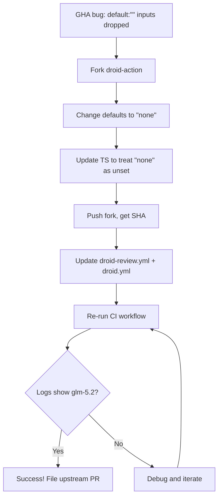

## Plan: Fork droid-action to fix GHA composite-action empty-default input bug

### Problem
GHA composite actions silently drop user-provided values for inputs with `default: ""`. The droid-action's `review_model`, `security_model`, `reasoning_effort`, and `fill_model` inputs all have `default: ""`, so `review_model: glm-5.2` is ignored and the action falls back to `gpt-5.2` (the `deep` preset default), which hits the 402 Payment Required standard usage limit. GLM-5.2 is a Droid Core model that would NOT hit this limit if used.

### Phase 1: Fork droid-action and fix empty defaults

**1. Fork `Factory-AI/droid-action` → `nam20485/droid-action` (public)**
- Use `gh repo fork Factory-AI/droid-action --clone=true`
- Checkout the pinned SHA `e3d1f5e7...` and create branch `fix/empty-default-inputs`

**2. Changes to the fork (6 files):**

| File | Change |
|------|--------|
| `action.yml` | Change `default: ""` → `default: "none"` for `review_model`, `security_model`, `reasoning_effort`, `fill_model` |
| `src/utils/review-depth.ts` | Update `resolveReviewConfig()` to treat `"none"` as falsy: `const isUnset = (v) => !v \|\| v === "none";` then use `isUnset(options?.reviewModel) ? defaults.model : options.reviewModel` |
| `src/entrypoints/generate-review-prompt.ts` | Update `rawModel` logic: add `resolveModel()` helper that treats `"none"` as undefined, apply to `SECURITY_MODEL` and `REVIEW_MODEL` reads |
| `src/tag/commands/review.ts` | No change needed (uses `resolveReviewConfig()` which is fixed) |
| `src/tag/commands/review-validator.ts` | No change needed (uses `resolveReviewConfig()` which is fixed) |
| `src/tag/commands/fill.ts` | Update `fillModel` check: `if (fillModel && fillModel !== "none")` |
| `src/entrypoints/collect-inputs.ts` | Update `inputDefaults`: `security_model: "none"`, add `review_model: "none"`, `reasoning_effort: "none"`, `fill_model: "none"`, `review_depth: "deep"` |

**3. Test and push:**
- Run `bun install && bun test` if tests exist in the fork
- Commit, push to `nam20485/droid-action`
- Record the fix commit SHA

### Phase 2: Update orchestrator-service workflows

**4. Update both workflow files on `dev/agent-readiness-quick-wins`:**

`.github/workflows/droid-review.yml`:
```yaml
# Before:
uses: Factory-AI/droid-action@e3d1f5e7861c36fe4a9c4dca3edec87b964b2bc4 # v5
# After:
uses: nam20485/droid-action@<fix-sha> # v5-fork: fixes empty-default input bug
```

`.github/workflows/droid.yml`: same change

**5. Validate and push:**
- Run `pwsh -NoProfile -File ./scripts/validate.ps1 -Lint` (actionlint)
- Commit as `ci: use forked droid-action with empty-default input fix`
- Push to `dev/agent-readiness-quick-wins`

**6. Re-run and verify:**
- `gh run rerun <failed-droid-review-run-id>`
- Watch the run and verify `INPUT_DROID_ARGS` now shows `--model "glm-5.2" --reasoning-effort "max"` instead of `--model "gpt-5.2" --reasoning-effort "high"`
- Verify `ALL_INPUTS` JSON shows `"review_model": "glm-5.2"` instead of `""`
- Confirm no 402 Payment Required error

### Phase 3: Upstream PR (optional, after verification)

**7. File PR with `Factory-AI/droid-action`:**
- Title: `fix: change empty-default inputs to "none" sentinel for GHA composite action compatibility`
- Body: Explain the GHA bug (`actions/runner#2525`), show the `ALL_INPUTS` evidence, describe the `"none"` sentinel approach
- Once merged and released, switch workflows back to `Factory-AI/droid-action@<new-sha>`

### Diagram



### Key verification points
- `ALL_INPUTS` JSON in CI logs must show `"review_model": "glm-5.2"` (not `""`)
- `INPUT_DROID_ARGS` must show `--model "glm-5.2" --reasoning-effort "max"` (not `gpt-5.2`/`high`)
- No 402 Payment Required error (GLM-5.2 is Droid Core, not standard tier)
- `validate` and `trivy` CI workflows remain green