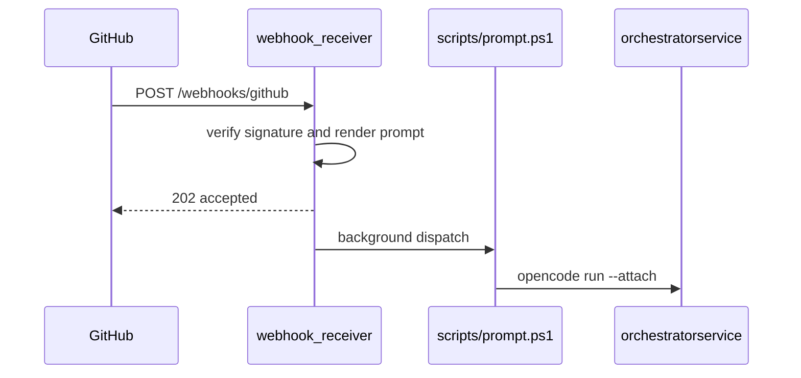
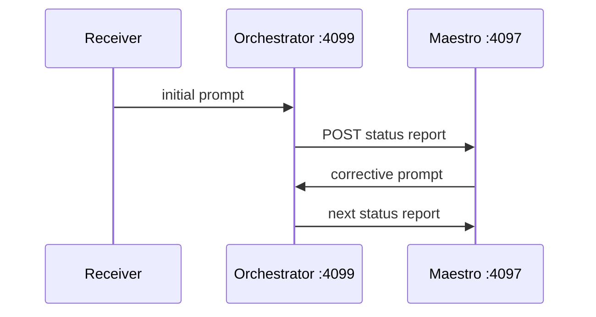
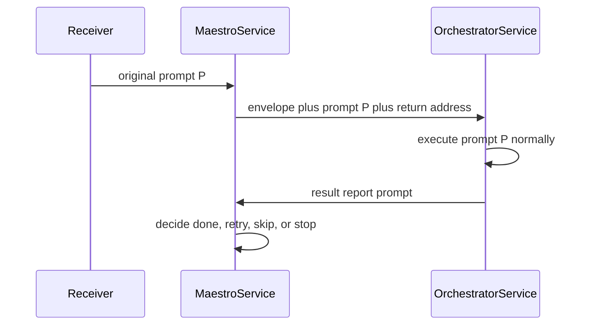
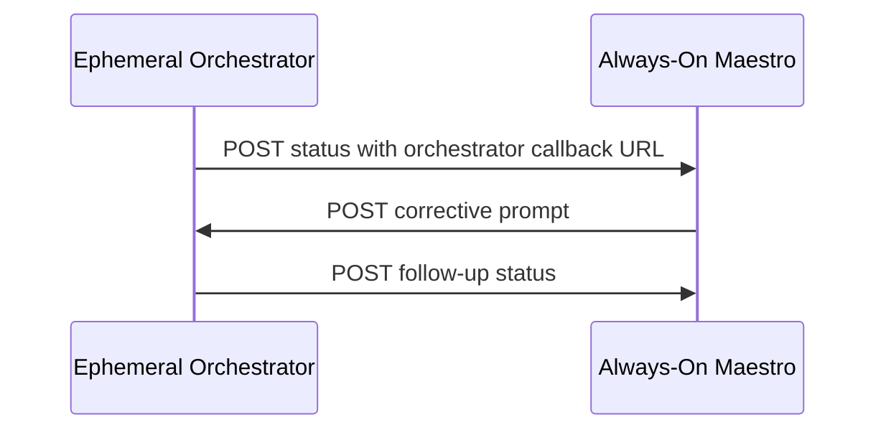
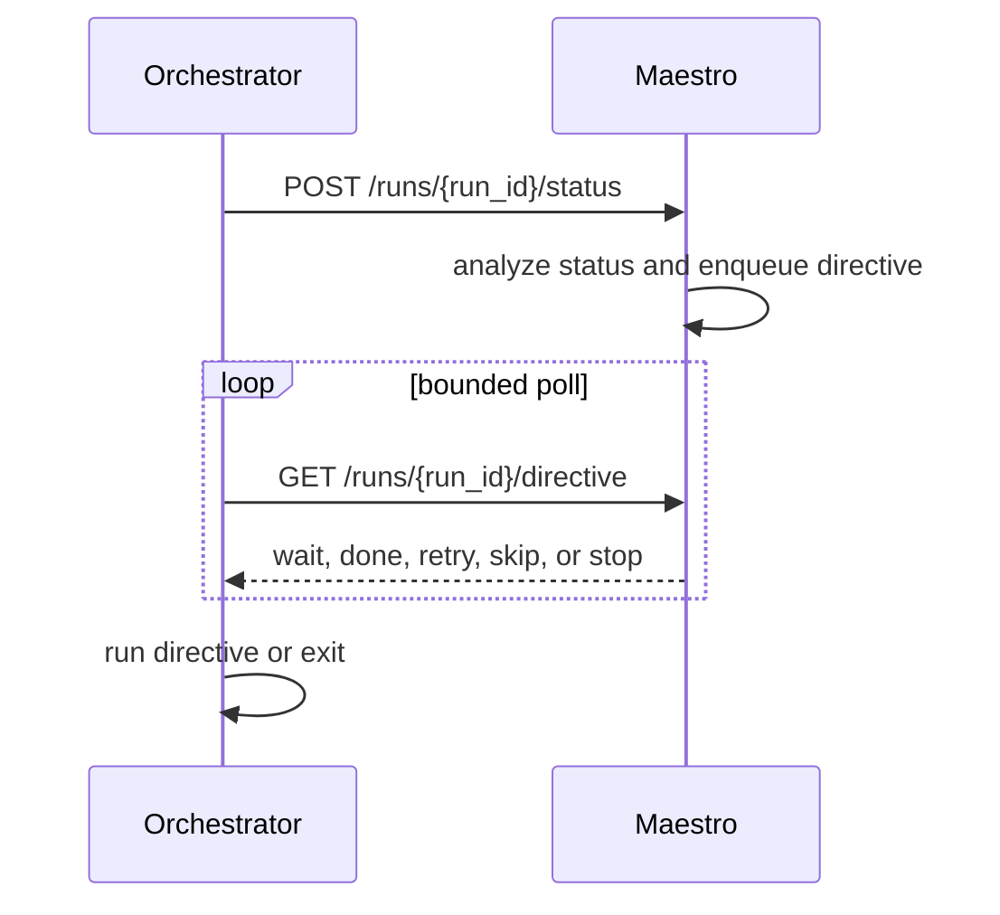
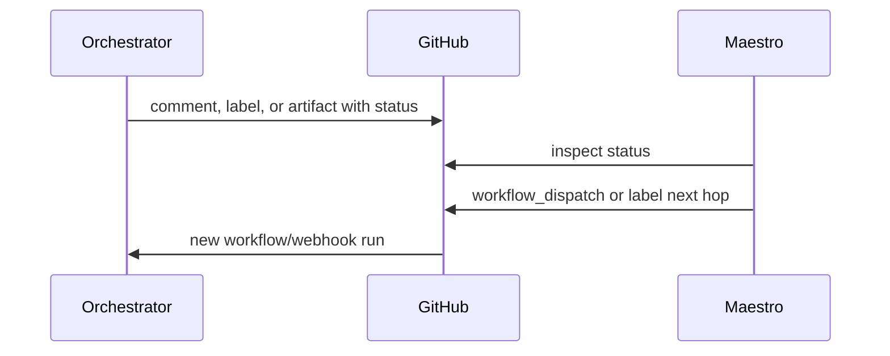
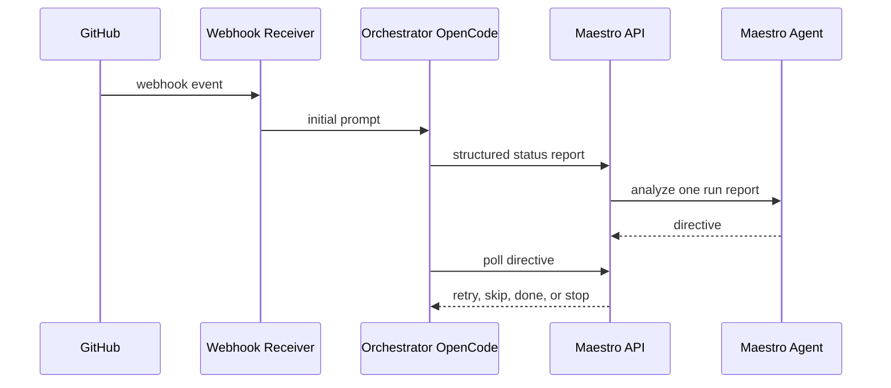

# Maestro Architecture Options

## Purpose

This document evaluates viable ways to implement the dual orchestrator architecture described in
`plan_docs/orchestration_supervisor.md`. The supervisor role is called the **maestro**: a higher-level
orchestrator that receives structured status from normal orchestrator runs, decides whether the work
should continue, retry, skip, or stop, and issues the next directive.

The core goal is to avoid dead-end orchestration failures. Today, the webhook receiver accepts a
GitHub event, renders an orchestrator prompt, and launches `scripts/prompt.ps1` against the single
OpenCode server at `orchestratorservice:4099`. That flow is intentionally thin and asynchronous. It
does not keep a run registry, capture final structured status, retry failed workflow stages, or route
corrective prompts after an orchestrator failure.

## Current Architecture Baseline

The current Docker stack has three services:

- `orchestratorservice`: runs `opencode serve` on port `4099`.
- `webhook-receiver`: verifies GitHub webhooks, builds the orchestrator prompt, and launches
  `scripts/prompt.ps1` in the background.
- `webhook-proxy`: Caddy ingress for `/webhooks/github`.

The current execution flow is:



There are three important constraints for the maestro design:

- The receiver does not wait for the OpenCode run to finish.
- The orchestrator server is reachable from the webhook container by Compose DNS, but external
  callback reachability is not guaranteed for arbitrary orchestrator containers or GitHub Actions
  runners.
- The existing OpenCode config has an `orchestrator` agent but no dedicated `maestro` agent or
  status-report contract yet.

## Evaluation Criteria

The options below are evaluated against:

- **Reliability:** Does the design actually improve recovery from failed orchestration runs?
- **Network feasibility:** Can the maestro and orchestrators reliably reach each other across
  containers, LAN, Tailscale, or GitHub-hosted runners?
- **Implementation complexity:** How much new service, script, API, prompt, and test surface is
  required?
- **State management:** Can the design track run identity, hop count, active directives, and
  prior attempts without confusing concurrent runs?
- **Security:** Does the design preserve authentication, avoid leaking logs/secrets, and keep
  privilege boundaries understandable?
- **Cost and timeout behavior:** Does it avoid runaway LLM hops, long blocked jobs, and needless
  always-on expense?
- **Fit with the current repo:** Does it compose cleanly with `compose.yaml`, `webhook_receiver`,
  `scripts/prompt.ps1`, and `image/opencode.json`?

## Option 1: Same-Job or Same-Compose Dual Servers

Run two OpenCode servers side by side in the same job or Compose project:

- normal orchestrator on `:4099`
- maestro on another port, for example `:4097`

The orchestrator reports to the maestro at the end of the run. The maestro then prompts the
orchestrator back directly if a retry or correction is needed.



### Pros

- Simple mental model: both processes are adjacent and can use fixed service names or ports.
- Good first proof of the leapfrog idea.
- Can reuse the same Docker image, provider auth setup, and OpenCode runtime.
- Avoids cross-network routing for early local or same-host validation.
- Easy to inspect logs because both services live in one deployment boundary.

### Cons

- It is not representative of future multi-repo or multi-run operation.
- If both services share `opencode-memory` or `/workspace`, concurrent sessions can collide unless
  volumes are split or runs are serialized.
- Same-job implementations inherit one job timeout. A long correction loop can consume the whole
  workflow budget.
- Direct maestro-to-orchestrator prompting only works while the orchestrator server remains alive
  and reachable.
- A single Compose deployment can prove mechanics, but it does not solve GitHub Actions runner NAT
  or external callback reachability.

### Implementation Impact

- Add a `maestroservice` to `compose.yaml` with its own port and preferably its own memory volume.
- Add a `maestro` agent definition under `image/.opencode/agents/`.
- Teach `webhook_receiver` or `scripts/prompt.ps1` to pass `SUPERVISOR_URL`/`MAESTRO_URL` into
  orchestrator prompts.
- Add a structured final status section to `webhook_receiver/orchestration_prompt.jinija2.md`.
- Add tests for the second service and OpenCode config.

### Best Use

This is useful as a local integration milestone, not as the recommended long-term architecture.

## Option 1A: Maestro-First Envelope Delegation

This variant still uses two same-job or same-Compose OpenCode services, but reverses the intake path.
Instead of sending the original GitHub-derived prompt directly to the regular orchestrator, the
webhook receiver sends it to the maestro first. The maestro wraps the original prompt in a supervision
envelope and delegates that envelope to the regular orchestrator service.

The envelope is conceptually:

```text
Execute this prompt:

<original prompt P>

When complete, report success or failure, relevant run details, and bounded logs back to
<maestro address> using the prompt wrapper.
```

The regular orchestrator then executes the original prompt as it would today. At the end, it uses the
maestro address embedded in the envelope to prompt the maestro service with a result report.



### Pros

- Makes the maestro the first-class entry point for orchestration without needing the receiver to know
  detailed recovery policy.
- Preserves the existing regular orchestrator behavior for the actual work. The second service still
  receives a prompt and runs it through the normal `orchestrator` agent path.
- Keeps the supervision instructions close to the delegated prompt, which is easy to reason about in
  a same-Compose prototype.
- Avoids requiring the regular orchestrator to know the maestro URL from global configuration; the
  return address is carried in the envelope for that specific run.
- Uses OpenCode prompting for both directions, so a first prototype may avoid building a full
  status/directive HTTP API immediately.

### Cons

- It relies heavily on prompt compliance. If the regular orchestrator crashes, times out, or ignores
  the final reporting instruction, the maestro may never receive a status report.
- The result report is delivered as another prompt, not a validated machine-level status POST. That
  makes schema enforcement, idempotency, and automated retries weaker unless a wrapper still captures
  ground-truth exit status.
- The original prompt becomes nested inside a larger prompt. That can dilute instruction priority,
  make prompt injection boundaries less clear, and increase token usage.
- The maestro can become a bottleneck for all inbound work because every run starts with a maestro
  prompt before the regular orchestrator even begins.
- It still depends on service-to-service reachability in both directions, even if both directions are
  implemented through `prompt.ps1`.
- If the maestro prompt launches the orchestrator prompt asynchronously, it needs a reliable run
  registry anyway; if it launches synchronously, the maestro session can block for the full duration
  of the delegated run.

### Implementation Impact

- Point the webhook receiver at the maestro service instead of the regular orchestrator service, or
  add routing that selects the maestro for supervised runs.
- Add a maestro prompt/agent that accepts original prompt `P`, creates the delegation envelope, and
  invokes `scripts/prompt.ps1 -ServerUrl <orchestrator-url>` with that envelope.
- Include a per-run return address such as `MAESTRO_SERVER_URL`, plus a `run_id`, `delivery_id`,
  `repo`, `hop`, and `max_hops` in the envelope.
- Add a result-report prompt template for the regular orchestrator to send back to the maestro.
- Prefer wrapper-level capture of exit code and logs even in this design, so the return prompt cannot
  replace ground-truth process status with the model's narrative.

### Best Use

This is a strong same-Compose prototype when the desired experiment is "make the maestro the first
thing that sees every prompt." It is less robust than a status API or polling design, but it can prove
whether maestro-authored delegation envelopes produce better supervised runs before investing in a
durable directive service.

## Option 2: Always-On Maestro With Direct Callback

Run the maestro as a long-lived service outside individual orchestrator runs. Each orchestrator
receives the maestro URL at startup, posts status to the maestro, and includes its own callback URL.
The maestro prompts the orchestrator server directly when it wants another hop.



### Pros

- Matches the original leapfrog concept closely.
- Maestro can outlive every orchestrator run and supervise multiple repositories.
- Enables a central run registry, shared recovery policy, and cross-run learning.
- Keeps retry decisions outside the failing orchestrator session.

### Cons

- The reverse connection is the hard part. An orchestrator running inside an ephemeral container,
  GitHub Actions runner, or NATed host is often not reachable from the maestro.
- Reverse tunnels would add operational fragility and a second failure mode.
- Publicly exposing orchestrator servers increases the security surface.
- Per-orchestrator credentials, TLS identity, and authorization become mandatory rather than nice
  to have.
- If callback routing fails, the maestro has a status report but cannot apply the correction to the
  live orchestrator.

### Implementation Impact

- Add a long-running maestro deployment and a session registry.
- Add stable TLS and credentials for maestro-to-orchestrator callbacks.
- Make each orchestrator publish or tunnel a reachable callback address.
- Add status schema validation, hop limits, and log redaction before reports leave the orchestrator
  runtime boundary.

### Best Use

This is viable only when orchestrators run on infrastructure that can expose stable, authenticated
callback endpoints to the maestro. It is not the best default for GitHub-hosted runners or arbitrary
ephemeral containers.

## Option 3: Always-On Maestro With Orchestrator Polling

Run the maestro as a long-lived service, but reverse the corrective path. Orchestrators only make
outbound calls:

1. POST their status report to the maestro.
2. Poll `GET /directive/{run_id}` or an equivalent endpoint for a bounded period.
3. Execute the returned directive if one exists.
4. Exit fail-open if the maestro is unavailable or no directive arrives before timeout.



### Pros

- Avoids inbound connectivity to ephemeral orchestrators.
- Works through NAT, GitHub-hosted runners, container networks, and locked-down LANs as long as the
  orchestrator can reach the maestro outbound.
- Fits the existing webhook-receiver style: the service can remain an HTTP control plane while
  execution stays in OpenCode.
- Supports many orchestrators reporting to one maestro with a clear compound key such as
  `{repo, delivery_id, run_id}`.
- Makes fail-open behavior straightforward: if the maestro is unreachable, the orchestrator logs a
  warning and exits with its own result.
- Allows bounded cost and time controls through `max_hops`, poll timeout, and per-step retry caps.

### Cons

- Requires an API layer around the maestro, not just a raw `opencode serve` process.
- The orchestrator wrapper must stay alive after the initial OpenCode run long enough to report and
  poll.
- The maestro needs durable directive state so orchestrators can retrieve decisions reliably.
- There is a small latency cost from polling.
- The status report must be sufficiently complete for the maestro to decide without relying on a
  live callback into the orchestrator.

### Implementation Impact

- Add a maestro service with HTTP endpoints for status reports and directives.
- Add a `maestro` OpenCode agent and prompt that evaluates one report at a time.
- Add a lightweight registry, ideally SQLite or a JSON-backed store to start.
- Extend `scripts/prompt.ps1` or the Python dispatch layer to capture exit status, collect logs,
  POST the report, poll for directives, and optionally invoke a follow-up prompt.
- Add schema validation and redaction before persisting or forwarding logs.

### Best Use

This is the best target architecture for the current repo. It preserves the useful parts of the
leapfrog model while removing the most fragile networking requirement.

## Option 4: GitHub-Native Hops

Use GitHub as the coordination bus instead of direct server-to-server supervision. The orchestrator
posts status to GitHub or the maestro, and the maestro triggers the next hop through GitHub primitives
such as:

- `workflow_dispatch`
- issue comments
- issue labels
- dispatch issues using the existing `orchestration:dispatch` flow



### Pros

- Avoids direct network access between maestro and orchestrator containers.
- GitHub provides durable audit history, run identity, permissions, and retries.
- Fits the existing label-driven orchestration prompt.
- Each hop can start with fresh infrastructure rather than relying on a still-running orchestrator.
- Works even if the original orchestrator process has exited.

### Cons

- Each correction becomes a new workflow or webhook run, so latency and cost increase.
- It is less like a live leapfrog conversation and more like queued workflow chaining.
- Requires careful deduplication to avoid label or dispatch loops.
- Depending on token configuration, workflow-triggering behavior can run into GitHub permission and
  recursion limitations.
- Status and logs need to be persisted somewhere GitHub can hold or reference safely.

### Implementation Impact

- Define a status artifact/comment format and next-hop dispatch issue contract.
- Teach the maestro to create GitHub-native directives.
- Harden idempotency around labels, comments, and workflow dispatch.
- Add loop prevention keyed by issue, delivery ID, workflow name, and hop count.

### Best Use

This is a strong fallback or later extension for work that can safely resume in a new run. It is less
suited to correcting a still-live OpenCode session, but more robust when the original orchestrator has
already exited.

## Option 5: Structured Status Reporting Only

Before adding automated correction, implement the status-report contract and fail-open observability:

- orchestrator emits structured JSON on success or failure
- wrapper captures logs, exit code, run metadata, and GitHub context
- status is written locally and optionally POSTed to a configured maestro URL
- unreachable maestro produces warnings but does not block the run

### Pros

- Lowest-risk first step.
- Creates the data contract every other option needs.
- Improves debugging even before automated retries exist.
- Keeps the current execution model mostly unchanged.
- Lets the team validate log size, redaction needs, schema fields, and failure modes with real runs.

### Cons

- Does not by itself recover from failures.
- Can create a false sense of progress if the status data is not consumed quickly.
- Requires discipline to keep the schema stable and machine-readable.

### Implementation Impact

- Add `status-report-schema.json` or equivalent Python model.
- Update the orchestrator prompt final section to require a structured supervisor report.
- Extend `scripts/prompt.ps1` or `webhook_receiver/runner.py` to capture run output and exit status.
- Add fail-open POST behavior with short timeouts and bounded retries.

### Best Use

This should be the first implementation phase regardless of the final maestro topology.

## Recommendation

Use **Option 3: Always-On Maestro With Orchestrator Polling** as the target architecture, preceded by
**Option 5: Structured Status Reporting Only** as the first implementation phase.

The direct callback and maestro-first envelope models are conceptually clean, but they make service
reachability and prompt compliance central risks. Those risks grow as soon as orchestrators move
across containers, LANs, Tailscale hosts, or GitHub Actions runners. Polling keeps every orchestrator
interaction outbound to the maestro, which is far more compatible with ephemeral infrastructure and
multi-repo supervision.

The recommended architecture is:



The maestro should be treated as a control plane, not just a second OpenCode server. The OpenCode
maestro agent can make decisions, but an API layer should own status ingestion, schema validation,
directive persistence, hop counting, idempotency, and redaction.

## Why This Recommendation Fits The Repo

- The current webhook receiver is already a small FastAPI control plane. Adding status and directive
  endpoints fits that style better than exposing ephemeral orchestrator servers.
- `scripts/prompt.ps1` is already the common client wrapper around `opencode run`; it is the natural
  place to capture exit status and participate in bounded reporting/polling.
- `image/opencode.json` can add a `maestro` agent without changing the existing default
  `orchestrator` behavior.
- The existing Compose model can host a long-running maestro service with its own memory volume and
  port while keeping the current orchestrator service stable.
- Polling supports future GitHub Actions, LAN, and Tailscale deployments without requiring inbound
  connectivity to each orchestrator.
- The maestro-first envelope option remains useful as a prototype path, but the long-term control
  plane should not depend on a model remembering to report its own final status.

## Proposed Phased Rollout

### Phase 1: Status Contract and Fail-Open Reporting

- Define the status report schema with `run_id`, `delivery_id`, `repo`, `outcome`, `step`,
  `error_code`, `hop`, `max_hops`, `elapsed_seconds`, `model_narrative`, and bounded logs.
- Update the orchestrator prompt final section to require the report on both success and failure.
- Capture enough wrapper-level ground truth to prevent hallucinated failure reasons from becoming
  authoritative.
- If `MAESTRO_URL` is unset or unreachable, log a warning and preserve the orchestrator exit code.

### Phase 2: Local Maestro Service

- Add a `maestroservice` in Compose using the same image but separate port and memory volume.
- Add a dedicated `maestro` agent and prompt.
- Keep the first version same-host or same-LAN to reduce deployment complexity.
- Process one status report per maestro prompt invocation to avoid cross-run context contamination.

### Phase 3: Directive API and Polling

- Add `POST /runs/{run_id}/status` and `GET /runs/{run_id}/directive`.
- Store run state and directives in a lightweight durable store.
- Add bounded polling to the orchestrator wrapper.
- Enforce `max_hops`, per-step retry caps, and terminal states: `done`, `retry`, `skip`, `stop`,
  and `human_required`.

### Phase 4: GitHub-Native Fallbacks

- Allow the maestro to trigger a new GitHub dispatch issue or workflow hop when the original
  orchestrator is no longer alive.
- Use this for long-running chains and post-exit remediation, not as the first retry mechanism.
- Add deduplication keys so labels, comments, or dispatch issues cannot loop indefinitely.

### Phase 5: Security and Operational Hardening

- Add schema validation and strict log redaction before persistence or model ingestion.
- Use distinct credentials for maestro and orchestrator roles when they leave a single trust domain.
- Add TLS appropriate to deployment scope: private CA or CA-signed certs for cross-host use.
- Add health checks, restart policy, and metrics around status intake, directive latency, hop count,
  retry outcomes, and fail-open events.

## Security Notes

The maestro will receive logs that may include command output, environment-derived context, GitHub
URLs, and occasional accidental sensitive text. The implementation should assume status payloads are
sensitive.

Minimum controls:

- Redact known secret env vars and token-like strings before POSTing status.
- Bound log size with both byte limits and targeted error excerpts.
- Authenticate orchestrator-to-maestro status reports.
- Validate JSON schema before invoking the maestro agent.
- Never let a status report directly become an executable prompt without a trusted prompt wrapper.

For same-host prototypes, shared `OPENCODE_SERVER_PASSWORD` and private Compose networking may be
acceptable. For cross-network use, use per-role credentials and TLS with stable identity.

## State Model

The maestro should track supervision state separately from OpenCode memory:

- `run_id`
- `delivery_id`
- `repo`
- `issue_or_pr`
- `workflow_name`
- `current_step`
- `hop`
- `max_hops`
- `last_status`
- `last_directive`
- `terminal_state`
- `created_at`
- `updated_at`

OpenCode memory is useful for narrative learning and long-term context, but it should not be the
source of truth for active orchestration control. A small SQLite database or JSON-backed registry is
more appropriate for run state and directive queues.

## Non-Recommendations

- Do not start with public inbound callbacks to orchestrator containers.
- Do not rely only on prompt-instruction reporting for authoritative success/failure status.
- Do not share one memory file between active orchestrator and maestro services without proving the
  MCP memory server handles concurrent writers safely.
- Do not let the maestro retry indefinitely. Every path needs hop and step caps.
- Do not treat the orchestrator's natural-language failure summary as authoritative when command
  output and exit codes are available.
- Do not make the orchestrator fail closed just because the maestro is unreachable.

## Final Position

The maestro architecture is worth implementing, but the safest shape is not a pure bidirectional
server-to-server callback loop. The recommended path is:

1. Establish structured status reporting and fail-open behavior.
2. Add an always-on maestro control plane.
3. Let orchestrators poll for directives.
4. Add GitHub-native continuation only after the direct polling loop is stable.

This keeps the original leapfrog benefit while avoiding the networking trap that would otherwise make
the supervisor less reliable than the workflow it is meant to supervise.
